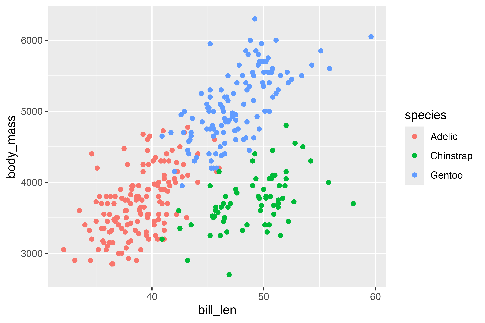
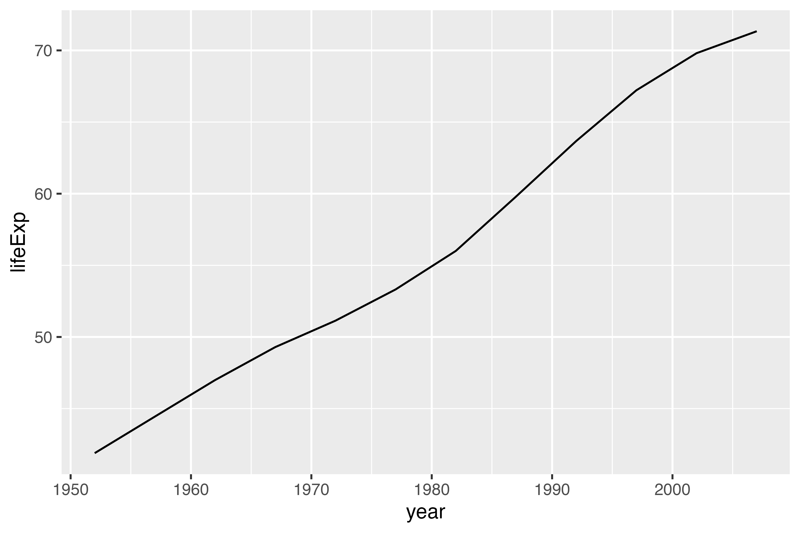

## Task 0: Load data

For this exercise, you'll work with two datasets:

1. `penguins`: measurements of 333 penguins living across three islands in Antarctica. See [this website](https://cran.r-project.org/web/packages/palmerpenguins/readme/README.html) for details about the variables.
2. `gapminder`: life expectancy, population, and GDP per capita for 142 countries, one row per country-year. See [this website](https://jennybc.github.io/gapminder/) for details about the variables.

Run the chunk below to load both datasets. You don't need to change any of the code here! I'm pre-filtering the Egypt data for you because we haven't covered things like `filter()` yet---that's in the next *ModernDive* chapter.

```{r}
#| label: load-libraries-data
#| warning: false
#| message: false

library(tidyverse)

penguins <- read_csv("data/penguins.csv") |> 
  drop_na(sex)

gapminder <- read_csv("data/gapminder.csv")

gapminder_egypt <- gapminder |> 
  filter(country == "Egypt")
```

## Task 1: The grammar of graphics

Look at this code:

```{r}
ggplot(
  data = penguins,
  mapping = aes(x = flipper_len, y = body_mass)
) +
  geom_point(aes(color = species)) +
  geom_smooth()
```

Answer these questions:

1. What is the `data` in this plot?
2. Which variable is mapped to `x`? To `y`? To `color`?
3. Which `geom`s are used, and what type of plot does that produce?
4. What does it mean that `color = species` is defined in `geom_point()` instead of in `ggplot()`?

**ANSWER HERE**

Imagine you want to make all the points in the scatterplot be 25% opaque. You try this code, but it's not working!

```{r}
ggplot(
  data = penguins,
  mapping = aes(x = flipper_len, y = body_mass)
) +
  geom_point(aes(color = species, alpha = 0.25)) +
  geom_smooth()
```

Without running the code, will this make the points 25% opaque? Why or why not? How would you fix this?

**ANSWER HERE**

## Task 2: Recreate a scatterplot

Run the code chunk below to see a plot.

```{r}
#| label: recreate-me-1
#| echo: false


```

Use `ggplot()` in the chunk below to re-create the plot above using the `penguins` dataset that you loaded earlier.

```{r}
#| label: recreation-plot-1

# Do stuff here
```

## Task 3: Recreate a linegraph

Run the code chunk below to see a plot. It shows life expectancy in Egypt over time.

```{r}
#| label: recreate-me-2
#| echo: false


```

Use `ggplot()` in the chunk below to re-create the plot above using the `gapminder_egypt` dataset that you made at the beginning of the document.

```{r}
#| label: recreation-plot-2

# Do stuff here
```

## Task 4: Make a histogram

This time I'm not giving you a plot! Instead, you'll create a plot based on a description that uses language from the grammar of graphics.

Create a histogram of penguin body mass across sex, with a bin width of 200 grams. It should:

- Use the `penguins` data
- Put `body_mass` on the x-axis
- Use a `geom` that displays your aesthetics as a histogram; use a bin width of 200 grams
- Facet by `sex` (hint: see `facet_wrap()` at [the documentation](https://ggplot2.tidyverse.org/reference/facet_wrap.html))

```{r}
#| label: make-plot-3

# Do stuff here
```

## Task 5: Make some barplots

### Part 1: Uncounted data

Visualize the count of penguins across three islands in the `penguins` data.

- Use the `penguins` data
- Put `island` on the x-axis
- Use a `geom` that shows the data as bars and also counts the data for you (see [2.8.1 from *ModernDive* for help!](https://moderndive.com/v2/02-visualization.html#barplots-via-geom_bar-or-geom_col))

```{r}
#| label: make-plot-4-1

# Do stuff here
```

### Part 2: Pre-counted data

Here's some code that creates a smaller dataset that calculates the counts of penguins across islands:

```{r}
#| label: species-counts

island_counts <- penguins |> 
  count(island)
island_counts
```

Visualize the count of penguins across three islands using this new `island_counts` dataset. You'll need to use different values in the `x` and `y` aesthetics, and you'll need to use a different `geom` (again, see [2.8.1 from *ModernDive* for help!](https://moderndive.com/v2/02-visualization.html#barplots-via-geom_bar-or-geom_col))

```{r}
#| label: make-plot-4-2

# Do stuff here
```

## Task 6: Extension

Copy the code for one of your plots above and paste it into the chunk below. Then do at least **two** of the following:

- Add a `labs()` layer with a real title, axis labels, and a caption naming the data source (see the documentation and examples for [`labs()`](https://ggplot2.tidyverse.org/reference/labs.html))
- Map a new variable to `color` or `fill` or `size` or `alpha`
- Change the theme (e.g., `theme_minimal()`)
- Plot some different variables
- Try changing the colors or fill (see the documentation and examples for [`scale_*_manual()`](https://ggplot2.tidyverse.org/reference/scale_manual.html) and [`scale_*_viridis()`](https://ggplot2.tidyverse.org/reference/scale_viridis.html))

**This is your chance to play around and explore---have fun!**

```{r}
#| label: extension

# Do stuff here
```
