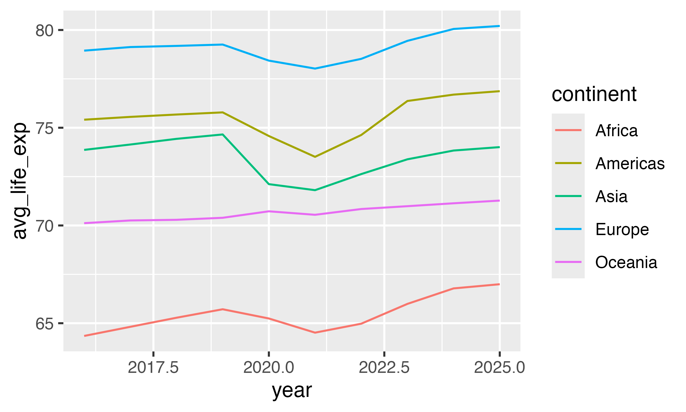

## Data description and cleaning

For this exercise, you'll work with `vdem`, a trimmed-down version of the [V-Dem (Varieties of Democracy) dataset](https://www.v-dem.net/). It contains one row for every country between 2016--2025 and includes these columns:

- `country_name`: Country name
- `country_id`: V-Dem's internal country ID number
- `year`: Year
- `continent`: Continent
- `region`: World Bank-style region
- `regime_num`: Regimes of the World category: 0 = closed autocracy, 1 = electoral autocracy, 2 = electoral democracy, 3 = liberal democracy
- `regime`: `regime_num`, but as text with nice labels
- `censorship_num`: Level of internet censorship: 0 = extremely restricted, 1 = substantially restricted, 2 = somewhat restricted, 3 = unrestricted
- `censorship`: `censorship_num`, but as text with nice labels
- `corruption`: Level of corruption on a scale of 0 to 1, where 0 is low
- `any_female_hos`: Has this country ever had a female head of state
- `life_exp`: Life expectancy at birth, in years
- `population`: Population, in tens of thousands
- `gdp`: Total GDP, in constant international dollars
- `gdpPercap`: GDP per capita, in constant international dollars

::: {.callout-warning}
The `population`, `gdp`, and `gdpPercap` columns here are actually missing all values after 2019---for reasons, V-Dem doesn't actually keep track of those or update those themselves, and the source they use ends in 2019.
:::


## Task 0: Load data

Run the chunk below to load the data. You don't need to change any of the code here!

```{r}
#| label: load-libraries-data
#| warning: false
#| message: false

library(tidyverse)

vdem <- readRDS("data/vdem_small.rds")
```

::: {.callout-tip}
For each task below, make sure you assign your wrangled result to a named object and then print that object on its own line, instead of having it output directly to the console:

```r
south_asia_only <- vdem |>
  filter(region == "South Asia") |>
  arrange(desc(lifeExp))
south_asia_only
```

This makes it a lot easier to inspect the results (especially if there are more than 10 rows), and makes it easier to reuse the results for other things, like `ggplot()`.
:::


## Task 1: Filtering, arranging, and selecting

### Part 1

Filter `vdem` so that it only shows rows in the "Middle East, North Africa, Afghanistan & Pakistan" region in 2024, then arrange the result by life expectancy in descending order. Keep only the `country_name`, `year`, and `life_exp` columns. Store this as a dataset named `mena_le_2024`.

Look at the results and answer these questions:

- Which five Middle Eastern countries had the highest life expectancies in 2024?
- Which four Middle Eastern countries had the lowest life expectancies in 2024?
- Palestine/Gaza shows `NA`---what does that mean?

```{r}
#| label: filter-arrange-1

# Do stuff here
```

**ANSWER HERE**

### Part 2

Filter `vdem` so that it shows all the countries where internet censorship was either "Substantially restricted" or "Extremely restricted" in 2019. Arrange the results by GDP per capita. Keep only the country name, internet censorship, and region columns. Store this as a dataset named `most_censored_2019`.

Look at the results and answer these questions:

- What was the richest country that censored the internet in 2019?
- In what region were most of the poorest countries that censored the internet in 2019?

```{r}
#| label: filter-arrange-2

# Do stuff here
```

**ANSWER HERE**

## Task 2: Mutating

Make a new dataset named `vdem_regime_wealth` and do these things:

- Keep rows for 2019 only
- Add a new column named `democracy` that collapses `regime_num` into two categories: `"Democracy"` when `regime_num` is 2 or 3, and `"Autocracy"` when it's 0 or 1 (hint: remember `ifelse()` from class)
- The current `population` column reports population in tens of thousands of people. Add a new column named `population_full` that multiplies `population` by 10000 to create the actual number
- Arrange by population in descending order
- Keep only columns for country name, the full population, and democracy

It should look like this in the end (this is just the first few rows):

```
# A tibble: 179 × 3
  country_name             population_full democracy
  <chr>                              <dbl> <chr>
1 China                         1483684900 Autocracy
2 India                         1422236210 Autocracy
3 United States of America       350941840 Democracy
4 Indonesia                      282170210 Democracy
5 Pakistan                       226865960 Autocracy
...
```

```{r}
#| label: mutate-1

# Do stuff here
```

## Task 3: Grouping and summarising

### Part 1

Filter the `vdem` data to only 2023 and then use `group_by()` and `summarise()` to calculate the average life expectancy in each region in 2023. Store the results as a dataset named `life_exp_by_region_2023`. It should look like this:

```
# A tibble: 7 × 2
  region                                            avg_life_exp
  <chr>                                                    <dbl>
1 East Asia & Pacific                                       71.3
2 Europe & Central Asia                                     78.1
3 Latin America & Caribbean                                 76.0
4 Middle East, North Africa, Afghanistan & Pakistan         74.9
5 North America                                             81.2
6 South Asia                                                75.4
7 Sub-Saharan Africa                                        65.0
```

::: {.callout-tip title="Hint!"}
If you get NA values for the averages, review [section 3.3 in *ModernDive*](https://moderndive.com/v2/03-wrangling.html#sec-summarize), especially the section about `na.rm`.
:::

```{r}
#| label: group-summarise-1

# Do stuff here
```

### Part 2

Filter the `vdem` data to include all years up to 2019, and then use `group_by()` and `summarise()` to calculate (1) the average GDP per capita and (2) the maximum GDP per capita in each continent and year. Sort the results by descending average GDP. Store the results as a dataset named `gdp_by_continent_year`. It should look like this (this is just the first few rows):

```
# A tibble: 20 × 4
  continent  year avg_gdpPercap max_gdpPercap
  <chr>     <dbl>         <dbl>         <dbl>
1 Europe     2019        72444.        181069
2 Europe     2018        71642.        175397
3 Europe     2017        70135.        170536
4 Europe     2016        68059.        163268
5 Oceania    2019        41063.        115340
...
```

```{r}
#| label: group-summarise-2
#| message: false

# Do stuff here
```

## Task 4: {dplyr} *and* {ggplot2}

Run the code chunk below to see a plot. It shows average life expectancy by continent from 2016--2025.

```{r}
#| label: recreate-me-1
#| echo: false

if (interactive()) {
  png::readPNG("images/recreate-me-1-1.png") |> grid::grid.raster()
} else {
  
}
```

Use `group_by()` and `summarise()` to build a small summary dataset named `avg_life_exp_by_continent` with the average `life_exp` for each continent and year, then feed `avg_life_exp_by_continent` into `ggplot()` to re-create the plot above.

Answer these questions:

- What happened in 2020 and 2021?
- Which continent saw the fastest recovery in life expectancy after 2021?

```{r}
#| label: make-plot-1
#| message: false

# Do stuff here
```

**ANSWER HERE**

## Task 5: Tidying data with `pivot_wider()` and `pivot_longer()`

### Part 1

Data often comes in wide, untidy format. To make it easier to plot and analyze, you need to be able to reshape it and tidy it.

I've provided a separate dataset at `data/corruption_wide.csv`. It contains V-Dem's corruption scores for all countries in South Asia between 2016 and 2025, but it's in wide format, with a column for every year.

1. Use `read_csv()` to read in `data/corruption_wide.csv` and store it as `corruption_wide`.
2. Use `pivot_longer()` to convert it into a tidy dataset with one column named `year` (from the old column names) and one column named `corruption` (from the cell values). Store this as `corruption_long`.
3. Use `corruption_long` to make a line chart with `year` on the x-axis, `corruption` on the y-axis, and a separate colored line for each `country_name`.

::: {.callout-tip title="Hint!"}
`pivot_longer()` will read the year columns in as character text (`"2016"`, `"2017"`, etc.), which will make it difficult to plot a line graph. After you pivot longer, add `mutate(year = as.integer(year))` to the pipeline to convert the years to actual numbers.
:::

```{r}
#| label: pivot-longer-1
#| message: false

# Do stuff here
```

### Part 2

In class, we talked a lot about how important tidy data is---that you typically want (1) each variable in a column, (2) each observation in a row, and (3) all values in a table. For some things, though, using wide data actually can be helpful! In this task, you'll see an example of that.

First, filter `vdem` so that it only includes the years 2020 to 2025. Keep only `country_name`, `year`, and `life_exp`. Then use `pivot_wider()` to spread `year` across the columns and `life_exp` into the cells, so you end up with one row per country and one column per year. Store the result as `life_exp_wide`. It should look like this (this is just the first few rows):

```
# A tibble: 179 × 7
  country_name  `2020` `2021` `2022` `2023` `2024` `2025`
  <chr>          <dbl>  <dbl>  <dbl>  <dbl>  <dbl>  <dbl>
1 Mexico          71.5   71.6   76.3   76.5   76.7   76.9
2 Suriname        73.0   70.7   70.7   73.3   73.4   73.5
3 Sweden          82.2   82.8   83.3   83.4   83.6   83.7
4 Switzerland     83.3   84.2   84.5   84.6   84.7   84.8
5 Ghana           65.7   65.3   65.5   66.1   67.2   67.4
...
```

```{r}
#| label: pivot-wider-1

# Do stuff here
```

### Part 3

::: {.callout-important title="Numeric column names"}
You can generally use whatever you want for column names in R, but there are two general rules: (1) column names cannot have spaces in them and (2) column names cannot start with numbers. If you have a column that starts with a number or has spaces it in it, don't worry! You can still use it! You just have to put the column name in between single backticks (`), like this:

```r
mutate(blah = `2025` - `2020`)
```
:::

Create a new dataset named `life_exp_diffs` that is based on `life_exp_wide`. Use `mutate()` to add a new column named `change` that calculates the change in life expectancy between 2020 and 2025. Then sort by `change` in descending order.

- Which three countries' life expectancy increased the most between 2020 and 2025?
- Which three countries increased the least?

```{r}
#| label: pivot-wider-2

# Do stuff here
```

**ANSWER HERE**

## Task 6: Extension

Copy the code from a previous task and paste it into the chunk below. Do something extra to it. Here are some ideas!

- Plot one of the filtered or summarized datasets that you made. Try using `geom_col()` for something
- Use `any_female_hos` as a grouping variable somewhere and see whether having a female head of state at some point in a country's history is associated with differences in internet censorship or life expectancy
- Add a `labs()` layer with a nice title, axis labels, and a caption that says where the data comes from
- Change the theme (e.g., `theme_minimal()`)
- Add another summary statistic (e.g., `median()`, `sd()`, or `min()` alongside `max()`)
- Facet your plot by a grouping variable instead of (or in addition to) using `color`
- Filter to a specific region, continent, or set of years before grouping and summarizing
- Anything else!

**This is your chance to play around and explore---have fun!**

```{r}
#| label: extension

# Do stuff here
```
