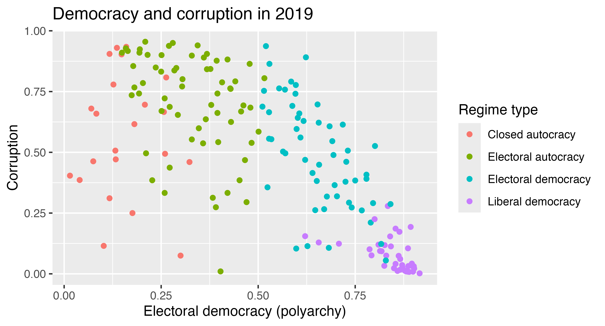

## Data description

For this exercise, you'll work with `vdem`, another trimmed-down version of the [V-Dem (Varieties of Democracy) dataset](https://www.v-dem.net/). It contains one row for every country between 2010--2025 and includes *a bunch* of columns (you won't use all of these here! I'm giving you a lot here so that you can explore different things in your extension):

- `country_name`: Country name
- `country_id`: V-Dem's internal country ID number
- `year`: Year
- `continent`: Continent
- `region`: World Bank-style region
- `regime_num`: Regimes of the World category: 0 = closed autocracy, 1 = electoral autocracy, 2 = electoral democracy, 3 = liberal democracy
- `regime`: `regime_num`, but as text with nice labels
- `polyarchy`: Electoral democracy index, on a scale of 0 to 1, where 1 is most democratic
- `civil_liberties`: Civil liberties index, on a scale of 0 to 1, where 1 is most free
- `physical_integrity`: Physical violence index (i.e. freedom from torture and political killings by the government), on a scale of 0 to 1, where 1 is most protected
- `rule_of_law`: Rule of law index, on a scale of 0 to 1, where 1 is the strongest rule of law
- `free_expression`: Freedom of expression and alternative sources of information index, on a scale of 0 to 1, where 1 is most free
- `women_empowerment`: Women's political empowerment index, on a scale of 0 to 1, where 1 is most empowered
- `corruption`: Political corruption index, on a scale of 0 to 1, where 1 is most corrupt
- `polyarchy_10`, `civil_liberties_10`, `physical_integrity_10`, `rule_of_law_10`, `free_expression_10`, `women_empowerment_10`, `corruption_10`: The same indexes, but multiplied by 10 so that they range from 0 to 10 instead of 0 to 1
- `population`: Population
- `gdpPercap`: GDP per capita, in constant international dollars
- `life_exp`: Life expectancy at birth, in years
- `fertility_rate`: Fertility rate (average number of births per woman)
- `child_mortality`: Child mortality rate (deaths of children under age 5 per 1,000 live births)

::: {.callout-warning}
Like last time, the `population` and `gdpPercap` columns are missing all values after 2019. Because of this, most of this problem set uses data from 2019 only.
:::


## Task 0: Load data

Run the chunk below to load the data. You don't need to change any of the code here!

```{r}
#| label: load-libraries-data
#| warning: false
#| message: false

library(tidyverse)
library(moderndive)

vdem <- readRDS("data/vdem_regression.rds")
```


## Task 1: Correlation

### Part 1

Filter `vdem` so that it only includes rows from 2019. Store this as a dataset named `vdem_2019`. You'll use `vdem_2019` for the rest of the problem set.

```{r}
#| label: filter-2019

# Do stuff here
```

### Part 2

Run the code chunk below to see a plot. It shows the relationship between electoral democracy and corruption in 2019, with each country colored by its regime type.

```{r}
#| label: recreate-me-1
#| echo: false

if (interactive()) {
  png::readPNG("images/recreate-me-1-1.png") |> grid::grid.raster()
} else {
  
}
```

Use `vdem_2019` and `ggplot()` to recreate the plot above.

Then answer these questions:

- What pattern do you see in the colors? Where do the different regime types tend to fall?
- Before calculating anything, guess the correlation coefficient between democracy and corruption. Is it positive or negative? Is it closer to 0, 0.5, or 1 (or −0.5 or −1)?

```{r}
#| label: make-plot-1

# Do stuff here
```

**ANSWER HERE**

### Part 3

Use `get_correlation()` to calculate the correlation between `corruption` and `polyarchy`. How close was your guess? Interpret the number: what does it tell you about the direction and strength of the relationship between democracy and corruption?

```{r}
#| label: correlation-1

# Do stuff here
```

**ANSWER HERE**

### Part 4

Use `get_correlation()` to calculate the correlation between each of these pairs of variables in `vdem_2019`:

- `life_exp` and `gdpPercap`
- `life_exp` and `fertility_rate`
- `polyarchy` and `population`

::: {.callout-tip title="Hint!"}
Some of these columns have missing values. If you get `NA` for a correlation, add `na.rm = TRUE` to `get_correlation()`, like `get_correlation(y ~ x, na.rm = TRUE)`, just like you did with `mean()` in the last problem set.
:::

For each pair, write one sentence that interprets the correlation. Is it positive or negative? Is it strong, moderate, weak, or basically nonexistent?

```{r}
#| label: correlation-2

# Do stuff here
```

**ANSWER HERE**

### Part 5

The correlation coefficient you calculated in Part 3 combines every country in the world. But the relationship between democracy and corruption might be stronger or weaker in different parts of the world.

Use `group_by()` and `summarise()` to calculate the correlation between `polyarchy` and `corruption` within each region. Also calculate the number of countries in each region using `n()`. Store the result as a dataset named `corruption_cor_region`.

::: {.callout-tip title="Hint!"}
`get_correlation()` doesn't work inside `summarise()`, but R's built-in `cor()` does. It works like this: `cor(x_variable, y_variable)`, so you'll want something like this:

```r
summarise(
  correlation = cor(polyarchy, corruption),
  n_countries = n()
)
```
:::

It should look like this:

```
# A tibble: 7 × 3
  region                                            correlation n_countries
  <chr>                                                   <dbl>       <int>
1 East Asia & Pacific                                    -0.515          23
2 Europe & Central Asia                                  -0.912          49
3 Latin America & Caribbean                              -0.808          25
4 Middle East, North Africa, Afghanistan & Pakistan      -0.179          24
5 North America                                          -1               2
6 South Asia                                             -0.719           6
7 Sub-Saharan Africa                                     -0.546          50
```

Answer these questions:

- In which region is the relationship between democracy and corruption the strongest? The weakest?
- North America has a correlation of exactly −1, which is a perfect negative relationship. Why? (Hint: look at `n_countries`.) Should you trust that number?

```{r}
#| label: correlation-3

# Do stuff here
```

**ANSWER HERE**


## Task 2: Regression with one numeric explanatory variable

### Part 1

Use `lm()` to create a regression model that explains corruption (y) with electoral democracy (x) using the `vdem_2019` data. Store the model as `model_corruption`, and then use `get_regression_table()` to look at the results.

Then make a scatterplot of the relationship with a straight regression line through the points. Use `geom_smooth(method = "lm", se = FALSE)` to add the line.

Do these things:

- Write out the regression equation for the fitted line, like predicted corruption = *b*~0~ + *b*~1~ × polyarchy, but with the actual numbers.
- Interpret the intercept. What does it mean here?
- Interpret the slope for `polyarchy`. Be careful about the units! A one-unit increase in `polyarchy` means going from 0 (least democratic) to 1 (most democratic)---that's the entire scale. It's often easier to think about a smaller change, like a 0.1-point increase in the polyarchy score. What happens to corruption when polyarchy increases by 0.1?

```{r}
#| label: regression-numeric-1
#| message: false

# Do stuff here
```

**ANSWER HERE**

### Part 2

Thinking about 0.1-point changes works, but it's a little awkward. To make this easier, the data also includes versions of all the 0--1 indexes that are multiplied by 10, so they range from 0 to 10 (`polyarchy_10`, `corruption_10`, etc.). A 1-point change in one of these 0--10 versions is the same as a 0.1-point change in the original version.

Use `lm()` to create another model that explains `corruption_10` (y) with `polyarchy_10` (x). Store the model as `model_corruption_10` and use `get_regression_table()` to look at the results.

Answer these questions:

- Interpret the slope for `polyarchy_10`.
- Compare this regression table to the one from Part 1. What changed? What stayed the same? Why?

```{r}
#| label: regression-numeric-rescaled

# Do stuff here
```

**ANSWER HERE**

### Part 3

Use the regression equation from Part 1 to calculate the predicted (or fitted) corruption score for the United States (polyarchy = 0.818) and Hungary (polyarchy = 0.466) by hand. Basically, plug those polyarchy scores into the regression equation (e.g., `0.913 - 0.820 * 0.818`).

The US's actual corruption score in 2019 was 0.093 and Hungary's was 0.468. Is each country more corrupt or less corrupt than the model predicts?

```{r}
#| label: regression-numeric-2

# Do stuff here
```

**ANSWER HERE**

### Part 4

Doing this by hand for every country would be tedious! Use `get_regression_points()` to calculate the fitted values and residuals for every country in `model_corruption`. Add the argument `ID = "country_name"` so that you can see which country each row is. Store the result as `corruption_points`.

Then use `arrange()` to sort `corruption_points` by `residual`.

Answer these questions:

- Which five countries are *much less* corrupt than the model predicts (i.e., the biggest negative residuals)? Do they have anything in common?
- Which five countries are *much more* corrupt than the model predicts (i.e., the biggest positive residuals)?
- Pick one country and interpret its residual in regular words.

```{r}
#| label: regression-numeric-3

# Do stuff here
```

**ANSWER HERE**


## Task 3: Regression with one categorical explanatory variable

### Part 1

First, use `mutate()` to add a new column to `vdem_2019` named `democracy` that collapses `regime_num` into two categories: `"Democracy"` when `regime_num` is 2 or 3, and `"Autocracy"` when it's 0 or 1 (just like you did in Problem Set 3!).

Next, use `group_by()` and `summarise()` to calculate the average child mortality rate for democracies and autocracies. Store this as `child_mortality_democracy`.

Finally, use `lm()` to create a regression model that explains child mortality (y) with `democracy` (x). (Use the full `vdem_2019` data, not your `child_mortality_democracy` dataset!) Store the model as `model_child_mortality` and use `get_regression_table()` to look at the results.

Answer these questions:

- Interpret the intercept. Which group does it represent? (Hint: compare it to `child_mortality_democracy`.)
- Interpret the coefficient for `democracy-Democracy`. What does it represent? How does it relate to the two averages you calculated with `summarise()`?

```{r}
#| label: regression-categorical-1

# Do stuff here
```

**ANSWER HERE**

### Part 2

Next, let's look at how women's political empowerment differs across regions.

First, use `group_by()` and `summarise()` to calculate the average `women_empowerment` score in each region. Store this as `women_empowerment_region`.

Then use `lm()` to create a regression model that explains `women_empowerment` (y) with `region` (x). (Use the full `vdem_2019` data, not your `women_empowerment_region` dataset!) Store the model as `model_women` and use `get_regression_table()` to look at the results.

Answer these questions:

- There are 7 regions, but only 6 region coefficients in the regression table. Which region is missing? Why?
- Interpret the intercept.
- Interpret the coefficients for Europe & Central Asia and for Middle East, North Africa, Afghanistan & Pakistan.
- Use the regression table to calculate the predicted women's empowerment score for a country in Sub-Saharan Africa. Check that it matches the average you calculated with `summarise()`.

```{r}
#| label: regression-categorical-2

# Do stuff here
```

**ANSWER HERE**


## Task 4: Correlation is not causation

In Task 3, you found that democracies have much lower child mortality than autocracies.

- Does this mean that becoming a democracy *causes* child mortality to drop? Why or why not?
- Name one other variable (in this dataset or not) that might be related to both democracy and child mortality, and explain how it could make the relationship look stronger than it really is.

**ANSWER HERE**


## Task 5: Extension

Copy the code from a previous task and paste it into the chunk below. Do something extra to it. Here are some ideas!

- Pick a different pair of numeric variables (e.g., `rule_of_law` and `corruption`, or `women_empowerment` and `fertility_rate`), calculate the correlation, run a regression, and interpret the slope
- Use `regime` (with 4 categories) instead of `democracy` as the explanatory variable for child mortality or life expectancy and interpret the coefficients
- Filter the data to a single region or continent and see if the relationship between democracy and corruption looks different there
- Use `group_by(year)` and `summarise()` with `cor()` on the full `vdem` dataset to see how the correlation between two variables has changed over time from 2010 to 2025, and plot it with `geom_line()`
- Add `labs()` and a theme to one of your scatterplots
- Anything else!

**This is your chance to play around and explore---have fun!**

```{r}
#| label: extension

# Do stuff here
```
