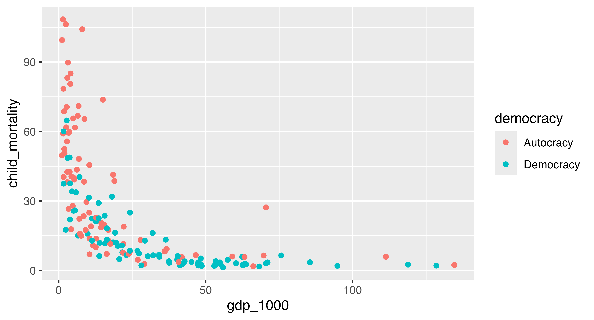

## Data description

For this exercise, you'll work with `vdem`, another trimmed-down version of the [V-Dem (Varieties of Democracy) dataset](https://www.v-dem.net/). It's almost the same as the data from Problem Set 4, with a few extra columns, and GDP per capita and population now come from the World Bank instead of V-Dem. It contains one row for every country between 2010--2025 and includes *a bunch* of columns (you won't use all of these here! I'm giving you a lot here so that you can explore different things in your extension):

- `country_name`: Country name
- `country_id`: V-Dem's internal country ID number
- `year`: Year
- `continent`: Continent
- `region`: World Bank-style region
- `regime_num`: Regimes of the World category: 0 = closed autocracy, 1 = electoral autocracy, 2 = electoral democracy, 3 = liberal democracy
- `regime`: `regime_num`, but as text with nice labels
- `polyarchy`: Electoral democracy index, on a scale of 0 to 1, where 1 is most democratic
- `libdem`: Liberal democracy index, on a scale of 0 to 1, where 1 is most democratic (this is stricter than `polyarchy` and also accounts for things like checks and balances and judicial independence)
- `civil_liberties`: Civil liberties index, on a scale of 0 to 1, where 1 is most free
- `political_liberties`: Political civil liberties index (i.e. freedom of association and expression), on a scale of 0 to 1, where 1 is most free
- `physical_integrity`: Physical violence index (i.e. freedom from torture and political killings by the government), on a scale of 0 to 1, where 1 is most protected
- `rule_of_law`: Rule of law index, on a scale of 0 to 1, where 1 is the strongest rule of law
- `free_expression`: Freedom of expression and alternative sources of information index, on a scale of 0 to 1, where 1 is most free
- `women_empowerment`: Women's political empowerment index, on a scale of 0 to 1, where 1 is most empowered
- `corruption`: Political corruption index, on a scale of 0 to 1, where 1 is most corrupt
- `polyarchy_10`, `libdem_10`, `civil_liberties_10`, `political_liberties_10`, `physical_integrity_10`, `rule_of_law_10`, `free_expression_10`, `women_empowerment_10`, `corruption_10`: The same indexes, but multiplied by 10 so that they range from 0 to 10 instead of 0 to 1
- `gov_effectiveness`: World Bank government effectiveness score (the quality of public services and the civil service), roughly ranging from -2.5 to 2.5, where higher numbers are more effective
- `population`: Population (from the World Bank)
- `gdpPercap`: GDP per capita, adjusted for purchasing power parity, in constant 2021 international dollars (from the World Bank)
- `life_exp`: Life expectancy at birth, in years
- `fertility_rate`: Fertility rate (average number of births per woman)
- `child_mortality`: Child mortality rate (deaths of children under age 5 per 1,000 live births)

::: {.callout-warning}
The `gov_effectiveness` column is missing all values for 2025, and a few countries (like Taiwan, Venezuela, Cuba, and North Korea) don't have World Bank GDP data. To get around these issues, we'll filter this data to only look at 2024.
:::


## Task 0: Load data

Run the chunk below to load the data. You don't need to change any of the code here!

```{r}
#| label: load-libraries-data
#| warning: false
#| message: false

library(tidyverse)
library(moderndive)

vdem <- readRDS("data/vdem_multiple.rds")
```


## Task 1: Explore the data

### Part 1

Create a new dataset named `vdem_2024` that does these things (in this order):

1. Filters `vdem` so that it only includes rows from 2024
2. Removes the handful of countries that are missing GDP per capita (hint: use `drop_na(gdpPercap)`, like you did with penguins in Problem Set 2)
3. Uses `mutate()` to add two new columns:
   - `democracy`, which collapses `regime_num` into two categories: `"Democracy"` when `regime_num` is 2 or 3, and `"Autocracy"` when it's 0 or 1 (just like you did in Problem Sets 3 and 4!)
   - `gdp_1000`, which is `gdpPercap` divided by 1,000 (so a country with a GDP per capita of \$25,000 will have a `gdp_1000` of 25)

`vdem_2024` should have 168 rows. You'll use it for the rest of the problem set.

::: {.callout-note title="Why divide GDP by 1,000?"}
A \$1 increase in GDP per capita is tiny---nobody's life changes because their country gets one dollar richer per person. If you put `gdpPercap` in a regression, its slope will be a really tiny number like 0.00084 that's hard to read and think about (like, "a \$1 increase in GDP per capita is associated with a 0.00084 increase in happiness" or whatever). Measuring GDP in thousands of dollars means a one-unit increase is a \$1,000 increase, which is a more meaningful change, and is easier to think about (like, "a \$1,000 increase in GDP per capita is associated with a 0.84 increase in happiness").
:::

```{r}
#| label: make-vdem-2024

# Do stuff here
```

### Part 2

In multiple regression, you need to pay attention to how your outcome is related to each explanatory variable, *and* how the explanatory variables are related to each other.

Use `select()` to choose these four columns from `vdem_2024`: `child_mortality`, `corruption_10`, `polyarchy_10`, and `gdp_1000`. Then pipe the result into `cor()` to calculate the correlation between every pair of these variables all at once (this is called a *correlation matrix*).

::: {.callout-tip title="Hint!"}
A few countries are missing `child_mortality`, so `cor()` will give you some `NA`s. Add `use = "complete.obs"` to `cor()`, like `cor(use = "complete.obs")`, to make it ignore the missing values. (It's like `na.rm = TRUE`, but `cor()` uses a different name for it.)
:::

Answer these questions:

- Which variable has the strongest relationship with child mortality? Is that relationship positive or negative?
- How strong is the correlation between `polyarchy_10` and `gdp_1000`? In regular words, what does it tell you about democracy and wealth?

```{r}
#| label: correlation-matrix

# Do stuff here
```

**ANSWER HERE**

### Part 3

Use `group_by()` and `summarise()` to calculate the average GDP per capita (`gdp_1000`), the average child mortality rate, and the number of countries for democracies and autocracies. Store this as `democracy_summary`.

It should look like this:

```
# A tibble: 2 × 4
  democracy avg_gdp_1000 avg_child_mortality n_countries
  <chr>            <dbl>               <dbl>       <int>
1 Autocracy         17.7                35.7          83
2 Democracy         34.4                13.1          85
```

Answer this question:

- In Problem Set 4, you found that democracies have much lower child mortality than autocracies. Based on this table, what's another big difference between democracies and autocracies that could help explain that gap?

```{r}
#| label: democracy-summary

# Do stuff here
```

**ANSWER HERE**

### Part 4

Run the code chunk below to see a plot. It shows the relationship between GDP per capita and child mortality in 2024, with each country colored by whether it's a democracy or an autocracy.

```{r}
#| label: recreate-me-1
#| echo: false

if (interactive()) {
  png::readPNG("images/recreate-me-1-1.png") |> grid::grid.raster()
} else {
  
}
```

Use `vdem_2024` and `ggplot()` to recreate the plot above.

Then answer this question:

- Look at countries with similar levels of GDP per capita (e.g., everyone with a GDP per capita of around \$10,000). Does child mortality look different across democracies and autocracies?

```{r}
#| label: make-plot-1

# Do stuff here
```

**ANSWER HERE**


## Task 2: One numeric and one categorical explanatory variable

### Part 1

Here's a simple regression model you ran in Problem Set 4. Use `lm()` to create a model that explains child mortality (y) with `democracy` (x) using `vdem_2024`. Store it as `model_mortality_simple` and use `get_regression_table()` to look at the results.

(The numbers here will be different from what you got in Problem Set 4, since (1) this uses 2024 data and (2) we dropped all the countries that are missing GDP per capita.)

Answer this question:

- Interpret the coefficient for `democracy-Democracy`.

```{r}
#| label: mortality-simple

# Do stuff here
```

**ANSWER HERE**

### Part 2

Now account for wealth. Use `lm()` to create a model that explains child mortality (y) with *both* GDP per capita (`gdp_1000`) and `democracy`. Store it as `model_mortality_gdp` and use `get_regression_table()` to look at the results.

::: {.callout-tip title="Hint!"}
Add more explanatory variables to a model with `+`, like `lm(y ~ x1 + x2, data = whatever)`.
:::

Answer these questions:

- Interpret the coefficient for `gdp_1000`. Remember that this represents \$1,000, not \$1 (so if you're thinking about sliders, like in class, moving a slider up means moving it up by \$1,000).
- Interpret the coefficient for `democracy-Democracy`. Make sure you mention that you're holding GDP per capita constant (e.g., "Holding GDP per capita constant…," "Among countries with the same level of wealth…," or "Controlling for GDP per capita…").
- Interpret the intercept. Which group does it represent? Does it make sense to talk about a country with that value of GDP per capita?

```{r}
#| label: mortality-gdp

# Do stuff here
```

**ANSWER HERE**

### Part 3

Use `ggplot()` to make a scatterplot of the model you just ran, with `gdp_1000` on the x-axis, `child_mortality` on the y-axis, and points colored by `democracy` (this is the plot you made in Task 1, Part 4!). Then add `geom_parallel_slopes(se = FALSE)` to draw the two regression lines from the model.

Answer these questions:

- Why are the two lines parallel? What does the vertical distance between them represent?
- Do straight lines do a good job of fitting these points? Where do they fit badly?
- Write out the equation for the autocracy line and the democracy line, like $\widehat{\text{child mortality}} = b_0 + b_1 \times \text{GDP}$, but with the actual numbers.

```{r}
#| label: mortality-plot

# Do stuff here
```

**ANSWER HERE**

### Part 4

Compare the `democracy-Democracy` coefficient in `model_mortality_simple` with the one in `model_mortality_gdp`.

- How much did the coefficient change?
- Why did it change? Use what you found in Task 1 (the correlation between democracy and GDP and the averages in `democracy_summary`) to explain.

**ANSWER HERE**


## Task 3: Two numeric explanatory variables

In Problem Set 4, you used a regression model to explain corruption with electoral democracy. Use `lm()` to recreate that model using `corruption_10` (y) and `polyarchy_10` (x) with `vdem_2024`. Store it as `model_corruption_simple` and use `get_regression_table()` to look at the results.

Then use `lm()` to create a model that explains `corruption_10` with *both* `polyarchy_10` and `gdp_1000`. Store it as `model_corruption_gdp` and use `get_regression_table()` to look at the results.

Answer these questions:

- Interpret the coefficient for `polyarchy_10` in `model_corruption_simple`.
- Interpret the coefficient for `polyarchy_10` in `model_corruption_gdp`. Remember to mention what you're holding constant or controlling for!
- Interpret the coefficient for `gdp_1000` in `model_corruption_gdp`. Since the number is pretty small, also describe what would happen with a \$10,000 increase in GDP per capita.
- How did the coefficient for `polyarchy_10` change when you added GDP per capita to the model?

```{r}
#| label: corruption-models

# Do stuff here
```

**ANSWER HERE**

## Task 4: One numeric and one categorical explanatory variable with lots of categories

### Part 1

Use `group_by()` and `summarise()` to calculate the average corruption (`corruption_10`), the average electoral democracy score (`polyarchy_10`), and the number of countries in each region. Store this as `corruption_region`.

It should look like this:

```
# A tibble: 7 × 4
  region                                avg_corruption_10 avg_polyarchy_10 n_countries
  <chr>                                             <dbl>            <dbl>       <int>
1 East Asia & Pacific                                4.41             4.76          21
2 Europe & Central Asia                              3.27             6.38          49
3 Latin America & Caribbean                          4.68             6.37          23
4 Middle East, North Africa, Afghanist…              5.19             2.63          21
5 North America                                      0.405            8.42           2
6 South Asia                                         5.4              5.16           6
7 Sub-Saharan Africa                                 6.22             3.92          46
```

Answer this question:

- On average, is the Middle East, North Africa, Afghanistan & Pakistan region more or less corrupt than East Asia & Pacific? By how much? How about Europe & Central Asia compared to East Asia & Pacific?

```{r}
#| label: corruption-region-summary

# Do stuff here
```

**ANSWER HERE**

### Part 2

Use `lm()` to create a model that explains `corruption_10` with `polyarchy_10` and `region`. Store it as `model_corruption_region` and use `get_regression_table()` to look at the results.

Answer these questions:

- Which region is the baseline category?
- Interpret the coefficient for `polyarchy_10`.
- Interpret the coefficients for Middle East, North Africa, Afghanistan & Pakistan and for Europe & Central Asia. Remember that these are relative to the baseline region *and* that you're holding democracy constant / controlling for democracy.
- Compare these two coefficients to the differences you calculated in Part 1. What changed? Why? (Hint: look at `avg_polyarchy_10` in `corruption_region`.)

```{r}
#| label: corruption-region-model

# Do stuff here
```

**ANSWER HERE**

## Task 5: Extension

Copy the code from a previous task and paste it into the chunk below. Do something extra to it. Here are some ideas!

- Add a 3rd or 4th explanatory variable to one of the models (e.g., `lm(child_mortality ~ gdp_1000 + democracy + region, data = vdem_2024)`) and see how the coefficients change
- Use `regime` (with 4 categories) instead of `democracy` in `model_mortality_gdp` and interpret the coefficients
- Use different variables to explain `life_exp`, `women_empowerment_10`, or `physical_integrity_10`
- Put both `polyarchy_10` and `civil_liberties_10` in a model explaining corruption. Look at the correlation between those two variables first. What happens to the coefficients? Why might that be?
- Filter the data to a single region or continent and run one of the models again
- Anything else!

**This is your chance to play around and explore---have fun!**

```{r}
#| label: extension

# Do stuff here
```
