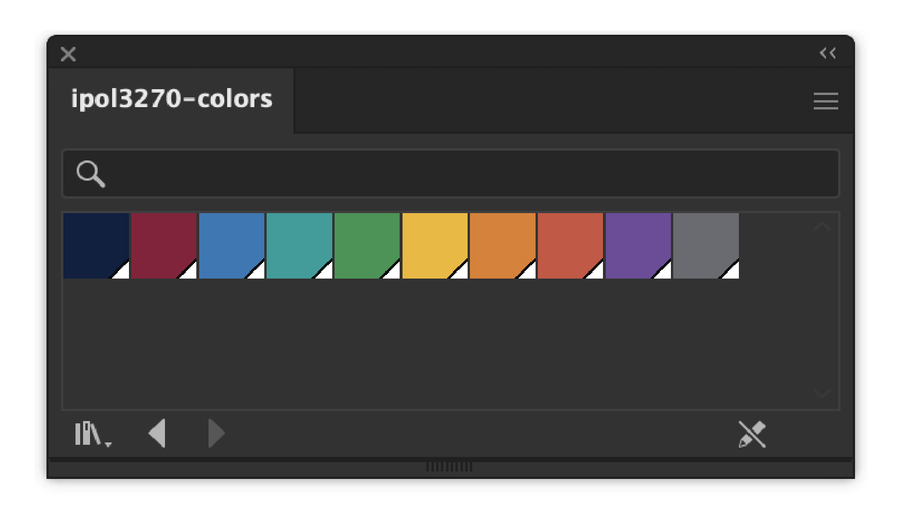
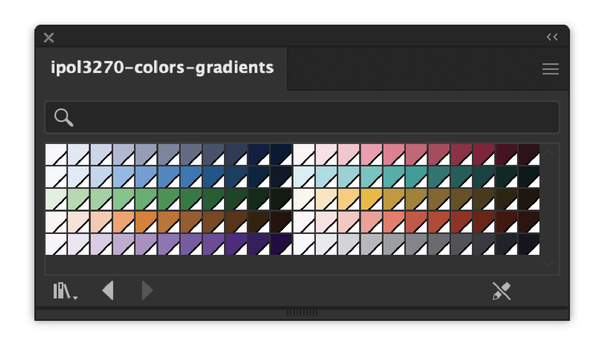

```{r}
#| warning: false
#| message: false

library(tidyverse)
library(colorspace)
library(ggtext)
library(svglite)
library(swatches)  # https://github.com/hrbrmstr/swatches

clrs <- c(
  navy = "#041E42",   # Georgetown blue
  maroon = "#8A1538", # Qatar Al Adaam maroon
  blue = "#2878B5",   # Lighter version of CARTOColors Prism's #1D6996
  teal = "#009E9A",   # Adjusted from Prism's #38A6A5
  green = "#2D934F",  # In between Prism's #0F8554 and #73AF48
  gold = "#F2B701",   # From CARTOColors Bold
  orange = "#E17C05", # From Prism
  red = "#CC503E",    # From Prism
  purple = "#6F4C9B", # Adjusted from Prism's #5F4690
  # Use hue from Navy, but desaturate it (low chroma) and set lightness to 45%
  # navy_hue <- coords(as(hex2RGB("#041E42"), "polarLUV"))[, "H"]
  # nice_navy_ish_gray <- hex(polarLUV(L = 50, C = 4, base_hue), fixup = TRUE)
  gray = "#696A6F"
)

time_updated <- format(
  lubridate::now(tzone = "Asia/Qatar"),
  "%F at %T Arabian Standard Time"
)

time_utc <- format(
  lubridate::now(tzone = "UTC"),
  "%FT%TZ UTC"
)
```

::: {.dictionary-entry}

[colophon]{.headword} [(noun)]{.part-of-speech}

[col&thinsp;•&thinsp;o&thinsp;•&thinsp;phon&emsp;/ˈkä-lə-fən, -fän/&emsp;/ˈkɒləfən, -fɒn/]{.pronunciation}

1. an inscription at the end of a book or manuscript containing information about its production
2. this page

:::

## Technology

- **Last built**: `{r} time_updated` ([`{r} time_utc`]{.small})
- **Software**: Quarto version  and  `{r} R.version$version.string`
- **Code**: The source for the site is available at  [GitHub](https://www.github.com/andrewheiss/quantf26.classes.andrewheiss.com). All the packages are managed with {renv} with [this `renv.lock` lockfile](https://github.com/andrewheiss/quantf26.classes.andrewheiss.com/blob/main/renv.lock). 

Here's a bunch of more technical detail for the morbidly curious:

```{r}
#| echo: true
#| code-fold: true
#| code-summary: "Show `sessioninfo::session_info()`"
#| collapse: true

sessioninfo::session_info(
  pkgs = names(renv::lockfile_read(here::here("renv.lock"))$Packages)
)
```

```{r}
#| echo: true
#| code-fold: true
#| code-summary: "Show Quarto extensions"
#| collapse: true

quarto::quarto_list_extensions() |> 
  filter(str_detect(Id, "/"))
```

## Design

The typography, colors, and custom CSS settings are all controlled with [this `_brand.yml` file](https://github.com/andrewheiss/quantf26.classes.andrewheiss.com/blob/main/_brand.yml):

<details>
<summary>Show `_brand.yml` for this site</summary>

```{.yaml filename="_brand.yml"}

```

</details>

[(See more about brand.yml [here](https://posit-dev.github.io/brand-yml/)).]{.small}


### Typefaces

I use [Atkinson Hyperlegible Next](https://www.brailleinstitute.org/freefont/) [([Google Fonts](https://fonts.google.com/specimen/Atkinson+Hyperlegible+Next?preview.script=Latn))]{.small} as the main body font throughout the site. It was developed by the Braille Institute to improve legibility, readability, and accessibility. I use [Charis SIL](https://en.wikipedia.org/wiki/Charis_SIL){style="font-family: 'Charis SIL'"} [([Google Fonts](https://fonts.google.com/specimen/Charis+SIL))]{.small} for all headings.

::: {.font-example}
[A heading]{.fake-heading}

Whereas recognition of the *inherent dignity* and of the ***equal and inalienable*** rights of all members of the human family is the foundation of freedom, justice and peace in the world…
:::

### Colors

I use a bunch of colors for this course website. The two main colors are [Georgetown Blue](https://www.georgetown.edu/color-guide/) (` `{r} I(clrs[[1]])` `) and [Al Adaam Maroon](https://www.qatar.qa/en/qatar/al-adaam/) (` `{r} I(clrs[[2]])` `), Qatar's national color. The other colors come largely from CARTOColors's [Prism palette](https://carto.com/carto-colors/), with some tweaks I made by hand in a color picker.

```{r}
#| label: build-ramp
#| warning: false
#| message: false

# Choose what percentage of lightness each step should use
# I basically borrowed the percentages at https://color-ramp.com/index-hsl
l_targets <- c(
  `50` = 97,
  `100` = 92,
  `200` = 85,
  `300` = 75,
  `400` = 65,
  `500` = 55,
  `600` = 45,
  `700` = 35,
  `800` = 25,
  `900` = 14,
  `950` = 7
)

make_ramp <- function(base_hex) {
  base_hex <- unname(base_hex)

  # Convert to HCL
  hcl <- coords(as(hex2RGB(base_hex), "polarLUV"))
  H_base <- hcl[, "H"]
  C_base <- hcl[, "C"]
  L_base <- hcl[, "L"]

  # Find the target lightness that's closest to the current color's actual lightness
  anchor_step <- names(l_targets)[which.min(abs(l_targets - L_base))]

  # Find which step to use as the text color when the background is lighter.
  # Originally I did this so that the text color was the base color, which was
  # nice and easy, but lots of the colors (red, gold, and orange in particular)
  # had awful contrast ratios, so the text needed to be a darker shade.
  #
  # The general rule here is that text can never be lighter than 700. If the
  # base color is 700 or higher, just use the base color; if the base color is
  # lighter than 700, then use 700. Step names double as their own numeric
  # lightness labels, so this is just a max() rather than an index lookup.
  text_step <- as.character(max(as.integer(anchor_step), 700))

  # Loop through all the target lightness values and build a good color given
  # the lightness and chroma
  ramp <- map_chr(l_targets, function(L) {
    # This will figure out a good chroma (saturation/vividness) value (C) based
    # while holding the hue (H) constant. Basically, it'll use the original base
    # color's C unless it doesn't fit well given the intendend L, in which case
    # it'll shift the C downward
    C <- min(C_base, max_chroma(H_base, L, floor = TRUE))

    # Create the actual color with the target L, the adjusted C (if it needed to
    # be adjusted), and the original H
    hex(polarLUV(L, C, H_base), fixup = TRUE)
  })

  # Clean up the colors and names and mark which anchor point is the actual color
  ramp[anchor_step] <- toupper(base_hex)
  ramp <- toupper(ramp)
  text_hex <- unname(ramp[text_step])

  # Return a bunch of stuff
  list(
    ramp = ramp,
    anchor = anchor_step,
    text_step = text_step,
    text_hex = text_hex,
    contrast_white = contrast_ratio(ramp, "#FFFFFF"),
    contrast_text = contrast_ratio(ramp, text_hex)
  )
}

ramps <- map(clrs, make_ramp)
anchors <- map_chr(ramps, "anchor")

ramps_df <- ramps |>
  map(\(x) {
    tibble(
      darkness = names(x$ramp),
      hex = x$ramp,
      contrast_white = x$contrast_white,
      contrast_text = x$contrast_text,
      text_hex = x$text_hex
    )
  }) |>
  list_rbind(names_to = "color") |>
  mutate(base = darkness == anchors[as.character(color)]) |>
  mutate(
    color = str_to_title(color),
    color = replace_values(
      color,
      "Navy" ~ "Georgetown\nBlue",
      "Maroon" ~ "Al Adaam\nMaroon"
    )
  ) |>
  mutate(across(c(color, darkness), \(x) fct_inorder(x))) |>
  mutate(
    contrast = pmax(contrast_white, contrast_text),
    text_color = ifelse(contrast_white >= contrast_text, "#FFFFFF", text_hex)
  ) |>
  mutate(
    contrast_rating = case_when(
      contrast >= 7 ~ "AAA",
      contrast >= 4.5 ~ "AA",
      TRUE ~ ""
    ),
    contrast_nice = str_glue("{contrast_rating} {round(contrast, 2)}:1"),
    label_full = str_glue(
      "{hex}<br><span style='font-size: 8pt'>{contrast_nice}</span>"
    )
  )

clrs_df <- enframe(clrs, name = "name", value = "color") |>
  mutate(x = str_glue("[{1:n()}]")) |>
  mutate(
    name = str_to_title(name),
    name = replace_values(
      name,
      "Navy" ~ "Georgetown\nBlue",
      "Maroon" ~ "Al Adaam\nMaroon"
    )
  )
```

```{r}
#| label: show-colors
#| fig-width: 6
#| fig-height: 2
#| fig-align: center
#| out-width: 100%

clrs_df |>
  mutate(full_label = fct_inorder(str_glue("{color}\n{name}"))) |>
  mutate(x = fct_inorder(x)) |>
  ggplot(aes(x = full_label, y = 1, fill = color)) +
  geom_tile() +
  scale_x_discrete(expand = c(0, 0)) +
  scale_fill_identity() +
  facet_wrap(vars(x), scales = "free_x", nrow = 2) +
  theme_void(base_size = 10.5, base_family = "Atkinson Hyperlegible Next") +
  theme(
    panel.spacing.x = unit(-1, units = "pt"),
    panel.spacing.y = unit(1, units = "lines"),
    axis.text.x = element_text(size = rel(0.8), vjust = 1)
  )
```

```{r}
#| results: asis

clrs_df |> 
  mutate(name = str_replace(name, "\\n", " ")) |> 
  mutate(nice = str_glue("{name} (`{color}`)")) |> 
  pull(nice) |> 
  pander::pandoc.list(style = "ordered")
```

I also use a whole [color ramp system](https://uxdesign.cc/how-to-create-a-color-ramp-used-in-design-systems-2edd5b93854c) with shades that work well for accessibility:

```{r}
#| label: show-ramps
#| column: screen
#| classes: col-bg-white
#| fig-width: 12
#| fig-height: 9
#| fig-align: center
#| out-width: 90%

ggplot(ramps_df, aes(x = darkness, y = fct_rev(color), fill = hex)) +
  geom_tile(width = 0.95, height = 0.95) +
  # geom_tile(
  #   data = filter(ramps_df, base),
  #   fill = NA,
  #   color = "grey50",
  #   linewidth = 1.5
  # ) +
  geom_point(
    data = filter(ramps_df, base),
    color = "white",
    fill = scales::alpha("white", 0.5),
    pch = 21,
    size = 4,
    position = position_nudge(y = 0.32)
  ) +
  geom_richtext(aes(
    label = label_full,
    color = text_color,
    fill = NA,
    label.color = NA,
    family = "Atkinson Hyperlegible Next"
  )) +
  scale_fill_identity() +
  scale_color_identity() +
  theme_void(base_family = "Atkinson Hyperlegible Next") +
  theme(axis.text = element_text(), axis.text.y = element_text(hjust = 1))
```

### Swatches

```{r}
clrs |>
  hex_to_ase("global") |>
  ase_encode() |>
  writeBin(here::here("files", "swatches", "ipol3270-colors.ase"))

ramps |>
  imap(\(x, ramp_name) set_names(x$ramp, paste0(ramp_name, "-", names(x$ramp)))) |>
  list_c() |> 
  hex_to_ase("global") |>
  ase_encode() |>
  writeBin(here::here("files", "swatches", "ipol3270-colors-gradients.ase"))
```

These colors are available as Adobe swatch files (ASE) that can be opened in Adobe programs like Illustrator, InDesign, and Photoshop, as well as the non-Adobe [Affinity](https://www.affinity.studio/) [(thanks to the neat [{swatches}](https://github.com/hrbrmstr/swatches) package; [see code here](https://github.com/andrewheiss/quantf26.classes.andrewheiss.com/blob/main/resource/colophon.qmd))]{.small}.

:::: {.grid}

::: {.g-col-12 .g-col-md-6 .text-center}
[{width="90%"}](/files/swatches/ipol3270-colors.ase)

<p style="line-height: 2.5"><a class="btn btn-success" target="_blank" href="/files/swatches/ipol3270-colors.ase"> &ensp;**ipol3270-colors.ase**</a></p>
:::

::: {.g-col-12 .g-col-md-6 .text-center}
[{width="90%"}](/files/swatches/ipol3270-colors-gradients.ase)

<p style="line-height: 2.5"><a class="btn btn-success" target="_blank" href="/files/swatches/ipol3270-colors-gradients.ase"> &ensp;**ipol3270-colors-gradients.ase**</a></p>
:::

::::


### `color` section for `_brand.yml`

Because there are so many possible colors, I use code to generate the `color: ` section of `_brand.yml` and manually copy/paste it into my official `_brand.yml` file. See the [full R code in all its messy glory here](https://github.com/andrewheiss/quantf26.classes.andrewheiss.com/blob/main/resource/colophon.qmd).

```{r}
#| label: brand-yaml

# k cool, super fun times here
#
# Since there are so many colors, I auto generate the `color:` section of 
# _brand.yml here, with entries that look like this:
#
# color:
#   palette:
#     navy: &navy "#041E42"
#     navy-50: "#F4F6FF"
#     navy-100: "#E1E8FF"
#     navy-200: &navy-light "#CCD4EE"
#     navy-300: "#B0B8D2"
#     ...
#     navy-900: *navy
#     navy-950: "#001534"
#     navy-light: *navy-light
#     navy-text: *navy
#
# In that case, navy-900 is the base color and navy-200 is the light version 
# (since all the light versions are -200; see below), so they get helpful little 
# anchor shortcuts like `&navy` and `navy-light`. Those get reused elsewhere as 
# aliases (i.e. `*navy` and `*navy-light`) in navy-900 (so it's not duplicated) 
# and in the light and text versions
#
# {yaml12} and {yaml} are great for converting R lists into YAML and dealing
# with indentation and escaping, etc., but neither support things like anchors,
# aliases, or comments, so it's easier to just build the YAML manually with
# str_glue()
#
# (I originally tried this with {yaml12} and had to do a bunch of
# post-processing with regex to convert YAML entries like `"&navy #041E42"` 
# to `&navy "#041E42"`) and it was sooo convoluted

# Some helper functions to build YAML values
yaml_entry <- function(value) {
  str_glue("\"{value}\"")
}

yaml_anchor <- function(name, value) {
  str_glue("&{name} \"{value}\"")
}

yaml_alias <- function(name) {
  str_glue("*{name}")
}

yaml_comment <- function(text, indent = 4) {
  str_c(strrep(" ", indent), "# ", text)
}

collapse_entries <- function(x, indent = 4) {
  str_c(strrep(" ", indent), names(x), ": ", unname(x), collapse = "\n")
}


# Build all the color ramp entries

# All the "-light" versions of the colors use step 200
light_step <- "200"

# Figure out which anchor name should be used for the -light and -text versions 
# of each color. Often it's just name-light or name-text (like for navy, it's 
# `navy-light: *navy-light`), but sometimes it's not (like for navy it's 
# `navy-text: *navy`), so we have to figure that out first here
alias_targets <- imap(ramps, \(x, name) {
  list(
    light = if (light_step == x$anchor) name else str_glue("{name}-light"),
    text  = if (x$text_step == x$anchor) name else str_glue("{name}-text")
  )
})

# Function for building all the entries for one color
build_color <- function(x, name, targets) {
  ramp_lines <- imap_chr(x$ramp, \(hex, step) {
    key <- str_glue("{name}-{step}")

    anchor_name <- case_when(
      # gray-50 and gray-950 are special and need aliases for off-white/black
      name == "gray" && step == "50" ~ "off-white",
      name == "gray" && step == "950" ~ "off-black",
      # Figure out the step name; if this is a -light or -text color, append
      # that to the name
      step == x$anchor ~ name,
      step == light_step && step != x$anchor ~ str_glue("{name}-light"),
      step == x$text_step && step != x$anchor ~ str_glue("{name}-text"),
      .default = NA_character_
    )

    # Create the actual entries
    value <- case_when(
      is.na(anchor_name) ~ yaml_entry(hex),
      anchor_name == name ~ yaml_alias(name),
      .default = yaml_anchor(anchor_name, hex)
    )

    str_glue("    {key}: {value}")
  })

  c(
    # Comment with name
    yaml_comment(str_to_title(name)),
    # Main base color
    str_glue("    {name}: {yaml_anchor(name, x$ramp[[x$anchor]])}"),
    # All the ramp entries
    ramp_lines,
    # The -light version of the color
    str_glue("    {name}-light: {yaml_alias(targets$light)}"),
    # The -text version of the color
    str_glue("    {name}-text: {yaml_alias(targets$text)}")
  ) |>
    str_c(collapse = "\n")
}

# Loop through all the colors and build their ramps
color_entries <- imap_chr(
  ramps,
  \(x, name) build_color(x, name, alias_targets[[name]])
) |>
  str_c(collapse = "\n\n")


# I want to include a few extra neutral colors into the palette too, like
# pure white, off-white (gray50) and off-black (gray950), and pure black.

neutral_colors <- c(
  white = yaml_entry("#FFFFFF"),
  `off-white` = yaml_alias("off-white"),
  `off-black` = yaml_alias("off-black"),
  black = yaml_entry("#000000")
)

neutral_entries <- str_c(
  yaml_comment("Neutrals"),
  collapse_entries(neutral_colors),
  sep = "\n"
)

# To make all this more reusable, I like having aliases like clr-1, clr-2, etc. 
# so I can use those classes in slides and have the slide deck automatically 
# adjust to new color palettes without needing to update literal names like 
# "navy" and "maroon"
#
# This makes clr-n, clr-n-light, and clr-text entries with aliases to their 
# correspding entry names
numbered_entries <- str_c(
  yaml_comment("Numbered aliases"),

  # clr-1, clr-2, ...
  str_c(
    "    clr-",
    seq_along(clrs),
    ": ",
    map_chr(names(clrs), yaml_alias),
    collapse = "\n"
  ),

  "",

  # clr-1-light, clr-2-light, ...
  str_c(
    "    clr-",
    seq_along(clrs),
    "-light: ",
    map_chr(alias_targets, "light") |>
      map_chr(yaml_alias),
    collapse = "\n"
  ),

  "",

  # clr-1-text, clr-2-text, ...
  str_c(
    "    clr-",
    seq_along(clrs),
    "-text: ",
    map_chr(alias_targets, "text") |>
      map_chr(yaml_alias),
    collapse = "\n"
  ),

  sep = "\n"
)

# Phew, all done with the `color: palette:` section. 
#
# This is all stuff in the larger `color:` section and refers to names defined 
# up there instead of working with aliases and anchors
#
# Set Bootstrap theme things
bootstrap_colors <- c(
  primary   = "navy",
  secondary = "maroon",
  tertiary  = "teal",
  success   = "green",
  info      = "blue",
  warning   = "gold",
  danger    = "red"
)

bootstrap_general <- c(
  foreground = "off-black",
  background = "white",
  light = "navy-light",
  dark = "off-black"
)

bootstrap_entries <- str_c(
  yaml_comment("Bootstrap things", indent = 2),
  collapse_entries(bootstrap_colors, indent = 2),
  "",
  collapse_entries(bootstrap_general, indent = 2),
  sep = "\n"
)

# FINALLY build the full nested list! This mirrors this kind of structure:
#
# color:
#   palette:
#     (all the colors and ramps and stuff here)
#   
#   foreground: BLAH
#   background: BLAH
#
#   primary: BLAH
#   secondary: BLAH
#   success: BLAH
#
brand_yaml <- str_c(
  "color:",
  "  palette:",
  color_entries,
  "",
  neutral_entries,
  "",
  numbered_entries,
  "",
  bootstrap_entries,
  sep = "\n"
)

# Save as YAML
# writeLines(brand_yaml, "_brand_color.yml")
```

```{r}
#| results: asis

cat(
  "<details><summary><code>_brand.yml</code> color section</summary>\n\n",
  "```yaml\n", brand_yaml, "\n```\n\n",
  "</details>",
  sep = ""
)
```

## License and credits

All the materials and content for this course are licensed under [ Creative Commons CC-BY-SA  ](https://github.com/andrewheiss/quantf26.classes.andrewheiss.com/blob/main/LICENSE.md). Use whatever you want!
