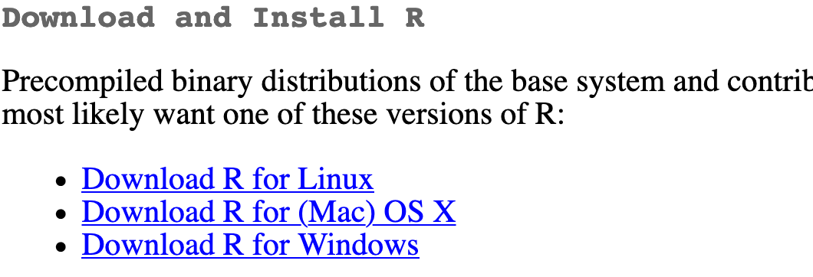
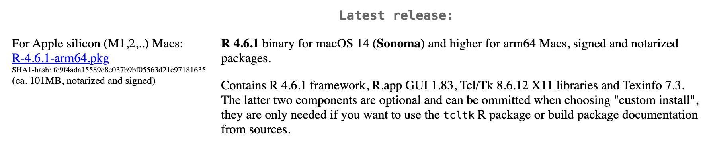
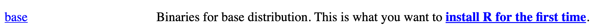
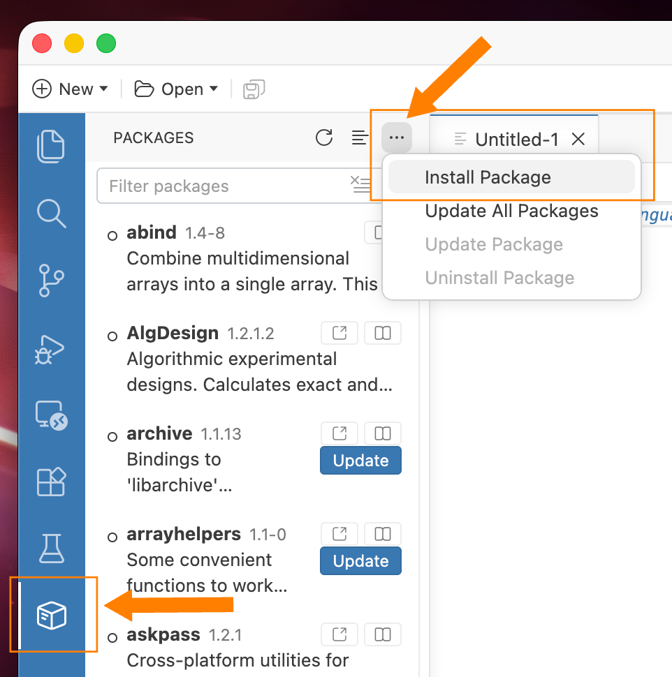
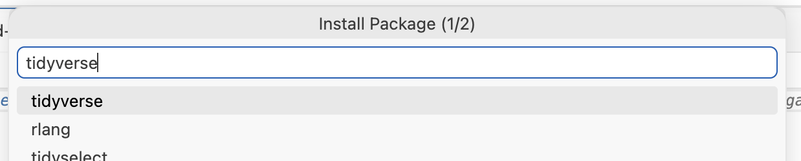

```{r setup, include=FALSE}
library(knitr)

knitr::opts_chunk$set(fig.align = "center")
```

You will do all of your work in this class with the open source (and free!) programming language [R](https://cran.r-project.org/). You will use [Positron](https://positron.posit.co/) as the main program to access R. Think of R as an engine and Positron as a car dashboard—R handles all the calculations and the actual statistics, while Positron provides a nice interface for running R code.

Here's how you install all these things

### Install R

First you need to install R itself (the engine).

1. Go to the CRAN (Collective R Archive Network) website: <https://cran.r-project.org/>
2. Click on "Download R for `XXX`", where `XXX` is either Mac or Windows:

   {width="50%" fig-align="center" .border}

   - If you use macOS, scroll down to the first `.pkg` file in the list of files and download it.

     {width="90%" fig-align="center" .border}

   - If you use Windows, click "base" (or click on the bolded "install R for the first time" link) and download it.

     {width="90%" fig-align="center" .border}

3. Double click on the downloaded file (check your `Downloads` folder). Click yes through all the prompts to install like any other program.

4. Extra final steps

   - If you use macOS, [download and install XQuartz](https://www.xquartz.org/). You do not need to do this on Windows.
   - If you use Windows, [download and install RTools 4.5](https://cran.r-project.org/bin/windows/Rtools/). You do not need to do this on macOS.


### Install Positron

Next, you need to install Positron, the nicer graphical user interface (GUI) for R (the dashboard). Once R and Positron are both installed, you can ignore R and only use Positron. Positron will use R automatically and you won't ever have to interact with it directly.

1. Go to the "Download Positron" page: <https://positron.posit.co/download.html>
2. The website should automatically detect your operating system (macOS or Windows) and show a big download button for it. If not, scroll down a little to the "All platforms" section and choose the download for your operating system.
3. Double click on the downloaded file (again, check your `Downloads` folder). Click yes through all the prompts to install like any other program.

Double click on Positron to run it (check your applications folder or start menu).


### Install {tidyverse}

R packages are easy to install with Positron. Select the Packages pane, click on the three dots (…) in the top right corner, select "Install Package", and type the name of the package you want to install, and press enter.

{width="50%" fig-align="center" .border}

{width="80%" fig-align="center" .border}


### Install TinyTeX

When you render to PDF, R uses a special scientific typesetting program named LaTeX (pronounced "lay-tek" or "lah-tex"; for goofy nerdy reasons, the x is technically the "ch" sound in "Bach", but most people just say it as "k"—saying "layteks" is frowned on for whatever reason).

LaTeX is neat and makes pretty documents, but it's a huge program—[the macOS version, for instance, is nearly 4 GB](https://tug.org/mactex/mactex-download.html)! To make life easier, there's a smaller version named [TinyTeX](https://yihui.org/tinytex/) that automatically deals with differences between macOS and Windows *and* automatically installs any missing LaTeX packages as needed.

Here's how to install TinyTeX so you can create pretty PDFs:

1. Open the Terminal pane in Positron
2. Type this:

   ``` bash
   quarto install tinytex
   ```
