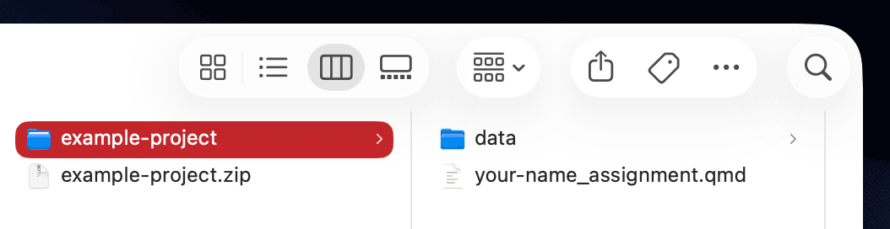
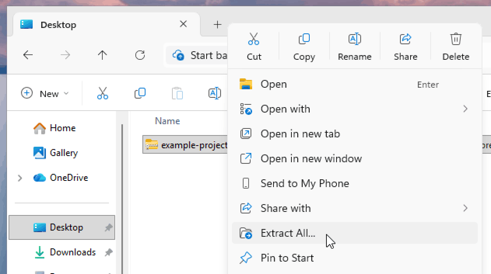
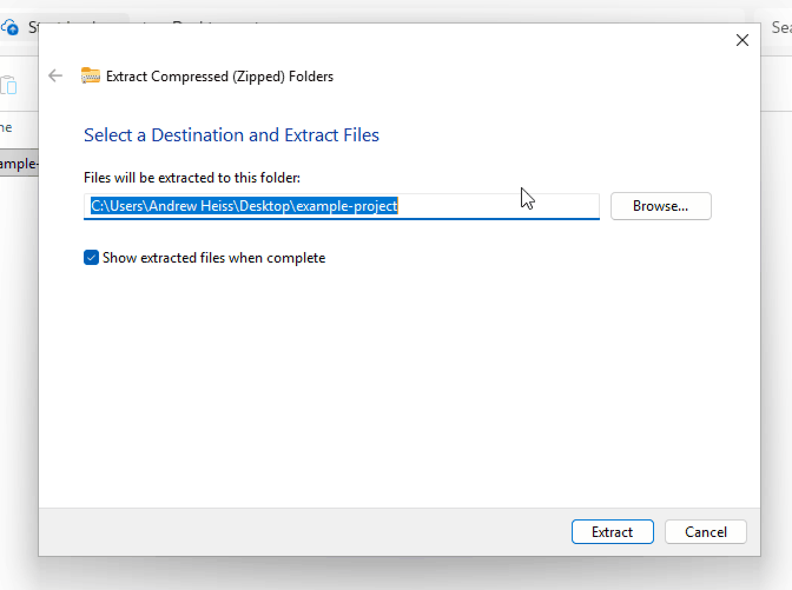
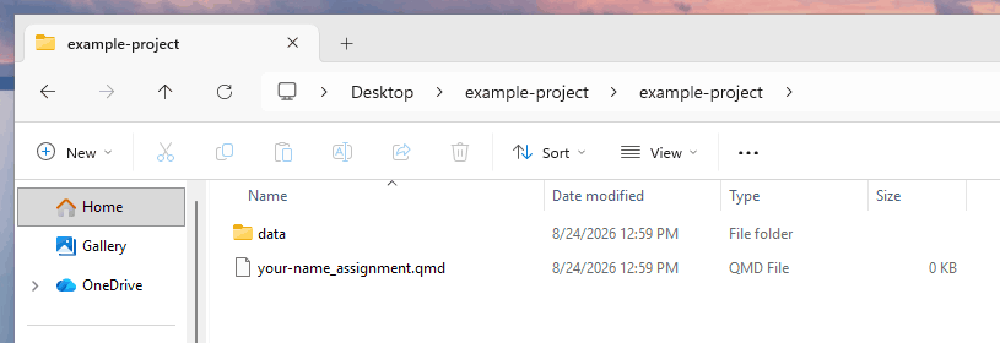

```{r setup, include=FALSE}
knitr::opts_chunk$set(
  fig.align = "center"
)
```

Because R projects typically consist of multiple files (R scripts, datasets, graphical output, etc.) the easiest way to distribute them to you for examples, assignments, and projects is to combine all the different files in to a single compressed collection called a **zip file**. When you unzip a zipped file, your operating system extracts all the files that are contained inside into a new folder on your computer.

Unzipping files on macOS is trivial, but unzipping files on Windows can mess you up if you don't pay careful attention. Here's a helpful guide to unzipping files on both macOS and Windows.


## Unzipping files on macOS

Double click on the downloaded `.zip` file. macOS will automatically create a new folder with the same name as the `.zip` file, and all the file's contents will be inside. Drag the folder to the Positron icon in the dock to get started.

{width="70%" .border fig-align="center"}

## Unzipping files on Windows

***tl;dr**: Right click on the `.zip` file, select "Extract All…", and work with the resulting unzipped folder.*

Unlike macOS, Windows does *not* automatically unzip things for you. If you double click on the `.zip` file, Windows will show you what's inside, but it will do so without actually extracting anything. This ~~can be~~ is incredibly confusing! 

Instead, you need to right click on the `.zip` file and select "Extract All…":

{width="70%" .border fig-align="center"}

Then choose where you want to unzip all the files and click on "Extract"

{width="70%" .border fig-align="center"}

You should then finally have a real folder with all the contents of the zipped file. Open that folder in Positron and you'll be good to go.

{width="70%" .border fig-align="center"}
