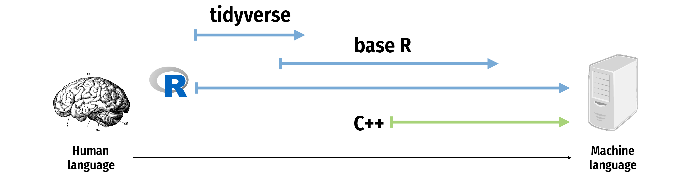
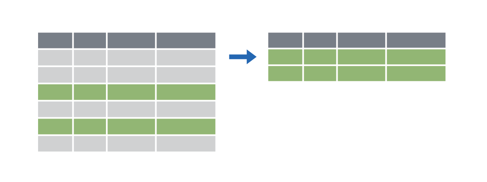
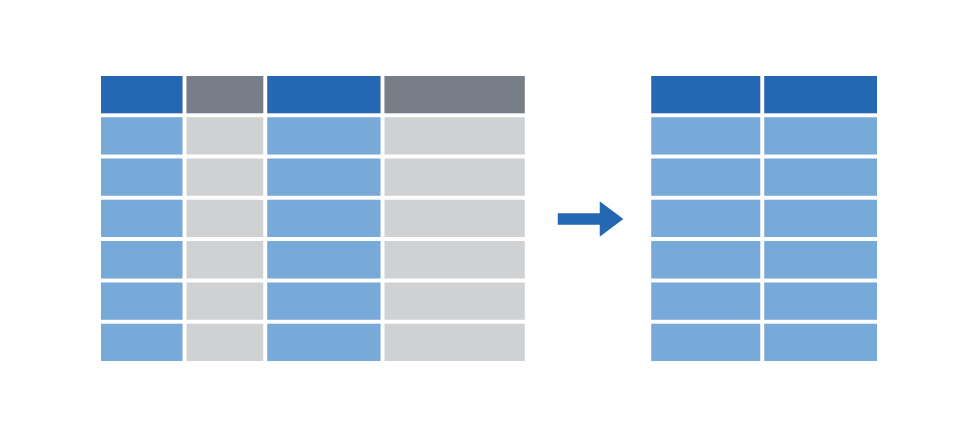
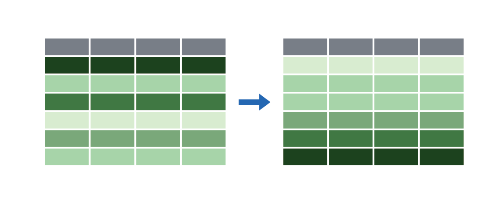
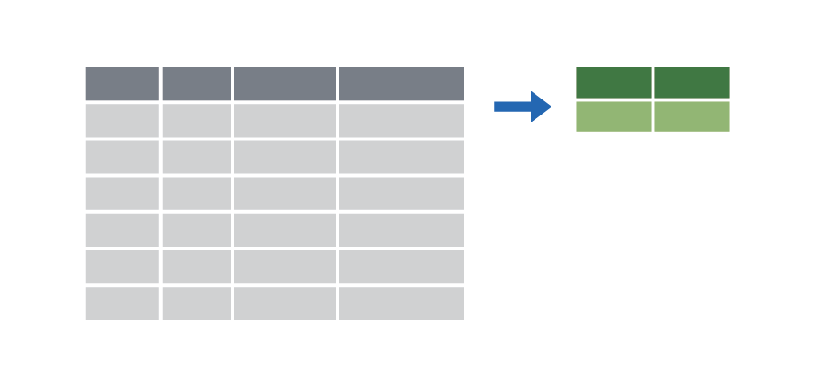
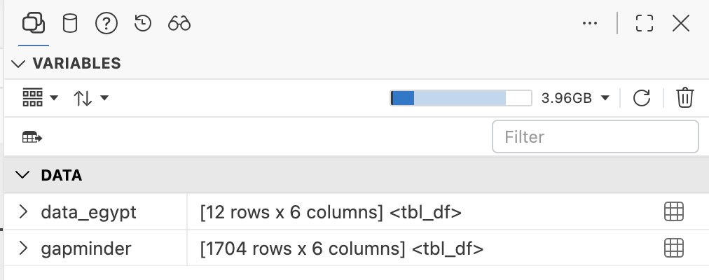

```{r}
#| label: setup
#| include: false

library(tidyverse)
library(gapminder)
library(tinytable)
library(countdown)
```

## Plan for today

::: {.incremental}
- Manipulating data with {dplyr}
- `filter()`
- `select()`
- `arrange()`
- `mutate()`
- Multiple verbs and pipes
- `summarise()`
- `group_by()`
:::

# Manipulating data with {dplyr} {background-color="" background-image="/slides/img/background-hex-shapes.svg" background-opacity="0.25"}

## Your turn #0: Load data {background-color="" background-image="/slides/img/background-hex-shapes.svg" background-opacity="0.25"}

1. Run the setup chunk
2. Take a look at the `gapminder` data

```{r}
#| label: clock-0
#| echo: false

countdown(minutes = 2, seconds = 0, play_sound = TRUE, warn_when = 1 * 60)
```

## The `gapminder` data {.small .clr-1}

```{r}
#| echo: true

gapminder
```

## The tidyverse {.clr-1}

{fig-align="center" width="100%" .shadow}

::: {.notes}
From "Master the Tidyverse" by RStudio
:::

## The tidyverse {.clr-1}

{fig-align="center" width="50%" .shadow}

## {dplyr}: verbs for data {.clr-1}

```{r}
tribble(
  ~task, ~img,
  "Extract rows with `filter()`", "",
  "Extract columns with `select()`", "",
  "Arrange/sort rows with `arrange()`", "",
  "Make new columns with `mutate()`", "",
  "Make group summaries with<br>`group_by() |> summarise()`", ""
) |> 
  tt(width = c(0.75, 0.25), colnames = FALSE) |> 
  format_tt(markdown = TRUE) |> 
  style_tt(fontsize = 1) |> 
  theme_html(class = "tinytable tinytable-striped no-img-margin shadow")
```

# `filter()` {background-color="" background-image="/slides/img/background-hex-shapes.svg" background-opacity="0.25"}

## `filter()` {.clr-4}

Extract rows that meet some sort of test

:::: {.columns}

::: {.column width="48%"}
```{r}
#| echo: true
#| eval: false
#| flourish:
#|   - target: "DATA"
#|     style: "background-color: var(--hl-1);"
#|   - target-rx: "[.][.][.]"
#|     style: "background-color: var(--hl-2);"

filter(
  DATA, 
  ...
)
```
:::

::: {.column width="48%"}
- **[`DATA`]{.bg-hl-1}** = Data frame to transform
- **[`...`]{.bg-hl-2}** = One or more tests
  ([`filter()`]{.small} returns each row for which the test is TRUE)
:::

::::

##

```{r}
#| echo: true
#| eval: false
#| flourish:
#|   - target: "gapminder"
#|     style: "background-color: var(--hl-1);"
#|   - target: 'country == \u0022Egypt\u0022'
#|     style: "background-color: var(--hl-2);"

filter(gapminder, country == "Egypt")
```

:::: {.columns}

::: {.column width="48%"}
```{r}
#| echo: false

gapminder |>
  select(country, continent, year) |>
  head(5) |>
  mutate(year = as.character(year)) |>
  bind_rows(tibble(country = "…", continent = "…", year = "…")) |>
  tt() |> 
  style_tt(fontsize = 0.8) |> 
  theme_html(class = "shadow")
```
:::

::: {.column width="48%" .fragment}
```{r}
#| echo: false

gapminder |>
  select(country, continent, year) |>
  filter(country == "Egypt") |>
  head(6) |>
  tt() |> 
  style_tt(fontsize = 0.8) |> 
  theme_html(class = "shadow")
```
:::

::::

## Assignment {.clr-4}

::: {.fragment}
What's the difference here?
:::

::: {.fragment}
```{.r}
filter(gapminder, country == "Egypt")
```

```{.r}
data_egypt <- filter(gapminder, country == "Egypt")
```
:::

## `<-` {.clr-4}

`<-` assigns the output from the righthand side to an object with the name on the lefthand side

```{.r}
data_egypt <- filter(gapminder, country == "Egypt")
```

{fig-align="center" width="70%" .shadow}


## `filter()` {.clr-4}

:::: {.columns}

::: {.column width="48%"}
```{r}
#| echo: true
#| eval: false
#| flourish:
#|   - target: "gapminder"
#|     style: "background-color: var(--hl-1);"
#|   - target: 'country == \u0022Egypt\u0022'
#|     style: "background-color: var(--hl-2);"

filter(
  gapminder,
  country == "Egypt"
)
```

:::

::: {.column width="48%"}
One `=` sets an argument

Two `==` tests if equal ([returns TRUE or FALSE]{.small})
:::

::::

## Logical tests {.clr-4}

```{r}
tribble(
  ~Test      , ~Meaning                   , ~Test1        , ~Meaning1               ,
  "`x < y`"  , "Less than"                , "`x %in% y`"  , "In (group membership)" ,
  "`x > y`"  , "Greater than"             , "`is.na(x)`"  , "Is missing"            ,
  "`x == y`" , "Equal to"                 , "`!is.na(x)`" , "Is not missing"        ,
  "`x <= y`" , "Less than or equal to"    , ""            , ""                      ,
  "`x >= y`" , "Greater than or equal to" , ""            , ""                      ,
  "`x != y`" , "Not equal to"             , ""            , ""
) |>
  setNames(c("Test", "Meaning", "Test", "Meaning")) |> 
  tt(width = c(0.18, 0.32, 0.18, 0.32)) |> 
  format_tt(markdown = TRUE) |> 
  style_tt(fontsize = 0.9) |> 
  theme_html(class = "tinytable tinytable-striped shadow")
```

## Your turn #1: Filtering {background-color="" background-image="/slides/img/background-hex-shapes.svg" background-opacity="0.25"}

Use `filter()` and logical tests to show...

1. The data for Canada
2. All data for countries in Oceania
3. Rows where the life expectancy is greater than 82

```{r}
#| label: clock-1
#| echo: false

countdown::countdown(minutes = 4, seconds = 0, play_sound = TRUE, warn_when = 1 * 60)
```

##

::: {.medium}
```{r}
#| echo: true
#| eval: false

filter(gapminder, country == "Canada")
```
:::

::: {.medium .fragment}
```{r}
#| echo: true
#| eval: false

filter(gapminder, continent == "Oceania")
```
:::

::: {.medium .fragment}
```{r}
#| echo: true
#| eval: false

filter(gapminder, lifeExp > 82)
```
:::

## Common mistakes {.clr-4}

:::: {.columns}

::: {.column width="48%"}
Using `=` instead of `==`

```{r}
#| echo: true
#| eval: false
#| flourish:
#|   - target: "country ="
#|     style: "color: #A61D23; font-weight: 700;"

filter(
  gapminder,
  country = "Canada"
)
```

```{r}
#| echo: true
#| eval: false
#| flourish:
#|   - target: "country =="
#|     style: "color: #277676; font-weight: 700;"

filter(
  gapminder,
  country == "Canada"
)
```
:::

::: {.column width="48%" .fragment}
Quote use

```{r}
#| echo: true
#| eval: false
#| flourish:
#|   - target: "Canada"
#|     style: "color: #A61D23; font-weight: 700;"

filter(
  gapminder,
  country == Canada
)
```

```{r}
#| echo: true
#| eval: false
#| flourish:
#|   - target: '\u0022Canada\u0022'
#|     style: "color: #277676; font-weight: 700;"

filter(
  gapminder,
  country == "Canada"
)
```
:::

::::

## `filter()` with multiple conditions {.clr-4}

Extract rows that meet *every* test

```{r}
#| echo: true
#| eval: false
#| flourish:
#|   - target: "gapminder"
#|     style: "background-color: var(--hl-1);"
#|   - target:
#|       - 'country == \u0022Egypt\u0022, '
#|       - "year"
#|       - ' \u0026gt; '
#|       - "2000"
#|     style: "background-color: var(--hl-2);"

filter(gapminder, country == "Egypt", year > 2000)
```

## `filter()` with multiple conditions {.clr-4}

```{r}
#| echo: true
#| eval: false
#| flourish:
#|   - target: "gapminder"
#|     style: "background-color: var(--hl-1);"
#|   - target:
#|       - 'country == \u0022Egypt\u0022, '
#|       - "year"
#|       - ' \u0026gt; '
#|       - "2000"
#|     style: "background-color: var(--hl-2);"

filter(gapminder, country == "Egypt", year > 2000)
```

:::: {.columns}

::: {.column width="48%"}
```{r}
#| echo: false

gapminder |>
  select(country, continent, year) |>
  head(5) |>
  mutate(year = as.character(year)) |>
  bind_rows(tibble(country = "…", continent = "…", year = "…")) |> 
  tt() |> 
  style_tt(fontsize = 0.8) |> 
  theme_html(class = "shadow")
```
:::

::: {.column width="48%" .fragment}
```{r}
#| echo: false

gapminder |>
  select(country, continent, year) |>
  filter(country == "Egypt", year > 2000) |>
  head(6) |>
  tt() |> 
  style_tt(fontsize = 0.8) |> 
  theme_html(class = "shadow")
```
:::

::::

## Boolean operators {.clr-4}

```{r}
tribble(
  ~Operator , ~Meaning ,
  "`a & b`" , "and"    ,
  "`a | b`" , "or"     ,
  "`!a`"    , "not"
) |>
  tt() |>
  format_tt(markdown = TRUE) |>
  style_tt(fontsize = 0.9) |>
  theme_html(class = "tinytable tinytable-striped shadow")
```

## Default is "and" {.clr-4}

These do the same thing:

```{r}
#| echo: true
#| eval: false
#| flourish:
#|   - target: "gapminder"
#|     style: "background-color: var(--hl-1);"
#|   - target:
#|       - 'country == \u0022Egypt\u0022, '
#|       - "year"
#|       - ' \u0026gt; '
#|       - "2000"
#|     style: "background-color: var(--hl-2);"

filter(gapminder, country == "Egypt", year > 2000)
```

```{r}
#| echo: true
#| eval: false
#| flourish:
#|   - target: "gapminder"
#|     style: "background-color: var(--hl-1);"
#|   - target:
#|       - 'country == \u0022Egypt\u0022 \u0026amp; '
#|       - "year"
#|       - ' \u0026gt; '
#|       - "2000"
#|     style: "background-color: var(--hl-2);"

filter(gapminder, country == "Egypt" & year > 2000)
```

## Your turn #2: Filtering {background-color="" background-image="/slides/img/background-hex-shapes.svg" background-opacity="0.25"}

Use `filter()` and Boolean logical tests to show...

1. Canada before 1970
2. Countries where life expectancy in 2007 is below 50
3. Countries where life expectancy in 2007 is below 50 and are not in Africa

```{r}
#| label: clock-2
#| echo: false
countdown::countdown(minutes = 4, seconds = 0, play_sound = TRUE, warn_when = 1 * 60)
```

##

```{.r}
filter(gapminder, country == "Canada", year < 1970)
```

::: {.fragment}
```{.r}
filter(gapminder, year == 2007, lifeExp < 50)
```
:::

::: {.fragment}
```{.r}
filter(
  gapminder,
  year == 2007,
  lifeExp < 50,
  continent != "Africa"
)
```
:::

## Common mistakes {.clr-4}

Collapsing multiple tests into one

:::: {.columns}

::: {.column width="48%"}

```{r}
#| echo: true
#| eval: false
#| flourish:
#|   - target:
#|       - "1960 "
#|       - '\u0026lt;'
#|       - "year"
#|       - '\u0026lt;'
#|       - " 1980"
#|     style: "color: #A61D23; font-weight: 700;"

filter(
  gapminder,
  1960 < year < 1980
)
```

:::

::: {.column width="48%" .fragment}

```{r}
#| echo: true
#| eval: false
#| flourish:
#|   - target:
#|       - "year "
#|       - '\u0026gt;'
#|       - " 1960, year "
#|       - '\u0026lt;'
#|       - " 1980"
#|     style: "color: #277676; font-weight: 700;"

filter(
  gapminder,
  year > 1960, year < 1980
)
```
:::

::::

## Common mistakes {.clr-4}

Using multiple tests instead of `%in%`

```{r}
#| echo: true
#| eval: false
#| flourish:
#|   - target:
#|       - 'country == \u0022Mexico\u0022 [|] '
#|       - 'country == \u0022Canada\u0022 [|] '
#|       - 'country == \u0022United States\u0022'
#|     style: "color: #A61D23; font-weight: 700;"

filter(
  gapminder,
  country == "Mexico" | country == "Canada" | 
    country == "United States"
)
```

::: {.fragment}

```{r}
#| echo: true
#| eval: false
#| flourish:
#|   - target: 'country %in% c[(]\u0022Mexico\u0022, \u0022Canada\u0022, \u0022United States\u0022[)]'
#|     style: "color: #277676; font-weight: 700;"

filter(
  gapminder,
  country %in% c("Mexico", "Canada", "United States")
)
```
:::

## Common syntax {.clr-4}

Every {dplyr} verb function follows the same pattern!

:::: {.columns}

::: {.column width="48%"}
```{r}
#| echo: true
#| eval: false
#| flourish:
#|   - target: "VERB"
#|     style: "background-color: var(--hl-1);"
#|   - target: "DATA"
#|     style: "background-color: var(--hl-2);"
#|   - target-rx: "[.][.][.]"
#|     style: "background-color: var(--hl-3);"

VERB(DATA, ...)
```
:::

::: {.column width="48%"}
- [`VERB`]{.bg-hl-1} = {dplyr} function/verb
- [`DATA`]{.bg-hl-2} = Data frame to transform
- [`...`]{.bg-hl-3} = Stuff the verb does
:::

::::

# `select()` {background-color="" background-image="/slides/img/background-hex-shapes.svg" background-opacity="0.25"}

## `select()` {.clr-5}

Keep specific columns

:::: {.columns}

::: {.column width="48%"}
```{r}
#| echo: true
#| eval: false
#| flourish:
#|   - target: "DATA"
#|     style: "background-color: var(--hl-1);"
#|   - target-rx: "[.][.][.]"
#|     style: "background-color: var(--hl-2);"

select(
  DATA, 
  ...
)
```
:::

::: {.column width="48%"}
- **[`DATA`]{.bg-hl-1}** = Data frame to work with
- **[`...`]{.bg-hl-2}** = Columns
:::

::::

##

```{r}
#| echo: true
#| eval: false
#| flourish:
#|   - target: "gapminder"
#|     style: "background-color: var(--hl-1);"
#|   - target: 'year, country'
#|     style: "background-color: var(--hl-2);"

select(gapminder, year, country)
```

:::: {.columns}

::: {.column width="48%"}
```{r}
#| echo: false

gapminder |>
  select(country, continent, year) |>
  head(5) |>
  mutate(year = as.character(year)) |>
  bind_rows(tibble(country = "…", continent = "…", year = "…")) |>
  tt() |> 
  style_tt(fontsize = 0.8) |> 
  theme_html(class = "shadow")
```
:::

::: {.column width="48%" .fragment}
```{r}
#| echo: false

gapminder |>
  select(year, country) |>
  head(5) |>
  mutate(year = as.character(year)) |>
  bind_rows(tibble(country = "…", year = "…")) |>
  tt() |> 
  style_tt(fontsize = 0.8) |> 
  theme_html(class = "shadow")
```
:::

::::

## Remove columns with `-` {.clr-5}

```{r}
#| echo: true
#| eval: false
#| flourish:
#|   - target: "gapminder"
#|     style: "background-color: var(--hl-1);"
#|   - target: '-continent'
#|     style: "background-color: var(--hl-2);"

select(gapminder, -continent)
```

::: {.fragment}
```{r}
#| echo: false

gapminder |>
  select(-continent) |>
  head(5) |>
  mutate(across(c(year, lifeExp, pop, gdpPercap), \(x) as.character(x))) |>
  bind_rows(tibble(country = "…", year = "…", lifeExp = "…", pop = "…", gdpPercap = "…")) |>
  tt() |> 
  style_tt(fontsize = 0.8) |> 
  theme_html(class = "shadow")
```
:::

## Keep other columns with `everything()` {.clr-5}

```{r}
#| echo: true
#| eval: false
#| flourish:
#|   - target: "gapminder"
#|     style: "background-color: var(--hl-1);"
#|   - target: 'year, pop, everything[(][)]'
#|     style: "background-color: var(--hl-2);"

select(gapminder, year, pop, everything())
```

::: {.fragment}
```{r}
#| echo: false

gapminder |>
  select(year, pop, everything()) |>
  head(5) |>
  mutate(across(c(year, lifeExp, pop, gdpPercap), \(x) as.character(x))) |>
  bind_rows(tibble(
    country = "…",
    continent = "…",
    year = "…",
    lifeExp = "…",
    pop = "…",
    gdpPercap = "…"
  )) |>
  tt() |>
  style_tt(fontsize = 0.8) |>
  theme_html(class = "shadow")
```
:::

## Helper functions {.clr-5}

```{r}
#| echo: true
#| eval: false
#| flourish:
#|   - target: "gapminder"
#|     style: "background-color: var(--hl-1);"
#|   - target: 'starts_with[(]\u0022c\u0022[)]'
#|     style: "background-color: var(--hl-2);"

select(gapminder, starts_with("c"))
```

::: {.fragment}
```{r}
#| echo: false

gapminder |>
  select(starts_with("c")) |>
  head(5) |>
  bind_rows(tibble(
    country = "…",
    continent = "…",
  )) |>
  tt() |>
  style_tt(fontsize = 0.8) |>
  theme_html(class = "shadow")
```
:::

## Helper functions {.clr-5}

```{r}
tribble(
  ~Operator         , ~Meaning                      ,
  "`starts_with()`" , "Starts with an exact prefix" ,
  "`ends_with()`"   , "Ends with an exact suffix"   ,
  "`contains()`"    , "Contains some text"          ,
  "`matches()`"     , "Matches a search"            ,
  "`num_range()`"   , "Contains a range of numbers"
) |>
  tt() |>
  format_tt(markdown = TRUE) |>
  style_tt(fontsize = 0.9) |>
  theme_html(class = "tinytable tinytable-striped shadow")
```

## Your turn #3: Selecting {background-color="" background-image="/slides/img/background-hex-shapes.svg" background-opacity="0.25"}

Use `select()` to...

1. Remove the `gdpPercap` column
2. Make `year` be the first column and keep all the others
2. Keep all the columns that end with "p"

```{r}
#| label: clock-3
#| echo: false
countdown::countdown(minutes = 5, seconds = 0, play_sound = TRUE, warn_when = 1 * 60)
```

##

```{r}
#| echo: true
#| eval: false
select(gapminder, -gdpPercap)
```

::: {.fragment}
```{r}
#| echo: true
#| eval: false
select(gapminder, year, everything())
```
:::

::: {.fragment}
```{r}
#| echo: true
#| eval: false
select(gapminder, ends_with("p"))
```
:::

# `arrange()` {background-color="" background-image="/slides/img/background-hex-shapes.svg" background-opacity="0.25"}

## `arrange()` {.clr-6}

Sort rows by specific columns

:::: {.columns}

::: {.column width="48%"}
```{r}
#| echo: true
#| eval: false
#| flourish:
#|   - target: "DATA"
#|     style: "background-color: var(--hl-1);"
#|   - target-rx: "[.][.][.]"
#|     style: "background-color: var(--hl-2);"

arrange(
  DATA, 
  ...
)
```
:::

::: {.column width="48%"}
- **[`DATA`]{.bg-hl-1}** = Data frame to sort
- **[`...`]{.bg-hl-2}** = Columns
:::

::::

##

```{r}
#| echo: true
#| eval: false
#| flourish:
#|   - target: "gapminder"
#|     style: "background-color: var(--hl-1);"
#|   - target: 'lifeExp'
#|     style: "background-color: var(--hl-2);"

arrange(gapminder, lifeExp)
```

:::: {.columns}

::: {.column width="48%"}
```{r}
#| echo: false

gapminder |>
  select(country, year, lifeExp) |>
  head(5) |>
  mutate(across(c(year, lifeExp), \(x) as.character(x))) |>
  bind_rows(tibble(country = "…", lifeExp = "…", year = "…")) |>
  tt() |> 
  style_tt(fontsize = 0.8) |> 
  theme_html(class = "shadow")
```
:::

::: {.column width="48%" .fragment}
```{r}
#| echo: false

gapminder |>
  select(country, year, lifeExp) |>
  arrange(lifeExp) |> 
  head(5) |>
  mutate(across(c(year, lifeExp), \(x) as.character(x))) |>
  bind_rows(tibble(country = "…", lifeExp = "…", year = "…")) |>
  tt() |> 
  style_tt(fontsize = 0.8) |> 
  theme_html(class = "shadow")
```
:::

::::

## Go the other way with `desc()` {.clr-6}

```{r}
#| echo: true
#| eval: false
#| flourish:
#|   - target: "gapminder"
#|     style: "background-color: var(--hl-1);"
#|   - target: 'desc[(]lifeExp[)]'
#|     style: "background-color: var(--hl-2);"

arrange(gapminder, desc(lifeExp))
```

:::: {.columns}

::: {.column width="48%"}
```{r}
#| echo: false

gapminder |>
  select(country, year, lifeExp) |>
  head(5) |>
  mutate(across(c(year, lifeExp), \(x) as.character(x))) |>
  bind_rows(tibble(country = "…", lifeExp = "…", year = "…")) |>
  tt() |> 
  style_tt(fontsize = 0.8) |> 
  theme_html(class = "shadow")
```
:::

::: {.column width="48%" .fragment}
```{r}
#| echo: false

gapminder |>
  select(country, year, lifeExp) |>
  arrange(desc(lifeExp)) |> 
  head(5) |>
  mutate(across(c(year, lifeExp), \(x) as.character(x))) |>
  bind_rows(tibble(country = "…", lifeExp = "…", year = "…")) |>
  tt() |> 
  style_tt(fontsize = 0.8) |> 
  theme_html(class = "shadow")
```
:::

::::

## Sort by multiple columns {.clr-6}

```{r}
#| echo: true
#| eval: false
#| flourish:
#|   - target: "gapminder"
#|     style: "background-color: var(--hl-1);"
#|   - target: 'desc[(]year[)], lifeExp'
#|     style: "background-color: var(--hl-2);"

arrange(gapminder, desc(year), lifeExp)
```

:::: {.columns}

::: {.column width="48%"}
```{r}
#| echo: false

gapminder |>
  select(country, year, lifeExp) |>
  head(5) |>
  mutate(across(c(year, lifeExp), \(x) as.character(x))) |>
  bind_rows(tibble(country = "…", lifeExp = "…", year = "…")) |>
  tt() |> 
  style_tt(fontsize = 0.8) |> 
  theme_html(class = "shadow")
```
:::

::: {.column width="48%" .fragment}
```{r}
#| echo: false

gapminder |>
  select(country, year, lifeExp) |>
  arrange(desc(year), lifeExp) |> 
  head(5) |>
  mutate(across(c(year, lifeExp), \(x) as.character(x))) |>
  bind_rows(tibble(country = "…", lifeExp = "…", year = "…")) |>
  tt() |> 
  style_tt(fontsize = 0.8) |> 
  theme_html(class = "shadow")
```
:::

::::

## Your turn #4: Arranging {background-color="" background-image="/slides/img/background-hex-shapes.svg" background-opacity="0.25"}

Use `arrange()` to...

1. Sort the data so that the countries with the highest GDP per capita are at the top
2. Sort the data so that the countries with the lowest population are at the top, starting in the earliest year
3. Sort the data so that the countries with the lowest population are at the top, starting in the latest year

```{r}
#| label: clock-4
#| echo: false
countdown::countdown(minutes = 5, seconds = 0, play_sound = TRUE, warn_when = 1 * 60)
```

##

```{r}
#| echo: true
#| eval: false
arrange(gapminder, desc(gdpPercap))
```

::: {.fragment}
```{r}
#| echo: true
#| eval: false
arrange(gapminder, year, pop)
```
:::

::: {.fragment}
```{r}
#| echo: true
#| eval: false
arrange(gapminder, desc(year), pop)
```
:::

## How can we remember all this??! {.clr-6}

::: {.fragment}
**You can't!** It'll come with practice.
:::

::: {.fragment}
[Copy/paste/tweak](https://moderndive.com/v2/01-getting-started.html#sec-tips-code)
:::

::: {.fragment .incremental}
- Your own problem sets
- R's help
- [*ModernDive*](https://moderndive.com/v2/) (i.e. actually do the readings 😀)
- [R Primers](https://r-primers.andrewheiss.com/) from the readings
- [Posit Cheatsheets](https://rstudio.github.io/cheatsheets/)
:::

# `mutate()` {background-color="" background-image="/slides/img/background-hex-shapes.svg" background-opacity="0.25"}

## `mutate()` {.clr-2}

Create new columns

:::: {.columns}

::: {.column width="48%"}
```{r}
#| echo: true
#| eval: false
#| flourish:
#|   - target: "DATA"
#|     style: "background-color: var(--hl-1);"
#|   - target-rx: "[.][.][.]"
#|     style: "background-color: var(--hl-2);"

mutate(
  DATA, 
  ...
)
```
:::

::: {.column width="48%"}
- **[`DATA`]{.bg-hl-1}** = Data frame to transform
- **[`...`]{.bg-hl-2}** = Columns
:::

::::

##

```{r}
#| echo: true
#| eval: false
#| flourish:
#|   - target: "gapminder"
#|     style: "background-color: var(--hl-1);"
#|   - target: "gdp = gdpPercap [*] pop"
#|     style: "background-color: var(--hl-2);"
mutate(gapminder, gdp = gdpPercap * pop)
```

:::: {.columns}

::: {.column width="48%" .smaller}
```{r}
#| echo: false
gapminder |>
  select(country, year, gdpPercap, pop) |>
  head(5) |>
  mutate(
    gdpPercap = scales::comma(gdpPercap, accuracy = 1),
    pop = scales::comma(pop),
    year = as.character(year)
  ) |>
  bind_rows(tibble(country = "…", year = "…", gdpPercap = "…", pop = "…")) |>
  tt() |>
  style_tt(fontsize = 0.9) |>
  theme_html(class = "shadow")
```
:::

::: {.column width="48%" .smaller .fragment}
```{r}
#| echo: false
gapminder |>
  mutate(gdp = scales::comma(gdpPercap * pop, accuracy = 1)) |>
  mutate(`…` = "…", year = as.character(year)) |>
  select(country, year, `…`, gdp) |>
  head(6) |>
  tt() |> 
  style_tt(fontsize = 0.9) |> 
  theme_html(class = "shadow")
```

:::

::::

##

```{r}
#| echo: true
#| eval: false
#| flourish:
#|   - target: "gapminder"
#|     style: "background-color: var(--hl-1);"
#|   - target:
#|       - "gdp = gdpPercap [*] pop,"
#|       - "pop_mil = round[(]pop / 1000000[)]"
#|     style: "background-color: var(--hl-2);"
mutate(
  gapminder,
  gdp = gdpPercap * pop,
  pop_mil = round(pop / 1000000)
)
```

:::: {.columns}

::: {.column width="48%" .smaller}
```{r}
#| echo: false
gapminder |>
  select(country, year, gdpPercap, pop) |>
  head(5) |>
  mutate(
    gdpPercap = scales::comma(gdpPercap, accuracy = 1),
    pop = scales::comma(pop),
    year = as.character(year)
  ) |>
  bind_rows(tibble(country = "…", year = "…", gdpPercap = "…", pop = "…")) |>
  tt() |>
  style_tt(fontsize = 0.85) |>
  theme_html(class = "shadow")
```
:::

::: {.column width="48%" .smaller .fragment}
```{r}
#| echo: false
gapminder |>
  mutate(
    gdp = scales::comma(gdpPercap * pop, accuracy = 1),
    pop_mil = round(pop / 1000000)
  ) |>
  mutate(`…` = "…", year = as.character(year)) |>
  select(country, year, `…`, gdp, pop_mil) |>
  head(6) |>
  tt() |>
  style_tt(fontsize = 0.85) |> 
  theme_html(class = "shadow")
```
:::

::::

## `ifelse()` {.clr-2}

Do conditional tests within `mutate()`

:::: {.columns}

::: {.column width="48%"}
```{r}
#| echo: true
#| eval: false
#| flourish:
#|   - target: "TEST"
#|     style: "background-color: var(--hl-1);"
#|   - target: "VALUE_IF_TRUE"
#|     style: "background-color: var(--hl-2);"
#|   - target: "VALUE_IF_FALSE"
#|     style: "background-color: var(--hl-3);"
ifelse(
  TEST,
  VALUE_IF_TRUE,
  VALUE_IF_FALSE
)
```
:::

::: {.column width="48%"}
- **[`TEST`]{.bg-hl-3}** = A logical test
- **[`VALUE_IF_TRUE`]{.bg-hl-1}** = What happens if test is true
- **[`VALUE_IF_FALSE`]{.bg-hl-2}** = What happens if test is false
:::

::::

##

```{r}
#| echo: true
#| eval: false
#| flourish:
#|   - target: 'year \u0026gt; 1960'
#|     style: "background-color: var(--hl-1);"
#|   - target: "TRUE"
#|     style: "background-color: var(--hl-2);"
#|   - target: "FALSE"
#|     style: "background-color: var(--hl-3);"
mutate(
  gapminder,
  after_1960 = ifelse(year > 1960, TRUE, FALSE)
)
```

```{r}
#| echo: true
#| eval: false
#| flourish:
#|   - target: 'year \u0026gt; 1960'
#|     style: "background-color: var(--hl-1);"
#|   - target: '\u0022After 1960\u0022'
#|     style: "background-color: var(--hl-2);"
#|   - target: '\u0022Before 1960\u0022'
#|     style: "background-color: var(--hl-3);"
mutate(
  gapminder,
  after_1960 = ifelse(
    year > 1960,
    "After 1960",
    "Before 1960"
  )
)
```

## Your turn #5: Mutating {background-color="" background-image="/slides/img/background-hex-shapes.svg" background-opacity="0.25"}

Use `mutate()` to...

1. Add an `africa` column that is TRUE if the country is on the African continent
2. Add a column for logged GDP per capita (hint: use `log()`)
3. Add an `africa_asia` column that says "Africa or Asia" if the country is in
   Africa or Asia, and "Not Africa or Asia" if it's not

```{r}
#| label: clock-5
#| echo: false
countdown::countdown(minutes = 5, seconds = 0, play_sound = TRUE, warn_when = 1 * 60)
```

##

```{r}
#| echo: true
#| eval: false
mutate(
  gapminder,
  africa = ifelse(continent == "Africa", TRUE, FALSE)
)
```

::: {.fragment}
```{r}
#| echo: true
#| eval: false
mutate(gapminder, log_gdpPercap = log(gdpPercap))
```
:::

::: {.fragment}
```{r}
#| echo: true
#| eval: false
mutate(
  gapminder,
  africa_asia = ifelse(
    continent %in% c("Africa", "Asia"),
    "Africa or Asia",
    "Not Africa or Asia"
  )
)
```
:::

## `rename()` {.clr-2}

Rename existing columns

:::: {.columns}

::: {.column width="48%"}
```{r}
#| echo: true
#| eval: false
#| flourish:
#|   - target: "DATA"
#|     style: "background-color: var(--hl-1);"
#|   - target-rx: "[.][.][.]"
#|     style: "background-color: var(--hl-2);"

rename(
  DATA, 
  ...
)
```
:::

::: {.column width="48%"}
- **[`DATA`]{.bg-hl-1}** = Data frame to transform
- **[`...`]{.bg-hl-2}** = `new` = `old`
:::

::::

##

```{r}
#| echo: true
#| eval: false
rename(
  gapminder,
  life_expectancy = lifeExp,
  gdp_per_capita = gdpPercap
)
```

## Legal column names {.clr-2}

::: {.fragment}
Columns in R can be whatever you want…

```{r}
#| echo: true
#| eval: false
rename(gapminder, blah = lifeExp, bloop = gdpPercap)
```
:::


::: {.fragment}

…EXCEPT (1) they can't start with numbers and (2) they can't have spaces

:::


::: {.fragment}

Use backticks (`s) to work with "illegal" column names

```{r}
#| echo: true
#| eval: false
rename(
  gapminder,
  `Life Expectancy` = lifeExp,
  `1234` = gdpPercap
)
```
:::


# Multiple verbs and pipes {background-color="" background-image="/slides/img/background-hex-shapes.svg" background-opacity="0.25"}

## What if you have multiple verbs? {.clr-3}

[Make a dataset for just 2002 *and* calculate logged GDP per capita]{.small}

::: {.fragment}
### Approach 1: Intermediate variables

```{r}
#| echo: true
#| eval: false
#| flourish:
#|   - target: "gapminder_2002"
#|     style: "background-color: var(--hl-2);"
#|   - target: "gapminder_2002_log"
#|     style: "background-color: var(--hl-1);"
gapminder_2002 <- filter(gapminder, year == 2002)

gapminder_2002_log <- mutate(
  gapminder_2002,
  log_gdpPercap = log(gdpPercap)
)
```
:::

## What if you have multiple verbs? {.clr-3}

[Make a dataset for just 2002 *and* calculate logged GDP per capita]{.small}

### Approach 2: Nested functions

```{r}
#| echo: true
#| eval: false
#| flourish:
#|   - target:
#|       - "filter[(]"
#|       - " year == 2002[)]"
#|     style: "background-color: var(--hl-1);"
#|   - target: 
#|       - "mutate[(]"
#|       - "[)],"
#|     style: "background-color: var(--hl-2);"
gapminder_2002_log <- filter(
  mutate(
    gapminder,
    log_gdpPercap = log(gdpPercap)
  ),
  year == 2002)
```

## What if you have multiple verbs? {.clr-3}

[Make a dataset for just 2002 *and* calculate logged GDP per capita]{.small}

### Approach 3: Pipes!

The `|>` operator (pipe) takes an object on the left and passes it as the
first argument of the function on the right

```{r}
#| echo: true
#| eval: false
#| flourish:
#|   - target: "gapminder"
#|     style: "background-color: var(--hl-1);"
#|   - target: "_____"
#|     style: "background-color: var(--hl-2);"
gapminder |> filter(_____, country == "Canada")
```

## What if you have multiple verbs? {.clr-3}

These do the same thing!

```{r}
#| echo: true
#| eval: false
#| flourish:
#|   - target: "gapminder"
#|     style: "background-color: var(--hl-1);"
filter(gapminder, country == "Canada")
```

```{r}
#| echo: true
#| eval: false
#| flourish:
#|   - target: "gapminder"
#|     style: "background-color: var(--hl-1);"
gapminder |> filter(country == "Canada")
```

## What if you have multiple verbs? {.clr-3}

[Make a dataset for just 2002 *and* calculate logged GDP per capita]{.small}

### Approach 3: Pipes!

```{r}
#| echo: true
#| eval: false
gapminder_2002_log <- gapminder |>
  filter(year == 2002) |>
  mutate(log_gdpPercap = log(gdpPercap))
```

## `|>` {.clr-3}

```{r}
#| echo: true
#| eval: false
#| flourish:
#|   - target:
#|       - "wake_up"
#|       - "get_out_of_bed"
#|       - "get_dressed"
#|       - "leave_house"
#|     style: "font-weight: 700;"
leave_house(
  get_dressed(
    get_out_of_bed(
      wake_up(me, time = "8:00"), 
      side = "correct"), 
    pants = TRUE, shirt = TRUE), 
  car = TRUE, bike = FALSE
)
```

::: {.fragment}
```{r}
#| echo: true
#| eval: false
#| flourish:
#|   - target:
#|       - "wake_up"
#|       - "get_out_of_bed"
#|       - "get_dressed"
#|       - "leave_house"
#|     style: "font-weight: 700;"
me |>
  wake_up(time = "8:00") |>
  get_out_of_bed(side = "correct") |>
  get_dressed(pants = TRUE, shirt = TRUE) |>
  leave_house(car = TRUE, bike = FALSE)
```
:::

## `|>` vs `%>%` {.clr-3}

::: {.fragment}
There are actually multiple pipes
:::

::: {.fragment}
- `%>%` was invented first, but requires a package to use

- `|>` is part of base R
:::

::: {.fragment}
They're interchangeable 99% of the time

[(Just be consistent)]{.small}
:::

# `summarise()` {background-color="" background-image="/slides/img/background-hex-shapes.svg" background-opacity="0.25"}

## `summarise()` {.clr-7}

Compute a table of summaries

```{r}
#| echo: true
#| eval: false
#| flourish:
#|   - target: "mean_life = mean[(]lifeExp[)]"
#|     style: "background-color: var(--hl-1);"
gapminder |>
  summarise(mean_life = mean(lifeExp))
```

:::: {.columns}

::: {.column width="48%" .smaller}
```{r}
#| echo: false
gapminder |>
  select(country, continent, year, lifeExp) |>
  head(4) |>
  mutate(across(c(year, lifeExp), as.character)) |>
  bind_rows(tibble(country = "…", continent = "…", year = "…", lifeExp = "…")) |>
  tt() |> 
  style_tt(fontsize = 0.9) |> 
  theme_html(class = "shadow")
```
:::

::: {.column width="48%" .small .fragment}
```{r}
#| echo: false
gapminder |>
  summarise(mean_life = mean(lifeExp)) |>
  tt() |> 
  style_tt(fontsize = 0.9) |> 
  theme_html(class = "shadow")
```
:::

::::

## `summarise()` {.clr-7}

```{r}
#| echo: true
#| eval: false
#| flourish:
#|   - target:
#|       - "mean_life = mean[(]lifeExp[)],"
#|       - "min_life = min[(]lifeExp[)]"
#|     style: "background-color: var(--hl-1);"
gapminder |>
  summarise(
    mean_life = mean(lifeExp),
    min_life = min(lifeExp)
  )
```

:::: {.columns}

::: {.column width="48%" .smaller}
```{r}
#| echo: false
gapminder |>
  select(country, continent, year, lifeExp) |>
  head(5) |>
  mutate(across(c(year, lifeExp), as.character)) |>
  bind_rows(tibble(
    country = "…",
    continent = "…",
    year = "…",
    lifeExp = "…"
  )) |>
  tt() |>
  style_tt(fontsize = 0.9) |>
  theme_html(class = "shadow")
```
:::

::: {.column width="48%" .small .fragment}
```{r}
#| echo: false
gapminder |>
  summarise(mean_life = mean(lifeExp), min_life = min(lifeExp)) |>
  tt() |>
  style_tt(fontsize = 0.9) |>
  theme_html(class = "shadow")
```
:::

::::

## Your turn #6: Summarizing {background-color="" background-image="/slides/img/background-hex-shapes.svg" background-opacity="0.25"}

Use `summarise()` to calculate...

1. The first (minimum) year in the dataset
2. The last (maximum) year in the dataset
3. The number of rows in the dataset (use the cheatsheet)
4. The number of distinct countries in the dataset (use the cheatsheet)

```{r}
#| label: clock-6
#| echo: false
countdown::countdown(minutes = 4, seconds = 0, play_sound = TRUE, warn_when = 1 * 60)
```

## 

```{r}
#| echo: true
#| eval: false
gapminder |>
  summarise(
    first = min(year),
    last = max(year),
    num_rows = n(),
    num_unique = n_distinct(country)
  )
```

```{r}
#| echo: false
gapminder |>
  summarise(
    first = min(year),
    last = max(year),
    num_rows = n(),
    num_unique = n_distinct(country)
  ) |>
  tt() |> 
  theme_html(class = "shadow")
```

## Your turn #7: Summarizing {background-color="" background-image="/slides/img/background-hex-shapes.svg" background-opacity="0.25"}

Use `filter()` and `summarise()` to calculate (1) the number of unique countries and (2) the median life expectancy in Africa in 2007

```{r}
#| label: clock-7
#| echo: false
countdown::countdown(minutes = 4, seconds = 0, play_sound = TRUE, warn_when = 1 * 60)
```

##

```{r}
#| echo: true
#| eval: false
gapminder |>
  filter(continent == "Africa", year == 2007) |>
  summarise(
    n_countries = n_distinct(country),
    med_le = median(lifeExp)
  )
```

```{r}
#| echo: false
gapminder |>
  filter(continent == "Africa", year == 2007) |>
  summarise(n_countries = n_distinct(country), med_le = median(lifeExp)) |>
  tt() |> 
  theme_html(class = "shadow")
```

# `group_by()` {background-color="" background-image="/slides/img/background-hex-shapes.svg" background-opacity="0.25"}

## `group_by()` {.clr-5}

Put rows into groups based on values in a column

```{r}
#| echo: true
#| eval: false
#| flourish:
#|   - target: "continent"
#|     style: "background-color: var(--hl-1);"
gapminder |> group_by(continent)
```

::: {.fragment}
Nothing happens by itself!
:::

::: {.fragment}
Powerful when combined with `summarise()`
:::

## `group_by() |> summarise()` {.clr-5}

```{r}
#| echo: true
#| eval: false
gapminder |>
  group_by(continent) |>
  summarise(
    n_countries = n_distinct(country),
    avg_life_exp = mean(lifeExp)
  )
```

::: {.fragment .small}
```{r}
#| echo: false
gapminder |>
  group_by(continent) |>
  summarise(
    n_countries = n_distinct(country),
    avg_life_exp = mean(lifeExp)
  ) |>
  tt() |> 
  style_tt(fontsize = 0.8) |> 
  theme_html(class = "shadow")
```
:::

##

```{r}
#| echo: false
pollution <- tribble(
  ~city, ~particle_size, ~amount,
  "New York", "Large", 23,
  "New York", "Small", 14,
  "London", "Large", 22,
  "London", "Small", 16,
  "Beijing", "Large", 121,
  "Beijing", "Small", 56
)
```

```{r}
#| echo: true
#| eval: false
#| flourish:
#|   - target: "mean = mean[(]amount[)], sum = sum[(]amount[)], n = n[(][)]"
#|     style: "background-color: var(--hl-1);"
pollution |> 
  summarise(
    mean = mean(amount), sum = sum(amount), n = n()
  )
```

:::: {.columns}

::: {.column width="48%" .small}
```{r}
#| echo: false
pollution |>
  tt() |> 
  style_tt(fontsize = 0.9) |> 
  theme_html(class = "shadow")
```
:::

::: {.column width="48%" .small .fragment}
```{r}
#| echo: false
pollution |>
  summarise(mean = mean(amount), sum = sum(amount), n = n()) |>
  tt() |> 
  theme_html(class = "shadow")
```
:::

::::

##

```{r}
#| echo: true
#| eval: false
#| flourish:
#|   - target: "city"
#|     style: "background-color: var(--hl-1);"
#|   - target: "mean = mean[(]amount[)], sum = sum[(]amount[)], n = n[(][)]"
#|     style: "background-color: var(--hl-2);"
pollution |>
  group_by(city) |>
  summarise(
    mean = mean(amount), sum = sum(amount), n = n()
  )
```

:::: {.columns}

::: {.column width="48%" .small}
```{r}
#| echo: false
pollution |>
  tt() |> 
  style_tt(fontsize = 0.9) |> 
  style_tt(i = 1:2, background = "#B7D3FBCC") |> 
  style_tt(i = 3:4, background = "#DAC9EDCC") |> 
  style_tt(i = 5:6, background = "#FAE1C7CC") |> 
  theme_html(class = "shadow")
```
:::

::: {.column width="48%" .small .fragment}
```{r}
#| echo: false
pollution |>
  group_by(city) |>
  summarise(mean = mean(amount), sum = sum(amount), n = n()) |>
  tt() |> 
  style_tt(i = 3, background = "#B7D3FBCC") |> 
  style_tt(i = 2, background = "#DAC9EDCC") |> 
  style_tt(i = 1, background = "#FAE1C7CC") |> 
  theme_html(class = "shadow")
```
:::

::::

##

```{r}
#| echo: true
#| eval: false
#| flourish:
#|   - target: "particle_size"
#|     style: "background-color: var(--hl-3);"
#|   - target: "mean = mean[(]amount[)], sum = sum[(]amount[)], n = n[(][)]"
#|     style: "background-color: var(--hl-2);"
pollution |>
  group_by(particle_size) |>
  summarise(
    mean = mean(amount), sum = sum(amount), n = n()
  )
```

:::: {.columns}

::: {.column width="48%" .small}
```{r}
#| echo: false
pollution |>
  tt() |> 
  style_tt(fontsize = 0.9) |> 
  style_tt(i = c(1, 3, 5), background = "#DAC9EDCC") |> 
  style_tt(i = c(2, 4, 6), background = "#FBE8BB") |> 
  theme_html(class = "shadow")
```
:::

::: {.column width="48%" .small .fragment}
```{r}
#| echo: false
pollution |>
  group_by(particle_size) |>
  summarise(mean = mean(amount), sum = sum(amount), n = n()) |>
  tt() |> 
  style_tt(i = 1, background = "#DAC9EDCC") |> 
  style_tt(i = 2, background = "#FBE8BB") |> 
  theme_html(class = "shadow")
```
:::

::::

## Your turn #8: Grouping and summarizing {background-color="" background-image="/slides/img/background-hex-shapes.svg" background-opacity="0.25"}

Find the minimum, maximum, and median life expectancy for each
continent

Find the minimum, maximum, and median life expectancy for each continent in
2007 only

```{r}
#| label: clock-8
#| echo: false
countdown::countdown(minutes = 5, seconds = 0, play_sound = TRUE, warn_when = 1 * 60)
```

##

```{r}
#| echo: true
#| eval: false
gapminder |>
  group_by(continent) |>
  summarise(
    min_le = min(lifeExp),
    max_le = max(lifeExp),
    med_le = median(lifeExp)
  )
```

::: {.fragment}
```{r}
#| echo: true
#| eval: false
gapminder |>
  filter(year == 2007) |>
  group_by(continent) |>
  summarise(
    min_le = min(lifeExp),
    max_le = max(lifeExp),
    med_le = median(lifeExp)
  )
```
:::
