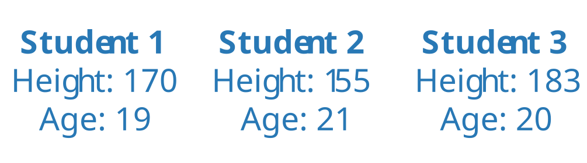
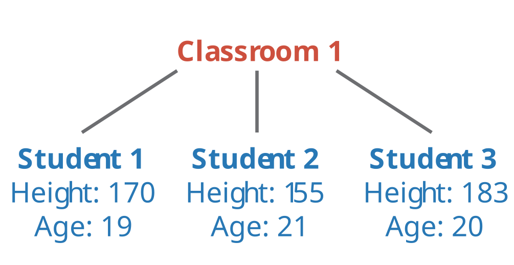
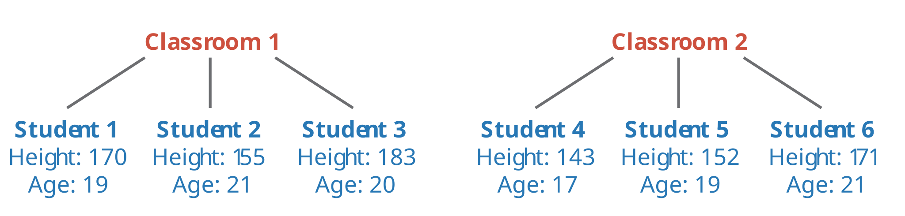
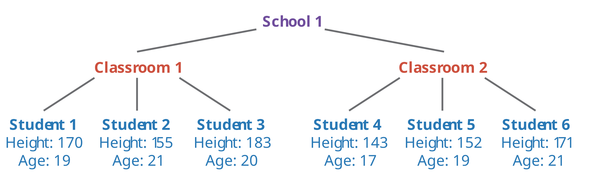
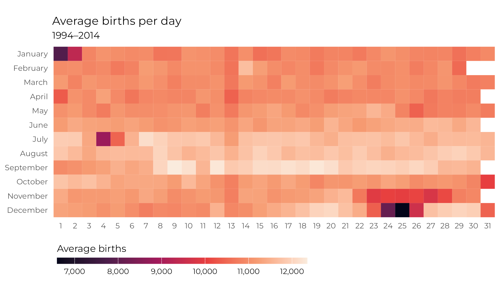

```{r}
#| label: setup
#| include: false

library(tidyverse)
library(tinytable)
library(countdown)
library(randomNames)
library(gapminder)
library(nycflights23)
```

## Plan for today {.clr-8 background-color="" background-image="/slides/img/background-hex-shapes.svg" background-opacity="0.25"}

[Types of variables]{.box-clr-2 .medium .fragment}

[Describing variables]{.box-clr-4 .medium .fragment}

# Types of variables {background-color="" background-image="/slides/img/background-hex-shapes.svg" background-opacity="0.25"}

## Variables and observations {.clr-2}

:::: {.columns}

::: {.column}
[Observations]{.box-clr-2}

A value that is recorded about something
:::

::: {.column}
[Variables]{.box-clr-2}

A set of observations about the same thing
:::

::::

:::: {.columns .column-gap-top}

::: {.column .small .fragment}

```{r}
withr::with_seed(1234, {
  height <- tibble(
    name = randomNames(10, name.order = "first.last", name.sep = " "),
    height_cm = round(rnorm(10, 170, 10))
  )
})
```

```{r}
#| echo: false

height |> slice_head(n = 10) |> as.data.frame()
```
:::

::: {.column .small .fragment}
**Observations**

`{r} height[1,1]`; `{r} height[1,2]`

**Variables**

Name; height

**Unit of observation**

A person
:::

::::

## Variables and observations {.clr-2}

:::: {.columns}

::: {.column}
[Observations]{.box-clr-2}

A value that is recorded about something
:::

::: {.column}
[Variables]{.box-clr-2}

A set of observations about the same thing
:::

::::

:::: {.columns}

::: {.column .small .fragment}

```{r}
# Made with datavizsp26 mini project 2:
#
# unhcr_refugees |> 
#   filter(coa_name %in% c("France", "Germany", "Egypt"), year %in% 2021:2024) |> 
#   group_by(country = coa_name, year) |> 
#   summarize(refugees_accepted = sum(refugees)) |> 
#   as.data.frame() |> 
#   dput()

refugees <- structure(list(country = c("Egypt", "Egypt", "Egypt", "Egypt", 
"France", "France", "France", "France", "Germany", "Germany", 
"Germany", "Germany"), year = c(2021, 2022, 2023, 2024, 2021, 
2022, 2023, 2024, 2021, 2022, 2023, 2024), refugees_accepted = c(280686, 
294632, 240507, 238014, 499914, 612934, 664366, 721771, 1255694, 
2075445, 2593007, 2749266)), row.names = c(NA, -12L), class = "data.frame")
```

```{r}
#| echo: false

refugees
```
:::

::: {.column .small .fragment}
**Observations**

`{r} refugees[1,1]`; `{r} refugees[1,2]`; `{r} scales::label_comma()(refugees[1,3])`

**Variables**

Country; year; refugees accepted

**Unit of observation**

Country year
:::

::::

## General types of variables {.clr-2}

:::: {.columns}

::: {.column}

[Identification variables]{.box-clr-2}

Values that **identify** observations

:::

::: {.column}

[Measurement variables]{.box-clr-2}

Values that **describe** the observations

:::

::::

::: {.small .fragment}
```{r}
#| echo: false

airports |> select(-tzone) |> slice_head(n = 8) |> as.data.frame()
```
:::

::: {.fragment}
Identification: `faa`, `name`  
Measurement: `lat`, `lon`, `alt`, `tz`, `dst`
:::

## Identification vs. measurement {.clr-2}

[**Identification variables uniquely identify each observation**]{.text-clr-2}


::: {.fragment}
Unit of observation = what each row represents
:::

::: {.fragment}
Think of a hierarchy!
:::


## {.center}

{.shadow}

## {.center}

{.shadow}

## {.center}

{.shadow}

## {.center}

{.shadow}

## General types of variables {.clr-2}

:::: {.columns}

::: {.column}

[Identification variables]{.box-clr-2}

Values that **identify** observations

:::

::: {.column}

[Measurement variables]{.box-clr-2}

Values that **describe** the observations

:::

::::

::: {.small .fragment}
```{r}
#| echo: false

gapminder |> slice_head(n = 8) |> as.data.frame()
```
:::

::: {.fragment}
Identification: `country`, `year` (`continent`?)  
Measurement: `lifeExp`, `pop`, `gdpPercap` (`continent`?)
:::


## Your turn! {background-color="" background-image="/slides/img/background-hex-shapes.svg" background-opacity="0.25"}

[What would these datasets look like?]{.box-clr-8}

- The height, age, and GPA of each student in this class
- The height, age, and GPA of each student in this class in their freshman, sophomore, junior, and senior years
- The population and GDP of GCC countries in 2026
- The population and GDP of GCC countries each year from 2020 to 2026

```{r}
#| label: clock-1
#| echo: false

countdown(minutes = 7, seconds = 0, play_sound = TRUE, warn_when = 1 * 60)
```


## Types of measurement variables {.clr-2}

[Numeric]{.box-clr-2}

:::: {.columns}

::: {.column .fragment}
[Continuous variables]{.box-clr-2-light}

**Numbers**: values from <br>−∞ to ∞

::: {.smaller}
Monthly income, duration of an exam, GDP
:::
:::

::: {.column .fragment}
[Count variables]{.box-clr-2-light}

**Counts**: values that are whole and not negative

::: {.smaller}
Population, number of civil wars, number of students in a class
:::

::: {.smaller}
Often treated like continuous
:::
:::

::::

## Types of measurement variables {.clr-2}

[Categories]{.box-clr-2}

:::: {.columns .fragment}

::: {.column}
[Categorical variables]{.box-clr-2-light}
:::

::: {.column}
::: {.smaller}
Race, religion, continent, highest level of education, color of flower, species of penguin
:::
:::

::::

:::: {.columns}

::: {.column .fragment}
[Binary variables]{.box-clr-2-light}

**Two categories only**

::: {.smaller}
- Person served in military? 
- Country faced civil war? 
- Country voted for UN resolution? 
- Penguin is heavier than 3 kg?
:::

:::

::: {.column .fragment}
[Ordinal variables]{.box-clr-2-light}

**Ordered categories**

::: {.smaller}
- ~~Species of penguin~~ (Adelie, Chinstrap, Gentoo)
- County income level (low, medium, high)
- Agreement with a survey question (Likert scale disagree → neutral → agree)
- Highest education completed (primary school, high school, university, graduate school)
:::
:::

::::

## Types of measurement variables {.clr-2}

[Qualitative data]{.box-clr-2}

:::: {.columns}

::: {.column}
[Qualitative variables]{.box-clr-2-light}
:::

::: {.column}
**Stuff that's not numeric and not categorical**

- Survey free response fields
- Pictures and videos
- Newspaper headlines
:::

::::

## Types of measurement variables {.clr-2}

:::: {.columns}

::: {.column width="33%"}
[Numeric]{.box-clr-2}

Continuous

Count
:::

::: {.column width="33%"}
[Categorical]{.box-clr-2}

Categorical

Binary

Ordinal
:::

::: {.column width="33%"}
[Qualitative]{.box-clr-2}

Qualitative
:::

::::

## Your turn! {background-color="" background-image="/slides/img/background-hex-shapes.svg" background-opacity="0.25"}

[What kind of variables are these?]{.box-clr-8}

:::: {.columns}

::: {.column .small}
- Temperature
- Number of goals scored in a World Cup match
- Did country hold an election this year?
- Olympic medal type (gold/silver/bronze)
- Interview transcripts
- Grade in a class (A–F)
- Grade on an exam (0-100)
:::

::: {.column .small}
- Blood type
- Religion
- Military rank
- Political party of head of state
- Did a law pass?
- Slogans on protest signs
- Number of siblings
- Distance traveled
- QAR to EUR exchange rate
:::

::::

```{r}
#| label: clock-2
#| echo: false

countdown(minutes = 5, seconds = 0, play_sound = TRUE, warn_when = 1 * 60)
```


# Describing variables {background-color="" background-image="/slides/img/background-hex-shapes.svg" background-opacity="0.25"}

## Why do we even care?? {.clr-4}

::: {.fragment .medium}
**Most of data analysis is really just describing variables**
:::

::: {.fragment}
We can describe variables with numbers and pictures
:::

::: {.fragment}
A variable's type determines *which* numbers and pictures you can use
:::


## Describing numbers with numbers {.clr-4}

[Summary statistics]{.box-clr-4}

::: {.incremental}
- **Mean**: add up all the numbers, divide by the count
- **Median**: the middle number of the variable
- **Minimum** and **Maximum**: the smallest and biggest numbers
- **Percentiles**: how many other observations are below certain numbers [(25th percentile, 75th percentile, 90th percentile, etc)]{.smaller}
- **Standard deviation**: how much numbers are spread out from the mean
:::

##

```{r}
#| echo: true

gapminder |> 
  filter(year == 2007) |> 
  summarize(
    avg_gdp = mean(gdpPercap),
    median_gdp = median(gdpPercap),
    min_gdp = min(gdpPercap),
    max_gdp = max(gdpPercap),
    pct_25 = quantile(gdpPercap, probs = 0.25),
    pct_75 = quantile(gdpPercap, probs = 0.75),
    sd_gdp = sd(gdpPercap)
  )
```

##

```{.r}
library(moderndive)

gapminder |> 
  filter(year == 2007) |> 
  tidy_summary(gdpPercap)
```

```{r}
#| classes: "smaller"

library(moderndive)

gapminder |> 
  filter(year == 2007) |> 
  tidy_summary(gdpPercap)
```

## Describing numbers with plots {.clr-4}

[Distributions]{.box-clr-4}

- Histograms
- Density plots
- ~~Boxplots~~
- Dot plots
- Raincloud plots

## Histogram {.clr-4}

:::: {.columns}

::: {.column width="50%"}
```{r}
#| label: plot-histogram
#| echo: true
#| eval: false
#| classes: small

gapminder |>
  filter(year == 2007) |>
  ggplot(aes(x = gdpPercap)) +
  geom_histogram(
    color = "white",
    binwidth = 2500,
    boundary = 0
  )
```
:::

::: {.column width="50%"}
```{r}
#| ref.label: plot-histogram
#| echo: false
#| fig-width: 4
#| fig-height: 3
#| out-width: "100%"
```
:::

::::

## Density plot {.clr-4}

:::: {.columns}

::: {.column width="50%"}
```{r}
#| label: plot-density
#| echo: true
#| eval: false
#| classes: small

gapminder |>
  filter(year == 2007) |>
  ggplot(aes(x = gdpPercap)) +
  geom_density(fill = "grey50")
```
:::

::: {.column width="50%"}
```{r}
#| ref.label: plot-density
#| echo: false
#| fig-width: 4
#| fig-height: 3
#| out-width: "100%"
```
:::

::::

## ~~Boxplot~~ {.clr-4}

:::: {.columns}

::: {.column width="50%"}
```{r}
#| label: plot-boxplot
#| echo: true
#| eval: false
#| classes: small

gapminder |>
  filter(year == 2007) |>
  ggplot(aes(x = gdpPercap)) +
  geom_boxplot()
```
:::

::: {.column width="50%"}
```{r}
#| ref.label: plot-boxplot
#| echo: false
#| fig-width: 4
#| fig-height: 3
#| out-width: "100%"
```
:::

::::

## Dot plot {.clr-4}

:::: {.columns}

::: {.column width="50%"}
```{r}
#| label: plot-dotplot
#| echo: true
#| eval: false
#| classes: small

gapminder |>
  filter(year == 2007) |>
  ggplot(
    aes(x = gdpPercap, y = "")
  ) +
  geom_point(
    position = position_jitter(
      width = 0,
      height = 0.05
    )
  )
```
:::

::: {.column width="50%"}
```{r}
#| ref.label: plot-dotplot
#| echo: false
#| fig-width: 4
#| fig-height: 3
#| out-width: "100%"
```
:::

::::

## Raincloud plot {.clr-4}

:::: {.columns}

::: {.column width="50%"}
```{r}
#| label: plot-raincloud
#| echo: true
#| eval: false
#| classes: small

library(ggdist)

gapminder |>
  filter(year == 2007) |>
  ggplot(
    aes(x = gdpPercap, y = "")
  ) +
  stat_slab(
    side = "top",
    color = NA
  ) +
  stat_dots(
    side = "bottom",
    layout = "swarm"
  )
```
:::

::: {.column width="50%"}
```{r}
#| ref.label: plot-raincloud
#| echo: false
#| fig-width: 4
#| fig-height: 3
#| out-width: "100%"
```
:::

::::

## Describing categorical variables {.clr-4}

:::: {.columns}

::: {.column}
```{r}
#| classes: "smaller"

withr::with_seed(12345, {
  penguins |>
    slice_sample(n = 10) |>
    select(species, island, body_mass, bill_len) |>
    as.data.frame()
})
```
:::

::: {.column .fragment}
What's the average species?

What's the maximum island?
:::

::::

::: {.fragment}
**Not possible!** 

Regular summary statistics don't work with categorical data!
:::


## Describing categories {.clr-4}


::: {.fragment}
[Summary statistics]{.box-clr-4}

- **Counts**: Count each category
- **Proportions**: Find the proportion of each category relative to something else [(total, another category, etc.)]{.small}
:::

::: {.fragment}
[Plots]{.box-clr-4}

- Bar plots
- Lollipop plots
- Heatmaps
:::


##

```{.r}
library(moderndive)

gapminder |> 
  filter(year == 2007) |> 
  tidy_summary(continent)
```

```{r}
#| classes: "smaller"

library(moderndive)

gapminder |> 
  filter(year == 2007) |> 
  tidy_summary(continent)
```

##

:::: {.columns}

::: {.column}
```{r}
#| echo: true

gapminder |> 
  filter(year == 2007) |> 
  count(continent)
```
:::

::: {.column .fragment}
```{r}
#| echo: true

gapminder |> 
  filter(year == 2007) |> 
  count(continent) |> 
  mutate(prop = n / sum(n))
```
:::

::::

##

:::: {.columns}

::: {.column}
```{r}
#| echo: true
#| classes: small

penguins |>  
  count(species, island)
```
:::

::: {.column .fragment}
```{r}
#| echo: true
#| classes: small

penguins |>  
  count(species, island) |> 
  mutate(prop = n / sum(n))
```
:::

::::

##

:::: {.columns}

::: {.column}
```{r}
#| echo: true
#| classes: small

penguins |>  
  count(species, island) |> 
  group_by(species) |> 
  mutate(prop = n / sum(n))
```
:::

::: {.column .fragment}
```{r}
#| echo: true
#| classes: small

penguins |>  
  count(species, island) |> 
  group_by(island) |> 
  mutate(prop = n / sum(n))
```
:::

::::

## Bar plot {.clr-4}

:::: {.columns}

::: {.column width="50%"}
```{r}
#| label: plot-barplot
#| echo: true
#| eval: false
#| classes: small

gapminder |>
  filter(year == 2007) |>
  count(continent) |>
  mutate(
    continent = fct_reorder(
      continent,
      desc(n)
    )
  ) |>
  ggplot(
    aes(x = continent, y = n)
  ) +
  geom_col()
```
:::

::: {.column width="50%"}
```{r}
#| ref.label: plot-barplot
#| echo: false
#| fig-width: 4
#| fig-height: 3
#| out-width: "100%"
```
:::

::::

## Lollipop plot {.clr-4}

:::: {.columns}

::: {.column width="50%"}
```{r}
#| label: plot-lollipop1
#| echo: true
#| eval: false
#| classes: small

gapminder |>
  filter(year == 2007) |>
  count(continent) |>
  mutate(
    continent = fct_reorder(
      continent,
      n
    )
  ) |>
  ggplot(
    aes(x = n, y = continent)
  ) +
  geom_pointrange(
    aes(xmin = 0, xmax = n)
  )
```
:::

::: {.column width="50%"}
```{r}
#| ref.label: plot-lollipop1
#| echo: false
#| fig-width: 4
#| fig-height: 3
#| out-width: "100%"
```
:::

::::

## Lollipop plot {.clr-4}

:::: {.columns}

::: {.column width="50%"}
```{r}
#| label: plot-lollipop2
#| echo: true
#| eval: false
#| classes: small

gapminder |>
  filter(year == 2007) |>
  count(continent) |>
  mutate(
    continent = fct_reorder(
      continent,
      n
    ),
    prop = n / sum(n)
  ) |>
  ggplot(
    aes(x = prop, y = continent)
  ) +
  geom_pointrange(
    aes(xmin = 0, xmax = prop)
  )
```
:::

::: {.column width="50%"}
```{r}
#| ref.label: plot-lollipop2
#| echo: false
#| fig-width: 4
#| fig-height: 3
#| out-width: "100%"
```
:::

::::

## Heat map {.clr-4}

:::: {.columns}

::: {.column width="50%"}
```{r}
#| label: plot-heatmap
#| echo: true
#| eval: false
#| classes: small

penguins |>
  count(species, island) |>
  group_by(island) |>
  mutate(prop = n / sum(n)) |>
  ggplot(
    aes(
      x = species,
      y = island,
      fill = prop
    )
  ) +
  geom_tile() +
  geom_text(
    aes(label = round(prop, 2)),
    color = "white"
  )
```
:::

::: {.column width="50%"}
```{r}
#| ref.label: plot-heatmap
#| echo: false
#| fig-width: 4
#| fig-height: 3
#| out-width: "100%"
```
:::

::::

## {.center}

{.shadow width="100%" fig-align="center"}

# Summary {background-color="" background-image="/slides/img/background-hex-shapes.svg" background-opacity="0.25"}

## Describing variables {.clr-7}


::: {.fragment}
**Variable = column; observation = row**
:::

:::: {.columns}

::: {.column .small .fragment width="35%"}
[Variables]{.box-clr-7}

**Identification vs. measurement**

**Numbers**: continuous, count

**Categories**: categorical, binary, ordinal

**Qualitative**
:::

::: {.column .small .fragment width="65%"}
[Descriptions]{.box-clr-7}

**Numeric variables**

- *Summary statistics*: mean, median, standard deviation, min, max, percentiles
- *Plots*: histograms, density plots, dot plots, raincloud plots

**Categorical variables**

- *Summary statistics*: counts, proportions
- *Plots*: Bar plots, lollipop plots, heatmaps
:::

::::

## Our turn! {background-color="" background-image="/slides/img/background-hex-shapes.svg" background-opacity="0.25"}

[Exploring cars in Qatar]{.box-clr-8}

[<https://profmusgrave.github.io/qatarcars/>]{.small}

- Identifying variable types
  - Identification vs. measurement
  - Numeric vs. categorical (and subtypes)
- Describe variables
  - Numbers
  - Plots
