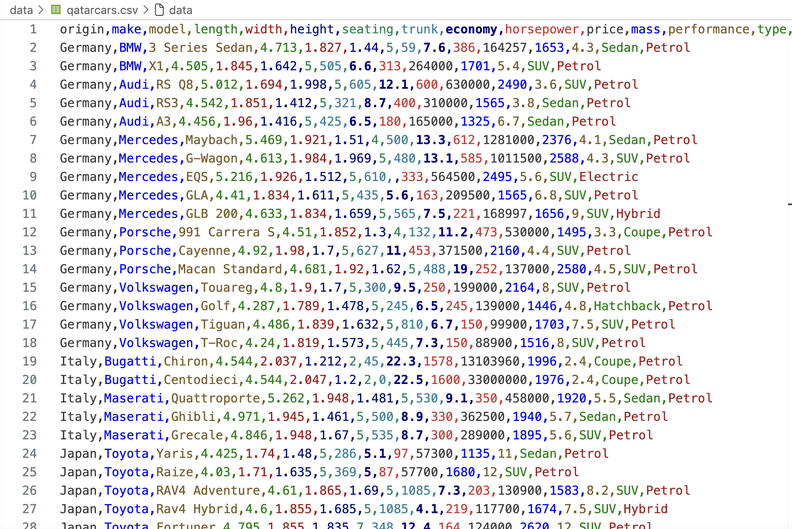
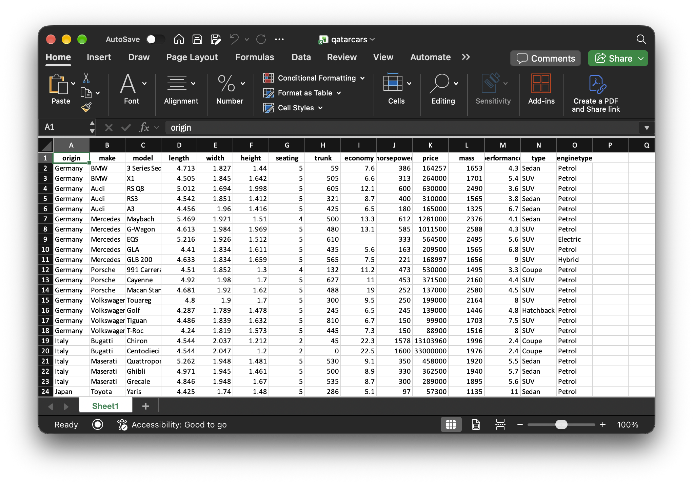
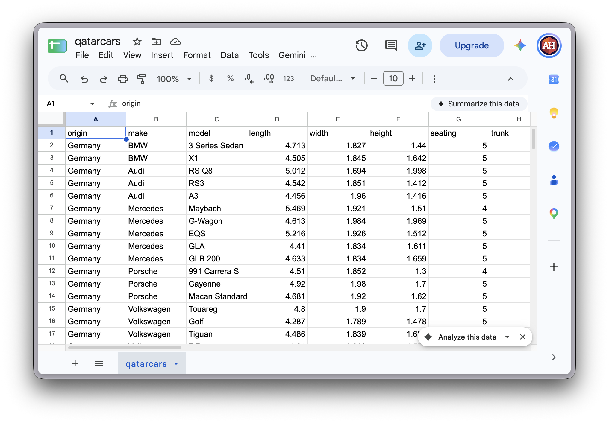
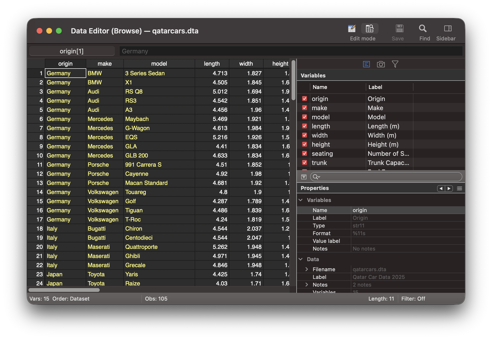
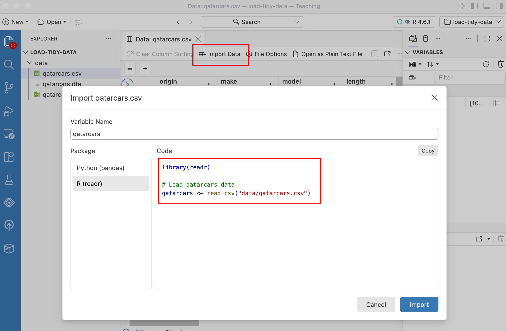
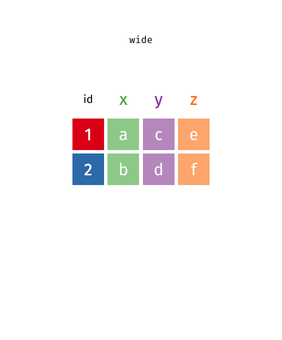
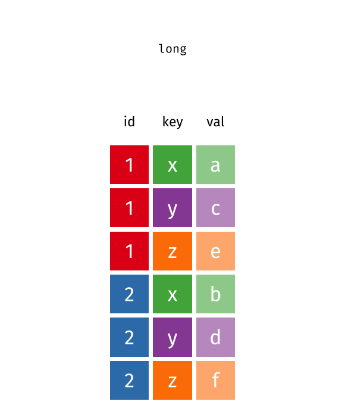

```{r}
#| label: setup
#| include: false

library(tidyverse)
library(tinytable)
library(randomNames)
library(countdown)
library(gapminder)

# https://github.com/dcl-docs/dcldata
# https://dcl-wrangle.stanford.edu/pivot-advanced.html
library(dcldata)
```

## Plan for today {.clr-8 background-color="" background-image="/slides/img/background-hex-shapes.svg" background-opacity="0.25"}

[Downloading, making,<br>and reading data]{.box-clr-2 .medium .fragment}

[Tidy data]{.box-clr-3 .medium .fragment}

[Pivoting data]{.box-clr-7 .medium .fragment}


# Downloading, making, and reading data {background-color="" background-image="/slides/img/background-hex-shapes.svg" background-opacity="0.25"}

## What does data look like? {.clr-2}

**Rectangles!**

- CSV files (`.csv`)
- Excel files (`.xlsx`)
- Google Sheets
- Other programs like Stata (`.dta`)

## CSV files {.clr-2}

{fig-align="center" width="70%" .shadow}

## CSV files {.clr-2}

```{.r}
library(tidyverse)

my_data <- read_csv("WHATEVER.csv")
```

## Excel files {.clr-2}

{fig-align="center" width="90%"}

## Excel files {.clr-2}

```{.r}
library(readxl)

my_data <- read_excel("WHATEVER.xlsx", sheet = "Sheet1")
```

## Google Sheets {.clr-2}

{fig-align="center" width="90%"}

## Google Sheets {.clr-2}

```{.r}
library(googlesheets4)

gs4_deauth()

# https://docs.google.com/spreadsheets/d/196A3XNQFSlyRvBdAu5DRPyI9woyMCwWK0lGNzo4Wcg8/edit?usp=sharing
my_data <- read_sheet(
  "196A3XNQFSlyRvBdAu5DRPyI9woyMCwWK0lGNzo4Wcg8"
)
```

(Though often easier to just download as CSV)

## Other programs [(Stata, SAS, SPSS)]{.small} {.clr-2}

{fig-align="center" width="90%"}

## Other programs [(Stata, SAS, SPSS)]{.small} {.clr-2}

```{.r}
library(haven)

my_data <- read_stata("WHATEVER.dta")
```

## Let Positron help you! {.clr-2}

{fig-align="center" width="85%" .shadow}

## Your/our turn #0 {.clr-8 background-color="" background-image="/slides/img/background-hex-shapes.svg" background-opacity="1"}

- Create a new empty Positron project!
- Download the `example-data.zip` folder from the class website, unzip it, and put it in your project

## Your turn #1 {.clr-8 background-color="" background-image="/slides/img/background-hex-shapes.svg" background-opacity="1"}

1. Download a dataset from Qatar's Open Data Catalog: <https://www.data.gov.qa/explore/>
2. Place the downloaded file in your Positron project folder
3. Load it into R
4. For bonus fun, make a plot!

```{r}
#| label: clock-1
#| echo: false

countdown(minutes = 7, seconds = 0, play_sound = TRUE, warn_when = 1 * 60)
```

# Tidy data {background-color="" background-image="/slides/img/background-hex-shapes.svg" background-opacity="0.25"}

## What is tidy data? {.clr-3}

::: {.fragment}
[~~Clean, perfect data~~]{.box-clr-3-light}
:::

::: {.fragment}
[Data shaped to make computers happy]{.box-clr-3-light}
:::

:::: {.columns .small .box-center .fragment}

::: {.column width="33%"}
[Each variable<br>is a column]{.box-clr-3}
:::

::: {.column width="33%"}
[Each observation<br>is a row]{.box-clr-3}
:::

::: {.column width="33%"}
[Each cell is a single measurement]{.box-clr-3}
:::

::::

{fig-align="center" width="100%" .fragment .shadow}

## Identification vs. measurement {.clr-3}

[**Identification variables uniquely identify each observation**]{.text-clr-3}

:::: {.columns}

::: {.column width="70%" .smaller .fragment}
```{r}
gapminder |> 
  select(country, year, lifeExp, gdpPercap, pop) |> 
  head(10) |> 
  tt() |> 
  theme_html(class = "tinytable shadow")
```
:::

::: {.column width="30%" .fragment}
**Identification:**

`country`, `year`

**Measurement:**

`lifeExp`, `gdpPercap`, `pop`
:::

::::

## Untidy data for humans {.clr-3}

```{r}
withr::with_seed(123456, {
  classroom <- tibble(
    student = randomNames(4, which.names = "first"),
    exercise1 = round(rbeta(4, 3, 1) * 100, 0),
    exercise2 = round(rbeta(4, 3, 1) * 100, 0),
    quiz1 = round(rbeta(4, 3, 1) * 100, 0)
  )
})

classroom_long <- classroom |>
  pivot_longer(
    cols = 2:4, # or cols = -student
    names_to = "assessment",
    values_to = "grade"
  )
```

```{r}
classroom |> 
  tt() |> 
  style_tt(fontsize = 0.8) |> 
  theme_html(class = "tinytable shadow")
```

. . .

<div style="margin-top: 30px"></div>

```{r}
classroom |> 
  pivot_longer(cols = -student, names_to = "assessment", values_to = "grade") |> 
  pivot_wider(names_from = student, values_from = grade) |> 
  tt() |> 
  style_tt(fontsize = 0.8) |> 
  theme_html(class = "tinytable shadow")
```

## Untidy data for humans {.clr-3}

:::: {.columns}

::: {.column .small width="60%"}

```{r}
classroom |> 
  tt() |> 
  style_tt(fontsize = 0.9) |> 
  theme_html(class = "tinytable shadow")
```

:::

::: {.column .small width="40%"}
- What are the variables here?
- Which are identification variables?
- Which are measurement variables?
:::

::::

## Untidy data for humans {.clr-3}

:::: {.columns}

::: {.column .small width="60%"}

```{r}
classroom |>
  tt() |>
  style_tt(fontsize = 0.9) |>
  style_tt(j = 1, background = "var(--hl-1)") |>
  style_tt(
    i = 0,
    j = 2:4,
    background = "var(--hl-3)",
    line = "l",
    line_color = "white"
  ) |>
  style_tt(
    i = 1:5,
    j = 2:4,
    background = "var(--hl-2)",
    line = "l",
    line_color = "white"
  ) |>
  theme_html(class = "tinytable shadow")
```

:::

::: {.column .small width="40%"}
- What are the variables here?
  - **Student**, **Assessment**, **Grade**
- Which are identification variables?
  - [**Student**]{.bg-hl-1}, [**Assessment**]{.bg-hl-3}
- Which are measurement variables?
  - [**Grade**]{.bg-hl-2}
:::

::::

## Tidy data for computers {.clr-3}

:::: {.columns}

::: {.column .small width="60%"}

```{r}
classroom_long |> 
  tt() |>
  style_tt(fontsize = 0.8) |>
  style_tt(j = 1, background = "var(--hl-1)") |>
  style_tt(j = 2, background = "var(--hl-3)") |>
  style_tt(j = 3, background = "var(--hl-2)") |>
  theme_html(class = "tinytable shadow")
```

:::

::: {.column .small width="40%"}
- What are the variables here?
  - **Student**, **Assessment**, **Grade**
- Which are identification variables?
  - [**Student**]{.bg-hl-1}, [**Assessment**]{.bg-hl-3}
- Which are measurement variables?
  - [**Grade**]{.bg-hl-2}
:::

::::

## Same data! {.clr-3}

:::: {.columns .box-center}

::: {.column width="50%"}

[Wide data]{.box-clr-3-light}

```{r}
classroom |> 
  tt() |> 
  style_tt(fontsize = 0.55) |> 
  theme_html(class = "tinytable shadow")
```
:::

::: {.column width="50%"}

[Long data]{.box-clr-3-light}

```{r}
classroom_long |> 
  tt() |> 
  style_tt(fontsize = 0.55) |> 
  theme_html(class = "tinytable shadow")
```
:::

::::

## Untidy data isn't bad! {.clr-3}

Who had the biggest improvement in exercise scores?  
Who scored the lowest on quiz 1?

:::: {.columns .box-center}

::: {.column width="50%"}

```{r}
classroom |> 
  tt() |> 
  style_tt(fontsize = 0.55) |> 
  theme_html(class = "tinytable shadow")
```
:::

::: {.column width="50%"}

```{r}
classroom_long |> 
  tt() |> 
  style_tt(fontsize = 0.55) |> 
  theme_html(class = "tinytable shadow")
```
:::

::::


## Tidy data easier to manipulate {.clr-3}

:::: {.columns}

::: {.column .tiny width="40%"}
```{r}
#| echo: true

classroom

classroom_long
```
:::

::: {.column .smaller width="60%"}
```{r}
#| echo: true

classroom_long |>
  group_by(student) |>
  summarize(
    avg_grade = mean(grade),
    med_grade = median(grade),
    total = sum(grade)
  ) |>
  mutate(pct = total / 300)
```
:::

::::

## Tidy data easier to plot {.clr-3}

:::: {.columns}

::: {.column .tiny width="40%"}
```{r}
#| echo: true

classroom

classroom_long
```
:::

::: {.column .smaller width="60%"}
```{r}
#| echo: true
#| fig-width: 5
#| fig-height: 3
#| out-width: "100%"

classroom_long |>
  ggplot(aes(
    x = assessment, y = grade, fill = assessment
  )) + 
  geom_col() + 
  guides(fill = "none") +
  facet_wrap(vars(student))
```
:::

::::

## Common types of untidy data {.clr-3}

::: {.incremental}
- Column headers are values, not variable names
- Variables and values are not in rows or columns
- Multiple variables are stored in one column
:::

## Headers are values {.clr-3}

```{r}
relig_income |> 
  select(1:7) |> 
  slice_head(n = 14) |> 
  tt() |>
  style_tt(fontsize = 0.55) |> 
  theme_html(class = "tinytable shadow")
```

## Headers are values {.clr-3}

```{r}
relig_income |> 
  select(1:7) |> 
  pivot_longer(cols = -religion, names_to = "income", values_to = "count") |> 
  slice_head(n = 14) |> 
  tt() |>
  style_tt(fontsize = 0.55) |> 
  theme_html(class = "tinytable shadow")
```

## Variables not in table {.clr-3}

```{r}
fake_legend <- tribble(
  ~student,
  "",
  "Key",
  "Junior",
  "Senior",
  "Surprisingly high",
  "Surprisingly low"
)

classroom_combined <- classroom |> 
  bind_rows(fake_legend)

mask_high <- classroom_combined |>
  mutate(across(everything(), \(x) {
    if (is.numeric(x)) x > 90 & !is.na(x) else FALSE
  })) |>
  as.matrix()

mask_low <- classroom_combined |>
  mutate(across(everything(), \(x) {
    if (is.numeric(x)) x < 50 & !is.na(x) else FALSE
  })) |>
  as.matrix()

classroom_combined |> 
  tt() |> 
  format_tt(replace = "") |> 
  style_tt(i = 6, j = 1, bold = TRUE) |> 
  style_tt(i = c(1, 3, 4, 7), j = 1, color = "var(--brand-clr-5)") |> 
  style_tt(i = c(2, 8), j = 1, color = "var(--brand-clr-9)") |> 
  style_tt(i = 9, j = 1, bold = TRUE) |> 
  style_tt(i = mask_high, bold = TRUE) |> 
  style_tt(i = 10, j = 1, italic = TRUE, color = "var(--brand-clr-6)") |> 
  style_tt(i = mask_low, italic = TRUE, color = "var(--brand-clr-6)") |> 
  style_tt(fontsize = 0.8) |> 
  theme_html(class = "tinytable shadow untidy")
```

## Variables not in table {.clr-3}

```{r}
classroom_long |> 
  mutate(class = recode_values(student, "Renee" ~ "Senior", default = "Junior")) |> 
  mutate(surprise = case_when(grade > 90 ~ "High surprise", grade < 50 ~ "Low surprise")) |> 
  tt() |> 
  format_tt(replace = "") |> 
  style_tt(fontsize = 0.65) |> 
  theme_html(class = "tinytable shadow")
```

## Multiple variables in column {.clr-3}

```{r}
tb_raw <- read_csv("data/tb.csv")

tb <- tb_raw |> 
  filter(year > 1995) |> 
  select(iso2, year, m014, m1524, m2534, m3544, f014, f1524, f2534, f3544)

tb |> 
  slice_head(n = 12) |> 
  tt() |> 
  style_tt(fontsize = 0.65) |> 
  theme_html(class = "tinytable shadow")
```

## Multiple variables in column {.clr-3}

```{r}
tb |>
  pivot_longer(
    !c(iso2, year),
    names_to = c("sex", "age"),
    names_pattern = "(.)(.+)",
    values_to = "n",
    values_drop_na = TRUE
  ) |>
  slice_head(n = 12) |>
  tt() |>
  style_tt(fontsize = 0.65) |>
  theme_html(class = "tinytable shadow")
```

## Your turn #2 {.clr-8 background-color="" background-image="/slides/img/background-hex-shapes.svg" background-opacity="1"}

```{r}
dcldata::example_gymnastics_1 |> 
  tt() |> 
  theme_html(class = "tinytable shadow")
```

```{r}
#| label: clock-2
#| echo: false

countdown(minutes = 2, seconds = 0, play_sound = TRUE, warn_when = 1 * 60)
```

## Your turn #2 {.clr-8 background-color="" background-image="/slides/img/background-hex-shapes.svg" background-opacity="1"}

```{r}
example_gymnastics_1 |> 
  pivot_longer(
    cols = !country, 
    names_to = "event", 
    names_prefix = "score_",
    values_to = "score"
  ) |> 
  tt() |> 
  theme_html(class = "tinytable shadow")
```

## Your turn #3 {.clr-8 background-color="" background-image="/slides/img/background-hex-shapes.svg" background-opacity="1"}

```{r}
gapminder |> 
  select(country, year, lifeExp) |> 
  filter(year %in% c(1957, 1967, 1977, 1987, 1997, 2007)) |> 
  pivot_wider(names_from = "year", values_from = "lifeExp") |> 
  slice_head(n = 8) |> 
  tt() |> 
  style_tt(fontsize = 0.8) |> 
  theme_html(class = "tinytable shadow")
```

```{r}
#| label: clock-3
#| echo: false

countdown(minutes = 3, seconds = 0, play_sound = TRUE, warn_when = 1 * 60)
```

## Your turn #3 {.clr-8 background-color="" background-image="/slides/img/background-hex-shapes.svg" background-opacity="1"}

```{r}
gapminder |> 
  select(country, year, lifeExp) |> 
  filter(year %in% c(1957, 1967, 1977, 1987, 1997, 2007)) |> 
  slice_head(n = 9) |> 
  tt() |> 
  style_tt(fontsize = 0.8) |> 
  theme_html(class = "tinytable shadow")
```

## Your turn #4 {.clr-8 background-color="" background-image="/slides/img/background-hex-shapes.svg" background-opacity="1"}

```{r}
dcldata::example_gymnastics_2 |> 
  tt() |> 
  style_tt(fontsize = 0.8) |> 
  theme_html(class = "tinytable shadow")
```

```{r}
#| label: clock-4
#| echo: false

countdown(minutes = 4, seconds = 0, play_sound = TRUE, warn_when = 1 * 60)
```

## Your turn #4 {.clr-8 background-color="" background-image="/slides/img/background-hex-shapes.svg" background-opacity="1"}

```{r}
example_gymnastics_2 |> 
  pivot_longer(
    cols = !country,
    names_to = c("event", "year"),
    names_sep = "_",
    values_to = "score"
  ) |> 
  tt() |> 
  style_tt(fontsize = 0.65) |> 
  theme_html(class = "tinytable shadow")
```

# Pivoting {background-color="" background-image="/slides/img/background-hex-shapes.svg" background-opacity="0.25"}

## Pivoting longer {.clr-7}

:::: {.columns}

::: {.column}

:::

::: {.column .small}

```{.r}
wide_data |>
  pivot_longer(
    # Columns to move
    cols = BLAH,

    # Name of new 
    # identification variable
    names_to = "key",

    # Name of new 
    # measurement variable
    values_to = "value"
  )
```
:::

::::

## Pivoting longer {.clr-7}

:::: {.columns}

::: {.column .smaller width="50%"}

```{r}
#| echo: true
classroom
```
:::

::: {.column .smaller width="50%"}
```{r}
#| echo: true
#| output-location: fragment

classroom |>
  pivot_longer(
    cols = 2:4,  # or cols = -student
    names_to = "assessment",
    values_to = "grade"
  )
```
:::

::::

## Pivoting wider {.clr-7}

:::: {.columns}

::: {.column}

:::

::: {.column .small}

```{.r}
long_data |>
  pivot_wider(
    # Names for the 
    # spread out columns
    names_from = "key",

    # Values for the 
    # spread out columns
    values_from = "value"
  )
```
:::

::::

## Pivoting wider {.clr-7}

:::: {.columns}

::: {.column .smaller width="50%"}

```{r}
#| echo: true
classroom_long
```
:::

::: {.column .smaller width="50%"}
```{r}
#| echo: true
#| output-location: fragment

classroom_long |>
  pivot_wider(
    names_from = "assessment",
    values_from = "grade"
  )
```
:::

::::

## Your/our turn #5 {.clr-8 background-color="" background-image="/slides/img/background-hex-shapes.svg" background-opacity="1"}

Pivoting!
