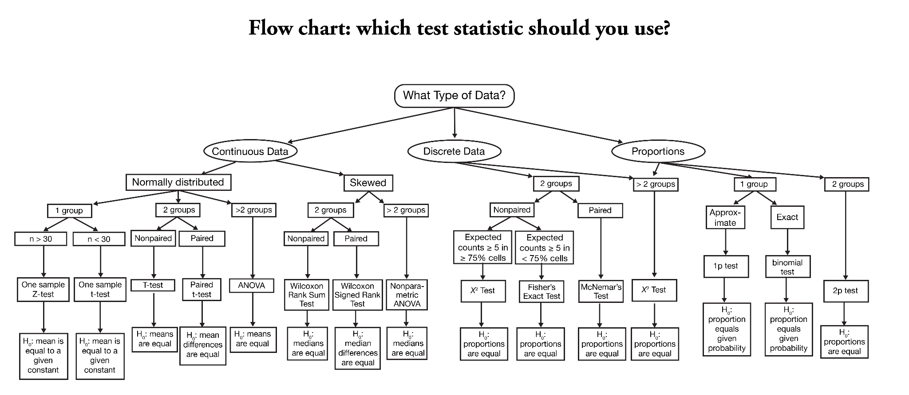

```{r}
#| label: setup
#| include: false

library(tidyverse)
library(tinytable)
library(countdown)
library(patchwork)
library(moderndive)
library(gapminder)

# Colors from _brand.yml
clrs <- list(
  blue = "#2878B5",
  orange = "#E17C05",
  maroon = "#8A1538",
  purple = "#6F4C9B",
  green = "#2D934F",
  gray = "#696A6F"
)

theme_set(theme_grey(base_size = 14))
```

```{r}
#| label: make-data
#| include: false

# Toy data for drawing lines
cookies <- tibble(
  happiness = c(0.5, 2, 1, 2.5, 3, 1.5, 2, 2.5, 2, 3),
  cookies = 1:10
)

cookies_model <- lm(happiness ~ cookies, data = cookies)
cookies_fitted <- get_regression_points(cookies_model)

cookies_b0 <- coef(cookies_model)[["(Intercept)"]]
cookies_b1 <- coef(cookies_model)[["cookies"]]

# Example person for observed vs. fitted
cookies_5 <- cookies_fitted |> filter(cookies == 5)

# ModernDive's UN data
UN_data_ch5 <- un_member_states_2024 |>
  select(
    iso,
    country,
    life_exp = life_expectancy_2022,
    fert_rate = fertility_rate_2022,
    obes_rate = obesity_rate_2016
  ) |>
  na.omit()

demographics_model <- lm(fert_rate ~ life_exp, data = UN_data_ch5)
demographics_points <- get_regression_points(demographics_model, ID = "iso")

un_cor <- cor(UN_data_ch5$fert_rate, UN_data_ch5$life_exp)
b0 <- coef(demographics_model)[["(Intercept)"]]
b1 <- coef(demographics_model)[["life_exp"]]

# Bosnia and Herzegovina, the example country in ModernDive's Figure 5.4
bih <- demographics_points |> filter(iso == "BIH")

gapminder_2007 <- gapminder |>
  filter(year == 2007) |>
  select(country, continent, lifeExp, gdpPercap)

continent_means <- gapminder_2007 |>
  group_by(continent) |>
  summarize(n = n(), mean = mean(lifeExp), median = median(lifeExp))

lifeexp_model <- lm(lifeExp ~ continent, data = gapminder_2007)
lifeexp_points <- get_regression_points(lifeexp_model, ID = "country")

cont_b0 <- coef(lifeexp_model)[["(Intercept)"]]
cont_b <- coef(lifeexp_model)[-1] |>
  set_names(levels(gapminder_2007$continent)[-1])

# Example country for observed vs. fitted
afg <- lifeexp_points |> filter(country == "Afghanistan")
```

## Plan for today {.clr-8 background-color="" background-image="/slides/img/background-hex-shapes.svg" background-opacity="0.25"}

[Relationships between variables]{.box-clr-2 .medium .fragment}

[Correlation]{.box-clr-4 .medium .fragment}

[Drawing lines]{.box-clr-3 .medium .fragment}

[Lines and regression]{.box-clr-7 .medium .fragment}

[Categories and regression]{.box-clr-8 .medium .fragment}


# Relationships between variables {background-color="" background-image="/slides/img/background-hex-shapes.svg" background-opacity="0.25"}

## Why statistics? {.clr-2}

::: {.incremental}
- We want to know the relationships and differences between variables!
- We want to know if those relationships and differences are "real"
:::

## Standard stats classes {.clr-2}

{fig-align="center" width="100%" .shadow}

## {.clr-2}

[Everything in statistics can be done with regression!]{.box-clr-2-light .huge}

::: {.incremental}
- Sample averages
- Differences in means
- Differences in proportions
- Slopes
:::

## Essential parts of regression {.clr-2}

:::: {.columns}

::: {.column width="50%"}
[**Y**]{.box-clr-2 .large .fragment}

::: {.fragment}
[Outcome variable]{.box-clr-2-light}

[Response variable]{.box-clr-2-light}

[Dependent variable]{.box-clr-2-light}
:::

[Thing you want to<br>explain or predict]{.box-clr-2 .fragment}
:::

::: {.column width="50%" .fragment}
[**X**]{.box-clr-2 .large .fragment}

::: {.fragment}
[Explanatory variable]{.box-clr-2-light}

[Predictor variable]{.box-clr-2-light}

[Independent variable]{.box-clr-2-light}
:::

[Thing you use to<br>explain or predict **Y**]{.box-clr-2 .fragment}
:::

::::

## Your turn #1: Identify variables {.clr-8 background-color="" background-image="/slides/img/background-hex-shapes.svg" background-opacity="1"}

- A study examines the effect of smoking on lung cancer
- Researchers predict genocides by looking at negative media coverage, revolutions in neighboring countries, and economic growth
- You want to see if taking more honors classes in secondary school improves university grades
- Netflix uses your past viewing history, the day of the week, and the time of the day to guess which show you want to watch next

```{r}
#| label: clock-identify
#| echo: false

countdown(minutes = 4, seconds = 0, play_sound = TRUE, warn_when = 1 * 60)
```

## Two purposes of regression {.clr-2}

:::: {.columns}

::: {.column width="50%"}
[Prediction]{.box-clr-2 .medium}

[Forecast the future]{.box-clr-2-light}


[Focus is on **Y**]{.box-clr-2-light}

::: {.small}
[Netflix trying to<br>guess your next show]{.box-clr-2}

[Predicting which countries<br>will have a coup]{.box-clr-2}
:::
:::

::: {.column width="50%" .fragment}
[Explanation]{.box-clr-2 .medium}

[Explain effect of **X** on **Y**]{.box-clr-2-light}

[Focus is on **X**]{.box-clr-2-light}

::: {.small}
[Netflix looking at the effect of the time of day on show selection]{.box-clr-2}

[Measuring the effect of<br>foreign aid on democratization]{.box-clr-2}
:::
:::

::::

## Basic steps for regression {.clr-2}

::: {.incremental}
1. Plot **X** and **Y**
2. Check how strongly they move together
3. Draw a line that approximates the relationship [(and that would plausibly work for data not in the sample!)]{.smaller}
4. Find mathy parts of the line
5. Interpret the math
:::

## Fertility and life expectancy {.clr-2}

[Do countries with longer life expectancy have lower fertility rates?]{.text-clr-2}


:::: {.columns}

::: {.column width="55%" .smaller}
```{r}
#| echo: true
library(moderndive)

UN_data_ch5 <- un_member_states_2024 |>
  select(
    iso,
    country,
    life_exp = life_expectancy_2022,
    fert_rate = fertility_rate_2022,
    obes_rate = obesity_rate_2016
  ) |>
  na.omit()
```
:::

::: {.column width="45%" .small}
- `fert_rate`: Expected number of children born per woman (**Y**)
- `life_exp`: Average life expectancy in years (**X**)
- `obes_rate`: % of adults who are obese
- 181 countries
:::

::::

## Fertility and life expectancy {.clr-2}

```{r}
UN_data_ch5 |>
  select(iso, country, life_exp, fert_rate) |>
  slice_head(n = 10) |>
  tt() |>
  style_tt(fontsize = 0.7) |>
  theme_html(class = "tinytable shadow")
```

## Plot X and Y {.clr-2}

```{r}
#| label: plot-un-base
#| fig-width: 8
#| fig-height: 4.25
#| out-width: "100%"

un_base <- ggplot(UN_data_ch5, aes(x = life_exp, y = fert_rate)) +
  geom_point(size = 2, alpha = 0.6) +
  labs(x = "Life expectancy (2022)", y = "Fertility rate (2022)")

un_base
```


# Correlation {background-color="" background-image="/slides/img/background-hex-shapes.svg" background-opacity="0.25"}

## Univariate vs. bivariate {.clr-4}

::: {.column width="50%"}
[Univariate summaries]{.box-clr-4 .medium}

[Describe one variable]{.box-clr-4-light}

::: {.small .fragment}
Mean, median, standard deviation, minimum, maximum, etc.
:::
:::

::: {.column width="50%" .fragment}
[Bivariate summaries]{.box-clr-4 .medium}

[Describe how two variables are related]{.box-clr-4-light}

::: {.small .fragment}
Correlation!
:::
:::

## Correlation coefficient ($r$) {.clr-4}

A number that measures the **strength** and **direction** of the **linear** relationship between two numeric variables

::: {.fragment}
Written as $r$; ranges between −1 and 1
:::

:::: {.columns .small .box-center .fragment}

::: {.column width="33%"}
[−1]{.box-clr-4 .medium}

Perfect negative relationship: as **X** goes up, **Y** goes down
:::

::: {.column width="33%"}
[0]{.box-clr-4 .medium}

No relationship: **X** and **Y** move independently
:::

::: {.column width="33%"}
[+1]{.box-clr-4 .medium}

Perfect positive relationship: as **X** goes up, **Y** goes up
:::

::::

## What do correlations look like? {.clr-4}

```{r}
#| label: plot-nine-correlations
#| fig-width: 8
#| fig-height: 4.6
#| out-width: "90%"

# Make x and y with an exact sample correlation of r
make_cor_data <- function(r, n = 100) {
  x <- as.numeric(scale(rnorm(n)))
  e <- as.numeric(scale(residuals(lm(rnorm(n) ~ x))))
  tibble(x = x, y = r * x + sqrt(1 - r^2) * e)
}

withr::with_seed(1234, {
  cor_examples <- tibble(r = c(-1, -0.9, -0.75, -0.3, 0, 0.3, 0.75, 0.9, 1)) |>
    mutate(data = map(r, make_cor_data)) |>
    unnest(data) |>
    mutate(r_label = fct_inorder(paste0("r = ", r)))
})

ggplot(cor_examples, aes(x = x, y = y)) +
  geom_point(size = 1, alpha = 0.6, color = clrs$green) +
  facet_wrap(vars(r_label), nrow = 3) +
  labs(x = NULL, y = NULL) +
  theme(
    axis.text = element_blank(),
    axis.ticks = element_blank(),
    strip.text = element_text(face = "bold", size = rel(1))
  )
```

## Correlation only measures *lines* {.clr-4}

```{r}
#| label: plot-cor-curve
#| fig-width: 8
#| fig-height: 3
#| out-width: "100%"

withr::with_seed(1234, {
  curvy <- tibble(x = seq(-3, 3, length.out = 100)) |>
    mutate(y = x^2 + rnorm(n(), sd = 0.75))
})

ggplot(curvy, aes(x = x, y = y)) +
  geom_point(size = 2, alpha = 0.6, color = clrs$green) +
  labs(
    title = paste0("r = ", round(cor(curvy$x, curvy$y), 2)),
    x = "X", y = "Y"
  )
```

::: {.fragment .box-center}
[Clear relationship, but **r** ≈ 0<br>because it's not a straight line!]{.box-clr-4-light}
:::

## Guess the correlation! {.clr-8 background-color="" background-image="/slides/img/background-hex-shapes.svg" background-opacity="1"}

<https://www.guessthecorrelation.com/>

How close can you get?

```{r}
#| label: clock-corr
#| echo: false

countdown(minutes = 4, seconds = 0, play_sound = TRUE, warn_when = 1 * 60)
```

## Fertility and life expectancy {.clr-4}

:::: {.columns}

::: {.column width="45%"}
[What's your guess?]{.box-clr-4-light}

::: {.fragment .small}
```{r}
#| echo: true
UN_data_ch5 |>
  get_correlation(
    fert_rate ~ life_exp
  )
```

```{.r}
# Or with regular {dplyr}
UN_data_ch5 |>
  summarize(
    r = cor(fert_rate, life_exp)
  )
```
:::
:::

::: {.column width="55%"}
```{r}
#| fig-width: 4.5
#| fig-height: 4
#| out-width: "100%"

un_base
```
:::

::::

## Interpreting correlation {.clr-4}

[r = `r round(un_cor, 3)`]{.box-clr-4 .medium}

::: {.fragment}
[Fairly strong negative relationship!]{.box-clr-4-light}

Countries with higher life expectancy tend to have lower fertility rates
:::

::: {.fragment .small}
Rough guidelines (though these are subjective!):

- ±0.1–0.3: Weak
- ±0.3–0.7: Moderate
- ±0.7–1.0: Strong
:::

## Correlation doesn't tell us much {.clr-4}

::: {.fragment}
[How much does fertility change when<br>life expectancy goes up by one year?]{.box-clr-4-light}
:::

::: {.fragment .small .sp-after}
Correlation only tells us direction and strength, not size!
:::

::: {.fragment}
[What does life expectancy *do* to fertility?]{.box-clr-4-light}
:::

::: {.fragment .small .sp-after}
Correlation isn't causation! Life expectancy doesn't *cause* fertility---wealth, education, access to health care, etc. all influence both
:::

::: {.fragment}
[For real details about the relationship, we need a line]{.box-clr-4 .medium}
:::


# Drawing lines {background-color="" background-image="/slides/img/background-hex-shapes.svg" background-opacity="0.25"}

## Cookies and happiness {.clr-3}

```{r}
cookies |>
  relocate(cookies) |>
  tt() |>
  style_tt(fontsize = 0.7) |>
  theme_html(class = "tinytable shadow")
```

## {.clr-3}

```{r}
#| label: plot-cookies-base
#| fig-width: 8
#| fig-height: 4.5
#| out-width: "100%"

cookies_base <- ggplot(cookies_fitted, aes(x = cookies, y = happiness)) +
  geom_point(size = 3) +
  coord_cartesian(xlim = c(0, 10), ylim = c(0, 3)) +
  scale_x_continuous(breaks = 0:10) +
  labs(x = "Cookies eaten", y = "Level of happiness")

cookies_base
```

## Draw your best line! {.clr-8 background-color="" background-image="/slides/img/background-hex-shapes.svg" background-opacity="1"}

Draw a *straight* line that fits the points the best

```{r}
#| label: clock-best-fit
#| echo: false

countdown(minutes = 5, seconds = 0, play_sound = TRUE, warn_when = 1 * 60)
```

## {.clr-3}

```{r}
#| label: plot-cookies-spline
#| fig-width: 8
#| fig-height: 4.5
#| out-width: "100%"

cookies_base +
  geom_smooth(
    method = "lm", formula = y ~ splines::bs(x, 7),
    color = clrs$blue, se = FALSE
  )
```

## {.clr-3}

```{r}
#| label: plot-cookies-loess
#| fig-width: 8
#| fig-height: 4.5
#| out-width: "100%"

cookies_base +
  geom_smooth(method = "loess", formula = y ~ x, color = clrs$blue, se = FALSE)
```

## {.clr-3}

```{r}
#| label: plot-cookies-lm
#| fig-width: 8
#| fig-height: 4.5
#| out-width: "100%"

cookies_base +
  geom_smooth(method = "lm", formula = y ~ x, color = clrs$blue, se = FALSE)
```

## {.clr-3}

```{r}
#| label: plot-cookies-residual
#| fig-width: 8
#| fig-height: 4.5
#| out-width: "100%"

cookies_with_residual <- cookies_base +
  geom_smooth(method = "lm", formula = y ~ x, color = clrs$blue, se = FALSE) +
  geom_segment(
    aes(xend = cookies, yend = happiness_hat),
    color = clrs$orange, linewidth = 1
  )

cookies_with_residual
```

## {.clr-3}

```{r}
#| label: plot-cookies-residual-only
#| fig-width: 8
#| fig-height: 4.5
#| out-width: "100%"

cookies_residual_only <- ggplot(cookies_fitted, aes(x = cookies, y = residual)) +
  geom_hline(yintercept = 0, color = clrs$purple, linewidth = 1) +
  geom_point(size = 3) +
  geom_segment(aes(xend = cookies, yend = 0), color = clrs$orange, linewidth = 1) +
  coord_cartesian(xlim = c(0, 10), ylim = c(-1.5, 1.5)) +
  scale_x_continuous(breaks = 0:10) +
  labs(x = "Cookies eaten", y = "Distance from line")

cookies_residual_only
```

## {.clr-3}

```{r}
#| label: plot-cookies-resid-side-by-side
#| fig-width: 8
#| fig-height: 4.5
#| out-width: "100%"

(cookies_with_residual + labs(title = "Cookies and happiness")) +
  (cookies_residual_only + labs(title = "Residuals"))
```

## Residuals {.clr-3}

:::: {.box-center}
[Residual = observed value − value on the line]{.box-clr-3-light}

$$
\text{residual} = y - \widehat{y}
$$

::: {.fragment}
[The line's "error" or "lack of fit" for each observation]{.box-clr-3-light}
:::

::::

## Calculate differences{.clr-8 background-color="" background-image="/slides/img/background-hex-shapes.svg" background-opacity="1"}

Calculate how far each point is from your line and square it

```{r}
#| label: clock-residuals
#| echo: false

countdown(minutes = 5, seconds = 0, play_sound = TRUE, warn_when = 1 * 60)
```

## Residuals {.clr-3}

:::: {.box-center}
[Residual = observed value − value on the line]{.box-clr-3-light}

$$
\text{residual} = y - \widehat{y}
$$

[The line's "error" or "lack of fit" for each observation]{.box-clr-3-light}

[Good lines have small residuals]{.box-clr-3 .medium}

::::

## Which line is best? {.clr-3}

```{r}
#| label: plot-cookies-ssr-pre
#| fig-width: 8
#| fig-height: 3.5
#| out-width: "100%"

candidate_lines <- tribble(
  ~line, ~intercept, ~slope,
  "Line A", mean(cookies$happiness), 0,
  "Line B", 0.5, 0.3,
  "Line C", coef(cookies_model)[[1]], coef(cookies_model)[[2]]
)

candidate_points <- candidate_lines |>
  cross_join(cookies) |>
  mutate(
    happiness_hat = intercept + slope * cookies,
    residual = happiness - happiness_hat
  )

candidate_ssr <- candidate_points |>
  group_by(line) |>
  summarize(ssr = sum(residual^2)) |>
  mutate(line_label = paste0(line, "\nSum of squared residuals = ", round(ssr, 2)))

plot_ssr_options <- candidate_points |>
  left_join(candidate_ssr, by = join_by(line)) |>
  ggplot(aes(x = cookies, y = happiness)) +
  geom_abline(
    data = candidate_lines |> left_join(candidate_ssr, by = join_by(line)),
    aes(intercept = intercept, slope = slope),
    color = clrs$blue, linewidth = 1
  ) +
  geom_segment(aes(xend = cookies, yend = happiness_hat), color = clrs$orange) +
  geom_point(size = 2) +
  coord_cartesian(xlim = c(0, 10), ylim = c(0, 3.5)) +
  scale_x_continuous(breaks = seq(0, 10, 2)) +
  facet_wrap(vars(line)) +
  labs(x = "Cookies eaten", y = "Level of happiness") +
  theme(strip.text = element_text(face = "bold", size = rel(0.8)))
plot_ssr_options
```

## Ordinary least squares (OLS) {.clr-3}

::: {.fragment}
1. Square each residual
2. Add them all up
:::

```{r}
#| label: plot-cookies-ssr-values
#| fig-width: 8
#| fig-height: 3.5
#| out-width: "100%"
#| classes: fragment

plot_ssr_options + facet_wrap(vars(line_label))
```

## Ordinary least squares (OLS) {.clr-3}

The "best-fitting" line is the one with the **smallest sum of squared residuals**

```{r}
#| fig-width: 8
#| fig-height: 2.75
#| out-width: "100%"

cookies_with_residual
```


# Lines and regression {background-color="" background-image="/slides/img/background-hex-shapes.svg" background-opacity="0.25"}

## Drawing lines with math {.clr-7}

$$
y = mx + b
$$

| | |
|:---:|:---|
| $y$ | A number |
| $x$ | A number |
| $m$ | Slope ($\frac{\text{rise}}{\text{run}}$) |
| $b$ | y-intercept |

## Slopes and intercepts {.clr-7}

:::: {.columns}

::: {.column width="50%"}
$$
y = 2x - 1
$$

```{r}
#| fig-width: 4.8
#| fig-height: 3.5
#| out-width: "100%"

ggplot(data = tibble(x = 0:5), aes(x = x)) +
  stat_function(fun = function(x) 2 * x - 1, color = clrs$maroon, linewidth = 1.5) +
  geom_vline(xintercept = 0) +
  geom_hline(yintercept = 0) +
  scale_x_continuous(breaks = 0:5) +
  scale_y_continuous(breaks = -1:9)
```
:::

::: {.column width="50%" .fragment}
$$
y = -0.5x + 6
$$

```{r}
#| fig-width: 4.8
#| fig-height: 3.5
#| out-width: "100%"

ggplot(data = tibble(x = 0:14), aes(x = x)) +
  stat_function(fun = function(x) -0.5 * x + 6, color = clrs$maroon, linewidth = 1.5) +
  geom_vline(xintercept = 0) +
  geom_hline(yintercept = 0) +
  scale_x_continuous(breaks = 0:14) +
  scale_y_continuous(breaks = -1:9)
```
:::

::::

## Draw some lines! {.clr-8 background-color="" background-image="/slides/img/background-hex-shapes.svg" background-opacity="1"}

:::: {.columns}

::: {.column width="33%"}
$$
y = 2x - 7
$$

$$
y = 2 - 0.2x
$$
:::

::: {.column width="33%"}
$$
y = -0.5x + 1
$$

$$
y = -2.5 + 4x
$$
:::

::: {.column width="33%"}
$$
y = 0.333x - 2
$$

$$
y = 6 - 3x
$$
:::

::::

```{r}
#| label: clock-lines
#| echo: false

countdown(minutes = 5, seconds = 0, play_sound = TRUE, warn_when = 1 * 60)
```

## {.clr-8 background-color="" background-image="/slides/img/background-hex-shapes.svg" background-opacity="1"}

```{r}
#| label: plot-draw-lines-answers
#| fig-width: 7
#| fig-height: 5
#| out-width: "100%"

draw_line <- function(fun, title) {
  ggplot() +
    geom_vline(xintercept = 0) +
    geom_hline(yintercept = 0) +
    geom_function(fun = fun, color = clrs$maroon, linewidth = 1.25, xlim = c(-10, 10)) +
    scale_x_continuous(breaks = seq(-10, 10, 5), minor_breaks = -10:10) +
    scale_y_continuous(breaks = seq(-10, 10, 5), minor_breaks = -10:10) +
    coord_equal(xlim = c(-10, 10), ylim = c(-10, 10)) +
    labs(title = title, x = NULL, y = NULL) +
    theme_bw() + 
    theme(plot.title = element_text(hjust = 0.5, face = "bold"))
}

draw_line(\(x) (2 * x) - 7, "y = 2x − 7") +
  draw_line(\(x) (-0.5 * x) + 1, "y = −0.5x + 1") +
  draw_line(\(x) (0.333 * x) - 2, "y = 0.333x − 2") +
  draw_line(\(x) 2 - (0.2 * x), "y = 2 − 0.2x") +
  draw_line(\(x) -2.5 + (4 * x), "y = −2.5 + 4x") +
  draw_line(\(x) 6 - (3 * x), "y = 6 − 3x") +
  plot_layout(nrow = 2)
```


## Drawing lines with stats {.clr-7}

| $y = mx + b$ | | $\widehat{y} = b_0 + b_1 x$ |
|:---:|:---:|:---:|
| $y$ | Outcome variable (**Y**) | $\widehat{y}$ |
| $x$ | Explanatory variable (**X**) | $x$ | 
| $m$ | Slope | $b_1$ | 
| $b$ | y-intercept | $b_0$ | 

::: {.small}
::: {.fragment}
[The ^ hat on $\widehat{y}$ is called a "hat"; read it like "y hat"]{.box-clr-7-light}

[$\widehat{y}$ means it's a *fitted value*, or the value on the line]{.box-clr-7-light}
:::
:::

## Building models in R {.clr-7}

```{.r}
name_of_model <- lm(<Y> ~ <X>, data = <DATA>)
```

:::: {.columns}

::: {.column width="35%"}
::: {.fragment .small}
- `lm()` = **l**inear **m**odel
- `<Y> ~ <X>` is a **model formula** (same as in `get_correlation()`!)
:::
:::

::: {.column width="65%"}
::: {.fragment .small}
```{.r}
library(moderndive)

# Make the model
name_of_model <- lm(..., data = BLAH)

# Coefficients in a nice table
get_regression_table(name_of_model)

# Fitted values and residuals for 
# every observation
get_regression_points(name_of_model)
```
:::
:::

::::

## Cookies and happiness {.clr-7}

:::: {.columns}

::: {.column width="45%" .small}
$$
\begin{aligned}
&\widehat{\text{happiness}} = \\
&b_0 + b_1 \times \text{cookies}
\end{aligned}
$$

```{r}
#| echo: true
cookies_model <- lm(
  happiness ~ cookies,
  data = cookies
)
```
:::

::: {.column width="55%"}
```{r}
#| label: plot-cookies-lm-small
#| fig-width: 4.8
#| fig-height: 4.2
#| out-width: "100%"

cookies_lm <- cookies_base +
  geom_smooth(method = "lm", formula = y ~ x, color = clrs$blue, se = FALSE)

cookies_lm
```
:::

::::

## Cookies and happiness {.clr-7}

::: {.small}
```{r}
#| echo: true
get_regression_table(cookies_model)
```

[(We'll learn what all those other columns mean later in the semester!)]{.smaller}
:::

## Translating results to math {.clr-7}

:::: {.columns}

::: {.column width="45%" .small}
```{r}
get_regression_table(cookies_model) |>
  select(term, estimate) |>
  tt() |>
  theme_html(class = "tinytable shadow")
```

$$
\begin{aligned}
&\widehat{\text{happiness}} = \\
&b_0 + b_1 \times \text{cookies}
\end{aligned}
$$

::: {.fragment}
$$
\begin{aligned}
&\widehat{\text{happiness}} = \\
&`r round(cookies_b0, 2)` + `r round(cookies_b1, 3)` \times \text{cookies}
\end{aligned}
$$
:::
:::

::: {.column width="55%"}
```{r}
#| fig-width: 4.8
#| fig-height: 4.2
#| out-width: "100%"

cookies_lm
```
:::

::::

## Template for the slope {.clr-7}

[A one unit increase in **X** is *associated* with a $b_1$ increase (or decrease) in **Y**, on average]{.box-clr-7 .medium}

$$
\widehat{\text{happiness}} = `r round(cookies_b0, 2)` + `r round(cookies_b1, 3)` \times \text{cookies}
$$

::: {.fragment}
[On average, eating one more cookie is associated with a `r round(cookies_b1, 3)` increase in happiness]{.box-clr-7-light}
:::

## Template for the intercept {.clr-7}

[$b_0$ is the average value of<br>**Y** when **X** is 0]{.box-clr-7 .medium}

$$
\widehat{\text{happiness}} = `r round(cookies_b0, 2)` + `r round(cookies_b1, 3)` \times \text{cookies}
$$

::: {.fragment}
[Average happiness is `r round(cookies_b0, 2)` for someone who eats 0 cookies]{.box-clr-7-light}
:::

## Sliders {.clr-7}

:::: {.columns}

::: {.column width="45%" .small}
```{r}
get_regression_table(cookies_model) |>
  select(term, estimate) |>
  tt() |>
  theme_html(class = "tinytable shadow")
```

$$
\begin{aligned}
&\widehat{\text{happiness}} = \\
&b_0 + b_1 \times \text{cookies}
\end{aligned}
$$

$$
\begin{aligned}
&\widehat{\text{happiness}} = \\
&`r round(cookies_b0, 2)` + `r round(cookies_b1, 3)` \times \text{cookies}
\end{aligned}
$$

:::

::: {.column width="55%"}
{.shadow}
:::

::::


## Observed vs. fitted values {.clr-7}

```{r}
#| label: plot-cookies-5
#| fig-width: 8
#| fig-height: 3
#| out-width: "100%"

cookies_lm +
  geom_segment(
    data = cookies_5,
    aes(x = cookies, xend = cookies, y = happiness, yend = happiness_hat),
    color = clrs$orange, linewidth = 1.25,
    arrow = arrow(length = unit(0.1, "inches"), ends = "first", type = "closed")
  ) +
  geom_point(data = cookies_5, aes(y = happiness), size = 4, color = clrs$maroon) +
  geom_point(data = cookies_5, aes(y = happiness_hat), size = 4, shape = 15, color = clrs$maroon) +
  annotate(
    geom = "label", x = cookies_5$cookies - 0.25, y = cookies_5$happiness,
    label = "Person who ate 5 cookies", hjust = 1, fontface = "bold", size = 3.5
  )
```

::: {.smaller}
[●]{.text-clr-2} **Observed value** ($y$): Actual happiness = `r cookies_5$happiness`  
[■]{.text-clr-2} **Fitted value** ($\widehat{y}$): $`r round(cookies_b0, 3)` + `r round(cookies_b1, 3)` \times `r cookies_5$cookies` = `r round(cookies_5$happiness_hat, 3)`$  
[↓]{.text-clr-7} **Residual** ($y - \widehat{y}$): $`r cookies_5$happiness` - `r round(cookies_5$happiness_hat, 3)` = `r round(cookies_5$residual, 3)`$
:::

## Residuals for every person {.clr-7}

::: {.small}
```{r}
#| echo: true
#| eval: false
get_regression_points(cookies_model)
```
:::

```{r}
cookies_fitted |>
  tt() |>
  style_tt(fontsize = 0.65) |>
  theme_html(class = "tinytable shadow")
```

## Fertility and life expectancy {.clr-7}

:::: {.columns}

::: {.column width="45%"}
$$
\widehat{y} = b_0 + b_1 x
$$

&nbsp;

$$
\begin{aligned}
&\widehat{\text{fert}\_\text{rate}} = \\
&b_0 + b_1 \times \text{life}\_\text{exp}
\end{aligned}
$$
:::

::: {.column width="55%"}
```{r}
#| label: plot-un-lm
#| fig-width: 4.8
#| fig-height: 4.2
#| out-width: "100%"

un_lm <- un_base +
  geom_smooth(method = "lm", formula = y ~ x, color = clrs$blue, se = FALSE)

un_lm
```
:::

::::

## Fertility and life expectancy {.clr-7}

:::: {.columns}

::: {.column width="45%" .small}
$$
\begin{aligned}
&\widehat{\text{fert}\_\text{rate}} = \\
&b_0 + b_1 \times \text{life}\_\text{exp}
\end{aligned}
$$

```{r}
#| echo: true
demographics_model <- lm(
  fert_rate ~ life_exp,
  data = UN_data_ch5
)
```
:::

::: {.column width="55%"}
```{r}
#| fig-width: 4.8
#| fig-height: 4.2
#| out-width: "100%"

un_lm
```
:::

::::

## Fertility and life expectancy {.clr-7}

::: {.small}
```{r}
#| echo: true
get_regression_table(demographics_model)
```
:::

## Translating results to math {.clr-7}

:::: {.columns}

::: {.column width="45%" .small}
```{r}
get_regression_table(demographics_model) |>
  select(term, estimate) |>
  tt() |>
  theme_html(class = "tinytable shadow")
```

$$
\begin{aligned}
&\widehat{\text{fert}\_\text{rate}} = \\
&b_0 + b_1 \times \text{life}\_\text{exp}
\end{aligned}
$$

::: {.fragment}
$$
\begin{aligned}
&\widehat{\text{fert}\_\text{rate}} = \\
&`r round(b0, 2)` + (`r round(b1, 3)`) \times \text{life}\_\text{exp}
\end{aligned}
$$
:::
:::

::: {.column width="55%"}
```{r}
#| fig-width: 4.8
#| fig-height: 4.2
#| out-width: "100%"

un_lm
```
:::

::::

## Template for the slope {.clr-7}

[A one unit increase in **X** is *associated* with a $b_1$ increase (or decrease) in **Y**, on average]{.box-clr-7 .medium}

$$
\widehat{\text{fert}\_\text{rate}} = `r round(b0, 2)` + (`r round(b1, 3)`) \times \text{life}\_\text{exp}
$$

::: {.fragment}
[On average, a one-year increase in life expectancy is associated with a `r abs(round(b1, 3))` decrease in the fertility rate]{.box-clr-7-light}
:::

## Use the right language! {.clr-7}

::: {.fragment}
["Associated"]{.box-clr-7}

**Correlation isn't causation!** Adding a year of life to everyone in a country won't *make* people have fewer kids
:::

::: {.fragment .sp-before}
["On average"]{.box-clr-7}

Two countries with life expectancies one year apart won't have fertility rates exactly `r abs(round(b1, 3))` apart. Some are above the line, some below
:::

## Correlation vs. slope {.clr-7}

:::: {.columns}

::: {.column width="50%"}
[Correlation]{.box-clr-7 .medium}

[r = `r round(un_cor, 3)`]{.box-clr-7-light}

::: {.small}
Strength and direction of the relationship

Always between −1 and 1; no units
:::
:::

::: {.column width="50%" .fragment}
[Slope]{.box-clr-7 .medium}

[$b_1$ = `r round(b1, 3)`]{.box-clr-7-light}

::: {.small}
Size of the relationship

Measured in units of **Y** per one unit of **X**
:::
:::

::::

::: {.fragment}
[They'll always have the same sign, but usually not the same value!]{.box-clr-7 .small}
:::

## Template for the intercept {.clr-7}

[$b_0$ is the average value of<br>**Y** when **X** is 0]{.box-clr-7 .medium}

$$
\widehat{\text{fert}\_\text{rate}} = `r round(b0, 2)` + (`r round(b1, 3)`) \times \text{life}\_\text{exp}
$$

::: {.fragment}
[In a country where life expectancy is 0 years, the average fertility rate would be `r round(b0, 2)`]{.box-clr-7-light}
:::

::: {.fragment .small}
A life expectancy of 0 is actually impossible, so this intercept has no practical meaning---it's just where the line crosses the y-axis!
:::

## Observed vs. fitted values {.clr-7}

```{r}
#| label: plot-un-bih
#| fig-width: 8
#| fig-height: 3
#| out-width: "100%"

un_lm +
  geom_segment(
    data = bih,
    aes(x = life_exp, xend = life_exp, y = fert_rate, yend = fert_rate_hat),
    color = clrs$orange, linewidth = 1.25,
    arrow = arrow(length = unit(0.1, "inches"), ends = "first", type = "closed")
  ) +
  geom_point(data = bih, aes(y = fert_rate), size = 4, color = clrs$maroon) +
  geom_point(data = bih, aes(y = fert_rate_hat), size = 4, shape = 15, color = clrs$maroon) +
  annotate(
    geom = "label", x = bih$life_exp - 0.4, y = bih$fert_rate - 0.15,
    label = "Bosnia and Herzegovina", hjust = 1, fontface = "bold", size = 3.5
  ) +
  coord_cartesian(xlim = c(65, 85), ylim = c(0.5, 4))
```

::: {.smaller}
[●]{.text-clr-2} **Observed value** ($y$): Bosnia's actual fertility rate = `r bih$fert_rate`  
[■]{.text-clr-2} **Fitted value** ($\widehat{y}$): $`r round(b0, 3)` + (`r round(b1, 3)`) \times `r round(bih$life_exp, 2)` = `r round(bih$fert_rate_hat, 3)`$  
[↓]{.text-clr-7} **Residual** ($y - \widehat{y}$): $`r bih$fert_rate` - `r round(bih$fert_rate_hat, 3)` = `r round(bih$residual, 3)`$
:::

## Residuals for every country {.clr-7}

::: {.small}
```{r}
#| echo: true
#| eval: false
get_regression_points(demographics_model)
```
:::

```{r}
demographics_points |>
  slice_head(n = 8) |>
  tt() |>
  style_tt(fontsize = 0.65) |>
  theme_html(class = "tinytable shadow")
```

## Your turn #2 {.clr-8 background-color="" background-image="/slides/img/background-hex-shapes.svg" background-opacity="1"}

Does a country's life expectancy predict its happiness?

[Use `simple-regression.qmd` in the "Simple regression" project]{.small}

1. Make a scatterplot of `happiness` and `life_expectancy`
2. Find the correlation between the two with `get_correlation()`
3. Fit a model with `lm()` and look at the coefficients with `get_regression_table()`
4. Interpret the slope and the intercept

```{r}
#| label: clock-interpret
#| echo: false

countdown(minutes = 8, seconds = 0, play_sound = TRUE, warn_when = 1 * 60)
```

# Categories<br>and regression {background-color="" background-image="/slides/img/background-hex-shapes.svg" background-opacity="0.25"}

## Life expectancy & continents [(2007)]{.small} {.clr-8}

```{r}
gapminder_2007 |>
  slice_head(n = 10) |>
  tt() |>
  format_tt(j = "gdpPercap", digits = 0, num_fmt = "decimal", num_mark_big = ",") |>
  style_tt(fontsize = 0.7) |>
  theme_html(class = "tinytable shadow")
```

## Plot X and Y {.clr-8}

```{r}
#| label: plot-gapminder-base
#| fig-width: 8
#| fig-height: 4.25
#| out-width: "100%"

gapminder_base <- ggplot(gapminder_2007, aes(x = continent, y = lifeExp)) +
  geom_point(
    position = position_jitter(width = 0.15, height = 0, seed = 1234),
    size = 2, alpha = 0.5
  ) +
  labs(x = "Continent", y = "Life expectancy (2007)")

gapminder_base
```

## Averages for each continent {.clr-8}

:::: {.columns}

::: {.column width="50%" .small}
```{.r}
gapminder_2007 |>
  group_by(continent) |>
  summarize(
    n = n(),
    mean = mean(lifeExp),
    median = median(lifeExp)
  )
```

::: {.fragment}
```{r}
continent_means |>
  tt(digits = 4) |>
  theme_html(class = "tinytable shadow")
```
:::
:::

::: {.column width="50%"}
```{r}
#| label: plot-gapminder-means
#| fig-width: 4.5
#| fig-height: 4.2
#| out-width: "100%"

gapminder_means <- gapminder_base +
  geom_segment(
    data = continent_means,
    aes(
      x = as.numeric(continent) - 0.3, xend = as.numeric(continent) + 0.3,
      y = mean, yend = mean
    ),
    color = clrs$purple, linewidth = 1.5
  )

gapminder_means
```
:::

::::

## Can we draw a line through this? {.clr-8}

:::: {.columns}

::: {.column width="45%"}
::: {.incremental}
- **X** isn't a number!
- There's no "one unit increase" in continent
- …but `lm()` works anyway!
:::
:::

::: {.column width="55%"}
```{r}
#| fig-width: 4.8
#| fig-height: 4.2
#| out-width: "100%"

gapminder_base
```
:::

::::

## Building the model {.clr-8}

::: {.smaller}
```{r}
#| echo: true
lifeexp_model <- lm(lifeExp ~ continent, data = gapminder_2007)
get_regression_table(lifeexp_model)
```
:::

::: {.fragment}
[Where'd Africa go?!]{.box-clr-8-light}
:::

## The base case {.clr-8}

[One category gets left out and<br>becomes the **base case**]{.box-clr-8 .medium}

::: {.fragment .small .sp-before}
Also called the baseline, reference category, or omitted category
:::

::: {.fragment}
R uses the first category (alphabetically, by default) as the base case, so here it's [Africa]{.text-clr-8}
:::

::: {.fragment}
[Every other coefficient is measured<br>relative to the base case]{.box-clr-8-light}
:::

## Translating results to math {.clr-8}

::: {.smaller}
```{r}
get_regression_table(lifeexp_model) |>
  select(term, estimate) |>
  tt() |>
  theme_html(class = "tinytable shadow")
```
:::

::: {.fragment}
$$
\begin{aligned}
\widehat{\text{lifeExp}} = &\ b_0 + b_1 \times \text{Americas} + b_2 \times \text{Asia} \\
&+ b_3 \times \text{Europe} + b_4 \times \text{Oceania}
\end{aligned}
$$
:::

::: {.fragment}
$$
\begin{aligned}
\widehat{\text{lifeExp}} = &\ `r round(cont_b0, 2)` + `r round(cont_b[["Americas"]], 2)` \times \text{Americas} + `r round(cont_b[["Asia"]], 2)` \times \text{Asia} \\
&+ `r round(cont_b[["Europe"]], 2)` \times \text{Europe} + `r round(cont_b[["Oceania"]], 2)` \times \text{Oceania}
\end{aligned}
$$
:::

## Switches {.clr-8}

:::: {.columns}

::: {.column width="50%" .small}
```{r}
get_regression_table(lifeexp_model) |>
  select(term, estimate) |>
  tt() |>
  theme_html(class = "tinytable shadow")
```

:::

::: {.column width="50%"}
{.shadow}
:::

::::

## Template for the intercept {.clr-8}

[$b_0$ is the average value of **Y**<br>for the base case]{.box-clr-8 .medium}

$$
\widehat{\text{lifeExp}} = `r round(cont_b0, 2)` + `r round(cont_b[["Americas"]], 2)` \times \text{Americas} + \dots
$$

::: {.fragment}
[Average life expectancy in Africa is `r round(cont_b0, 2)` years]{.box-clr-8-light}
:::

::: {.fragment .small}
All switches are off, so this is just the average of the base case
:::

## Template for the other coefficients {.clr-8}

[On average, **Y** is $b$ higher (or lower) in this category, compared to the base case]{.box-clr-8 .medium}

$$
\widehat{\text{lifeExp}} = `r round(cont_b0, 2)` + `r round(cont_b[["Americas"]], 2)` \times \text{Americas} + \dots
$$

::: {.fragment}
[On average, life expectancy in the Americas is `r round(cont_b[["Americas"]], 2)` years higher than in Africa]{.box-clr-8-light}
:::

::: {.fragment .small}
It's **not** "a one unit increase in continent"!  
It's the offset from the base case
:::

## Flip the switches! {.clr-8}

:::: {.columns}

::: {.column width="55%" .small}
| Switch on | $\widehat{\text{lifeExp}}$ |
|:---|:---|
| None (Africa) | $`r round(cont_b0, 2)`$ |
| Americas | $`r round(cont_b0, 2)` + `r round(cont_b[["Americas"]], 2)` = `r round(cont_b0 + cont_b[["Americas"]], 2)`$ |
| Asia | $`r round(cont_b0, 2)` + `r round(cont_b[["Asia"]], 2)` = `r round(cont_b0 + cont_b[["Asia"]], 2)`$ |
| Europe | $`r round(cont_b0, 2)` + `r round(cont_b[["Europe"]], 2)` = `r round(cont_b0 + cont_b[["Europe"]], 2)`$ |
| Oceania | $`r round(cont_b0, 2)` + `r round(cont_b[["Oceania"]], 2)` = `r round(cont_b0 + cont_b[["Oceania"]], 2)`$ |
:::

::: {.column width="45%" .fragment}
::: {.small}
```{r}
#| echo: true

gapminder |> 
  filter(year == 2007) |> 
  group_by(continent) |> 
  summarise(avg = mean(lifeExp))
```
:::

[These are just the averages for each continent!]{.box-clr-8-light .small}

:::

::::

## Offsets from the base case {.clr-8}

```{r}
#| label: plot-gapminder-offsets
#| fig-width: 8
#| fig-height: 4.5
#| out-width: "100%"

continent_offsets <- continent_means |>
  filter(continent != "Africa") |>
  mutate(
    offset = mean - cont_b0,
    label = paste0("+", round(offset, 2))
  )

gapminder_means +
  geom_hline(yintercept = cont_b0, color = clrs$purple, linetype = "dashed") +
  geom_segment(
    data = continent_offsets,
    aes(x = continent, xend = continent, y = cont_b0, yend = mean),
    color = clrs$orange, linewidth = 1.25,
    arrow = arrow(length = unit(0.1, "inches"), type = "closed")
  ) +
  geom_label(
    data = continent_offsets,
    aes(x = continent, y = (cont_b0 + mean) / 2, label = label),
    fontface = "bold", size = 4, color = clrs$orange
  ) +
  annotate(
    geom = "label", x = 1, y = cont_b0 - 6,
    label = paste0("Base case\n(intercept)\n", round(cont_b0, 2)),
    fontface = "bold", size = 3.5, color = clrs$purple
  )
```

## Observed vs. fitted values {.clr-8}

```{r}
#| label: plot-gapminder-afg
#| fig-width: 8
#| fig-height: 3
#| out-width: "100%"

# Drop Afghanistan's jittered point so it only shows up once
(gapminder_means %+% filter(gapminder_2007, country != "Afghanistan")) +
  geom_segment(
    data = afg,
    aes(x = continent, xend = continent, y = lifeExp, yend = lifeExp_hat),
    color = clrs$orange, linewidth = 1.25,
    arrow = arrow(length = unit(0.1, "inches"), ends = "first", type = "closed")
  ) +
  geom_point(data = afg, aes(y = lifeExp), size = 4, color = clrs$maroon) +
  geom_point(data = afg, aes(y = lifeExp_hat), size = 4, shape = 15, color = clrs$maroon) +
  annotate(
    geom = "label", x = 3.25, y = afg$lifeExp,
    label = "Afghanistan", hjust = 0, fontface = "bold", size = 3.5
  )
```

::: {.smaller}
[●]{.text-clr-2} **Observed value** ($y$): Afghanistan's actual life expectancy = `r round(afg$lifeExp, 2)`
[■]{.text-clr-2} **Fitted value** ($\widehat{y}$): $`r round(cont_b0, 2)` + `r round(cont_b[["Asia"]], 2)` \times 1 = `r round(afg$lifeExp_hat, 2)`$ (the Asia average)
[↓]{.text-clr-8} **Residual** ($y - \widehat{y}$): $`r round(afg$lifeExp, 2)` - `r round(afg$lifeExp_hat, 2)` = `r round(afg$residual, 2)`$
:::

## Residuals for every country {.clr-8}

::: {.small}
```{r}
#| echo: true
#| eval: false
get_regression_points(lifeexp_model, ID = "country")
```
:::

```{r}
lifeexp_points |>
  slice_head(n = 8) |>
  tt() |>
  style_tt(fontsize = 0.65) |>
  theme_html(class = "tinytable shadow")
```

## Sliders and switches {.clr-8}

{.shadow width="80%" fig-align="center"}

:::: {.columns .small .box-center}

::: {.column width="50%"}
[Categorical **X**]{.box-clr-8}

**Y** shifts by $b_n$<br>compared to the base case
:::

::: {.column width="50%"}
[Continuous **X**]{.box-clr-7}

**Y** changes by $b_n$
:::

::::

## Your turn #3 {.clr-8 background-color="" background-image="/slides/img/background-hex-shapes.svg" background-opacity="1"}

Is happiness different across continents?

[Keep using `simple-regression.qmd`]{.small}

1. Make a plot of `happiness` across `continent`
2. Find the average `happiness` in each continent with `group_by()` and `summarize()`
3. Fit a model with `lm()` and look at the coefficients with `get_regression_table()`
4. Interpret the intercept and the coefficient for Europe

```{r}
#| label: clock-categories
#| echo: false

countdown(minutes = 8, seconds = 0, play_sound = TRUE, warn_when = 1 * 60)
```
